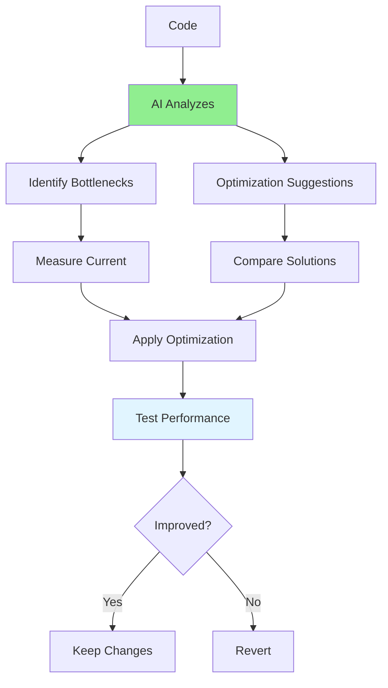

# 05.06 AI Performance Optimization / Tối ưu hiệu năng với AI

## Table of Contents / Mục lục
1. [Introduction / Giới thiệu](#introduction--giới-thiệu)
2. [Performance Analysis Prompts / Prompt phân tích hiệu năng](#performance-analysis-prompts--prompt-phân-tích-hiệu-năng)
3. [Optimization Suggestions / Gợi ý tối ưu hóa](#optimization-suggestions--gợi-ý-tối-ưu-hóa)
4. [Best Practices / Thực hành tốt nhất](#best-practices--thực-hành-tốt-nhất)
5. [Summary / Tóm tắt](#summary--tóm-tắt)

---

## Introduction / Giới thiệu

### Overview / Tổng quan

**English**: AI can analyze code for performance issues and suggest optimizations. Learn to use AI for performance analysis while measuring improvements.

**Vietnamese**: AI có thể phân tích code về vấn đề hiệu năng và đề xuất tối ưu hóa. Học cách sử dụng AI để phân tích hiệu năng trong khi đo lường cải thiện.

### Performance Optimization Process / Quy trình tối ưu hiệu năng



---

## Performance Analysis Prompts / Prompt phân tích hiệu năng

### Example 1: Performance Review Templates / Ví dụ 1: Mẫu review hiệu năng

```typescript
// Performance analysis prompt / Prompt phân tích hiệu năng
const performancePrompt = `
Analyze this code for performance issues:

\`\`\`typescript
${codeSnippet}
\`\`\`

Check for:
1. N+1 query problems
2. Inefficient algorithms (time complexity)
3. Memory leaks
4. Unnecessary operations
5. Missing indexes
6. Caching opportunities
7. Unoptimized loops

For each issue:
- Identify the problem
- Explain the performance impact
- Suggest optimization with code example
- Estimate performance improvement
`;

// Algorithm optimization / Tối ưu thuật toán
const algorithmPrompt = `
Analyze the time and space complexity of this algorithm:

\`\`\`typescript
function findDuplicates(arr: number[]): number[] {
  const duplicates = [];
  for (let i = 0; i < arr.length; i++) {
    for (let j = i + 1; j < arr.length; j++) {
      if (arr[i] === arr[j] && !duplicates.includes(arr[i])) {
        duplicates.push(arr[i]);
      }
    }
  }
  return duplicates;
}
\`\`\`

Suggest an optimized version with better time complexity.
`;

// Database query optimization / Tối ưu truy vấn database
const dbOptimizationPrompt = `
Review this database query code for performance:

\`\`\`typescript
async function getUserOrders(userId: string) {
  const user = await prisma.user.findUnique({ where: { id: userId } });
  const orders = [];
  for (const orderId of user.orderIds) {
    const order = await prisma.order.findUnique({ where: { id: orderId } });
    orders.push(order);
  }
  return orders;
}
\`\`\`

Identify the performance issue and provide an optimized solution.
`;
```

---

## Optimization Suggestions / Gợi ý tối ưu hóa

### Example 2: Optimization Examples / Ví dụ 2: Ví dụ tối ưu hóa

```typescript
// ❌ Performance issue / Vấn đề hiệu năng
const slowCode = `
// O(n²) - Nested loops
function findCommon(arr1: number[], arr2: number[]): number[] {
  const common = [];
  for (const num1 of arr1) {
    for (const num2 of arr2) {
      if (num1 === num2 && !common.includes(num1)) {
        common.push(num1);
      }
    }
  }
  return common;
}
`;

// ✅ Optimized / Tối ưu
const optimizedCode = `
// O(n) - Using Set
function findCommon(arr1: number[], arr2: number[]): number[] {
  const set2 = new Set(arr2);
  const common = [];
  const seen = new Set();
  
  for (const num of arr1) {
    if (set2.has(num) && !seen.has(num)) {
      common.push(num);
      seen.add(num);
    }
  }
  return common;
}
`;

// Database optimization example / Ví dụ tối ưu database
const dbOptimized = `
// ❌ N+1 queries
async function getUserOrders(userId: string) {
  const user = await prisma.user.findUnique({ where: { id: userId } });
  const orders = [];
  for (const orderId of user.orderIds) {
    const order = await prisma.order.findUnique({ where: { id: orderId } });
    orders.push(order);
  }
  return orders;
}

// ✅ Single query with include
async function getUserOrders(userId: string) {
  return prisma.user.findUnique({
    where: { id: userId },
    include: { orders: true } // Eager loading
  });
}
`;
```

---

## Best Practices / Thực hành tốt nhất

1. **Measure first** - Profile before optimizing
2. **Verify improvements** - Test after optimization
3. **Understand trade-offs** - Performance vs readability
4. **Profile regularly** - Continuous optimization
5. **Document changes** - Record performance improvements

---

## Summary / Tóm tắt

### Key Takeaways / Điểm chính

- **Analyze**: Identify bottlenecks and inefficiencies
- **Suggest**: Get optimization recommendations
- **Measure**: Profile before and after
- **Verify**: Test improvements

### Next Steps / Bước tiếp theo

- [05.07 AI for Frontend](./05.07_AI_Frontend_Development.md) - Next: Frontend Development

---

**Last Updated / Cập nhật lần cuối**: 2024

