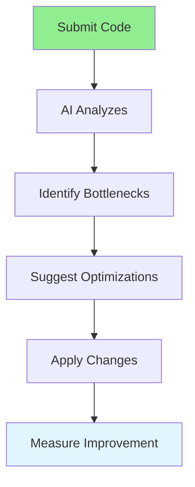

# 05.06 AI Performance Optimization / Tối ưu hiệu suất AI

## Table of Contents / Mục lục
1. [Introduction / Giới thiệu](#introduction--giới-thiệu)
2. [Performance Analysis / Phân tích hiệu suất](#performance-analysis--phân-tích-hiệu-suất)
3. [Optimization Suggestions / Đề xuất tối ưu](#optimization-suggestions--đề-xuất-tối-ưu)
4. [Best Practices / Thực hành tốt nhất](#best-practices--thực-hành-tốt-nhất)
5. [Summary / Tóm tắt](#summary--tóm-tắt)

---

## Introduction / Giới thiệu

### Overview / Tổng quan

**English**: AI can analyze code for performance issues and suggest optimizations. Learn to use AI tools to identify bottlenecks and improve code performance.

**Vietnamese**: AI có thể phân tích code để tìm vấn đề hiệu suất và đề xuất tối ưu. Học cách sử dụng công cụ AI để xác định điểm nghẽn và cải thiện hiệu suất code.

### AI Performance Optimization Flow / Luồng tối ưu hiệu suất AI



---

## Performance Analysis / Phân tích hiệu suất

### Example 1: Performance Review / Ví dụ 1: Review hiệu suất

```markdown
# Performance Review Request

Analyze this code for performance issues:

```typescript
async function getUsersWithOrders() {
  const users = await prisma.user.findMany();
  const result = [];
  
  for (const user of users) {
    const orders = await prisma.order.findMany({
      where: { userId: user.id }
    });
    result.push({ ...user, orders });
  }
  
  return result;
}
```

## AI Performance Analysis

### Issues Identified:
1. **N+1 Query Problem**: One query for users, then N queries for orders
2. **Inefficient**: O(n) database queries instead of O(1)

### Optimized Solution:
```typescript
async function getUsersWithOrders() {
  return await prisma.user.findMany({
    include: {
      orders: true  // Single query with JOIN
    }
  });
}
```

### Performance Improvement:
- Before: N+1 queries (1000 users = 1001 queries)
- After: 1 query
- Speedup: ~1000x for 1000 users
```

---

## Optimization Suggestions / Đề xuất tối ưu

### Example 2: Common Optimizations / Ví dụ 2: Tối ưu phổ biến

```markdown
# AI Performance Optimization Suggestions

## Database Queries
- Use indexes on frequently queried columns
- Avoid N+1 queries (use JOINs or includes)
- Use pagination for large datasets
- Cache frequently accessed data

## Algorithms
- Use efficient data structures (Sets, Maps)
- Optimize loops (cache array length)
- Use appropriate sorting algorithms
- Avoid unnecessary iterations

## Memory
- Release unused resources
- Use streaming for large files
- Limit result sets
- Clear caches when appropriate
```

---

## Best Practices / Thực hành tốt nhất

1. **Profile first** - Measure before optimizing
2. **Focus on bottlenecks** - Optimize slowest parts
3. **Test improvements** - Verify optimizations work
4. **Measure impact** - Quantify performance gains
5. **Balance** - Consider readability vs performance

---

## Summary / Tóm tắt

### Key Takeaways / Điểm chính

- **Identify bottlenecks**: AI can find performance issues
- **Suggest optimizations**: AI provides improvement ideas
- **Measure**: Test performance improvements
- **Focus**: Optimize bottlenecks first
- **Balance**: Consider code readability

### Next Steps / Bước tiếp theo

- [05.07 AI Frontend Development](./05.07_AI_Frontend_Development.md) - Next: Frontend

---

**Last Updated / Cập nhật lần cuối**: 2024


