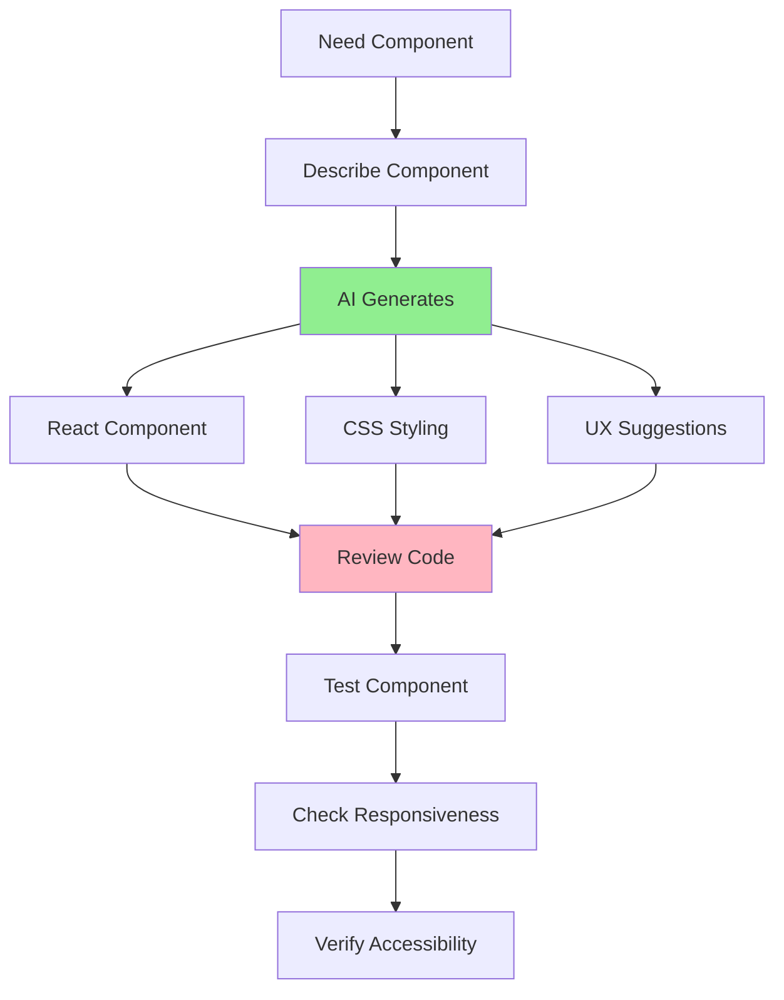

# 05.07 AI for Frontend Development / AI cho Frontend Development

## Table of Contents / Mục lục
1. [Introduction / Giới thiệu](#introduction--giới-thiệu)
2. [Component Generation / Tạo component](#component-generation--tạo-component)
3. [Styling and Design / Styling và thiết kế](#styling-and-design--styling-và-thiết-kế)
4. [Best Practices / Thực hành tốt nhất](#best-practices--thực-hành-tốt-nhất)
5. [Summary / Tóm tắt](#summary--tóm-tắt)

---

## Introduction / Giới thiệu

### Overview / Tổng quan

**English**: AI can help generate React/Vue components, CSS styling, and provide UI/UX suggestions. Learn to use AI effectively for frontend development.

**Vietnamese**: AI có thể giúp tạo component React/Vue, CSS styling và đưa ra gợi ý UI/UX. Học cách sử dụng AI hiệu quả cho phát triển frontend.

### Frontend AI Workflow / Quy trình AI Frontend



---

## Component Generation / Tạo component

### Example 1: React Component Generation / Ví dụ 1: Tạo React Component

```typescript
// Component generation prompt / Prompt tạo component
const componentPrompt = `
Create a React component for a user profile card:

Requirements:
- Display user avatar, name, email
- Show user stats (posts, followers, following)
- Include edit button
- Responsive design
- Use TypeScript
- Follow React best practices (hooks, props interface)
- Use Tailwind CSS for styling

Generate the complete component with:
1. TypeScript interfaces
2. Component implementation
3. Styling
4. Accessibility attributes
`;

// AI-generated component (example) / Component do AI tạo (ví dụ)
interface UserProfileProps {
  user: {
    id: string;
    name: string;
    email: string;
    avatar?: string;
    stats: {
      posts: number;
      followers: number;
      following: number;
    };
  };
  onEdit?: () => void;
}

export const UserProfileCard: React.FC<UserProfileProps> = ({ user, onEdit }) => {
  return (
    <div className="bg-white rounded-lg shadow-md p-6 max-w-md mx-auto">
      <div className="flex items-center space-x-4">
        
        <div>
          <h2 className="text-xl font-bold">{user.name}</h2>
          <p className="text-gray-600">{user.email}</p>
        </div>
      </div>
      
      <div className="mt-4 grid grid-cols-3 gap-4">
        <div className="text-center">
          <p className="text-2xl font-bold">{user.stats.posts}</p>
          <p className="text-sm text-gray-600">Posts</p>
        </div>
        <div className="text-center">
          <p className="text-2xl font-bold">{user.stats.followers}</p>
          <p className="text-sm text-gray-600">Followers</p>
        </div>
        <div className="text-center">
          <p className="text-2xl font-bold">{user.stats.following}</p>
          <p className="text-sm text-gray-600">Following</p>
        </div>
      </div>
      
      {onEdit && (
        <button
          onClick={onEdit}
          className="mt-4 w-full bg-blue-500 text-white py-2 rounded hover:bg-blue-600"
          aria-label="Edit profile"
        >
          Edit Profile
        </button>
      )}
    </div>
  );
};
```

---

## Styling and Design / Styling và thiết kế

### Example 2: CSS Generation / Ví dụ 2: Tạo CSS

```typescript
// CSS generation prompt / Prompt tạo CSS
const cssPrompt = `
Generate responsive CSS for a navigation bar:

Requirements:
- Horizontal layout on desktop
- Hamburger menu on mobile
- Smooth transitions
- Accessible (keyboard navigation)
- Use CSS Grid or Flexbox
- Modern design with hover effects

Provide:
1. HTML structure
2. CSS styles
3. Mobile breakpoint styles
4. Accessibility considerations
`;
```

---

## Best Practices / Thực hành tốt nhất

1. **Review UI code** - Check component structure
2. **Test responsiveness** - Verify mobile/desktop
3. **Verify accessibility** - Check ARIA attributes
4. **Match design system** - Follow project guidelines
5. **Optimize performance** - Check bundle size

---

## Summary / Tóm tắt

### Key Takeaways / Điểm chính

- **Components**: Generate React/Vue components
- **Styling**: CSS, responsive design
- **UX**: UI/UX suggestions
- **Accessibility**: Ensure accessible code

### Next Steps / Bước tiếp theo

- [05.08 AI for Backend](./05.08_AI_Backend_Development.md) - Next: Backend Development

---

**Last Updated / Cập nhật lần cuối**: 2024

