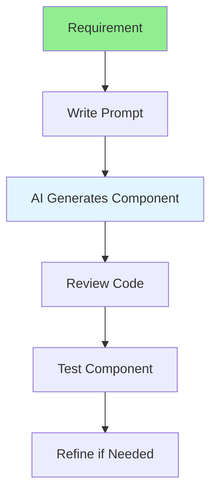

# 05.07 AI Frontend Development / Phát triển Frontend với AI

## Table of Contents / Mục lục
1. [Introduction / Giới thiệu](#introduction--giới-thiệu)
2. [AI Frontend Development Flow / Luồng phát triển Frontend AI](#ai-frontend-development-flow--luồng-phát-triển-frontend-ai)
3. [Use Cases / Trường hợp sử dụng](#use-cases--trường-hợp-sử-dụng)
4. [Best Practices / Thực hành tốt nhất](#best-practices--thực-hành-tốt-nhất)
5. [Summary / Tóm tắt](#summary--tóm-tắt)

---

## Introduction / Giới thiệu

### Overview / Tổng quan

**English**: AI assists in frontend development by generating React components, styling, and handling user interactions. Learn to use AI for efficient frontend development.

**Vietnamese**: AI hỗ trợ phát triển frontend bằng cách tạo React components, styling và xử lý tương tác người dùng. Học cách sử dụng AI cho phát triển frontend hiệu quả.

### AI Frontend Development Flow / Luồng phát triển Frontend AI



---

## AI Frontend Development Flow / Luồng phát triển Frontend AI

### Example 1: Component Generation / Ví dụ 1: Tạo component

```markdown
# Prompt for React Component

Create a React component for user registration form with:
- Email input field
- Password input field
- Confirm password field
- Submit button
- Form validation
- Error messages
- Loading state
- Use TypeScript and React hooks

## Generated Component
```typescript
import { useState } from 'react';

interface FormErrors {
  email?: string;
  password?: string;
  confirmPassword?: string;
}

export function RegistrationForm() {
  const [email, setEmail] = useState('');
  const [password, setPassword] = useState('');
  const [confirmPassword, setConfirmPassword] = useState('');
  const [errors, setErrors] = useState<FormErrors>({});
  const [loading, setLoading] = useState(false);

  const validate = () => {
    const newErrors: FormErrors = {};
    if (!email.includes('@')) newErrors.email = 'Invalid email';
    if (password.length < 8) newErrors.password = 'Password too short';
    if (password !== confirmPassword) newErrors.confirmPassword = 'Passwords do not match';
    setErrors(newErrors);
    return Object.keys(newErrors).length === 0;
  };

  const handleSubmit = async (e: React.FormEvent) => {
    e.preventDefault();
    if (!validate()) return;
    
    setLoading(true);
    // Registration logic
    setLoading(false);
  };

  return (
    <form onSubmit={handleSubmit}>
      {/* Form fields */}
    </form>
  );
}
```
```

---

## Best Practices / Thực hành tốt nhất

1. **Be specific** - Describe component requirements clearly
2. **Include styling** - Specify CSS framework or approach
3. **State management** - Indicate state management needs
4. **Review generated code** - Always review and test
5. **Iterate** - Refine prompts for better results

---

## Summary / Tóm tắt

### Key Takeaways / Điểm chính

- **Component generation**: AI can create React components
- **Form handling**: Generate forms with validation
- **State management**: Include state management logic
- **Styling**: Generate styled components
- **Review**: Always review generated code

### Next Steps / Bước tiếp theo

- [05.08 AI Backend Development](./05.08_AI_Backend_Development.md) - Next: Backend

---

**Last Updated / Cập nhật lần cuối**: 2024

