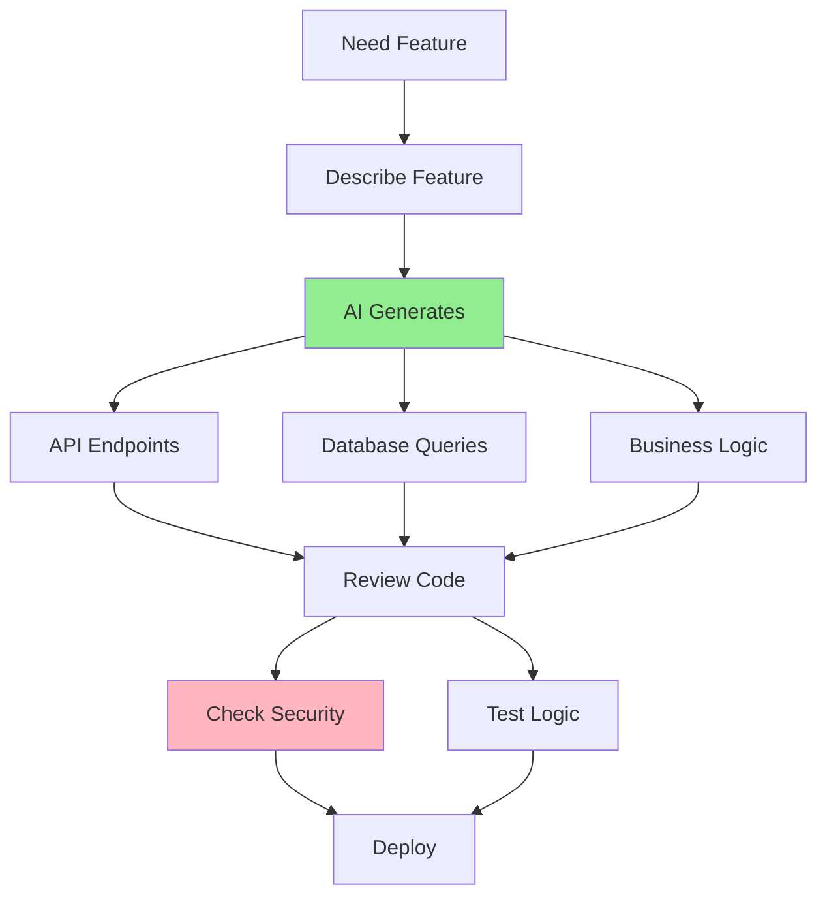

# 05.08 AI for Backend Development / AI cho Backend Development

## Table of Contents / Mục lục
1. [Introduction / Giới thiệu](#introduction--giới-thiệu)
2. [API Endpoint Generation / Tạo API endpoint](#api-endpoint-generation--tạo-api-endpoint)
3. [Database and Business Logic / Database và logic nghiệp vụ](#database-and-business-logic--database-và-logic-nghiệp-vụ)
4. [Best Practices / Thực hành tốt nhất](#best-practices--thực-hành-tốt-nhất)
5. [Summary / Tóm tắt](#summary--tóm-tắt)

---

## Introduction / Giới thiệu

### Overview / Tổng quan

**English**: AI can help generate API endpoints, database queries, and business logic. Learn to use AI effectively for backend development while ensuring security and quality.

**Vietnamese**: AI có thể giúp tạo API endpoint, truy vấn database và logic nghiệp vụ. Học cách sử dụng AI hiệu quả cho phát triển backend trong khi đảm bảo bảo mật và chất lượng.

### Backend AI Workflow / Quy trình AI Backend



---

## API Endpoint Generation / Tạo API endpoint

### Example 1: API Generation / Ví dụ 1: Tạo API

```typescript
// API generation prompt / Prompt tạo API
const apiPrompt = `
Create a NestJS REST API endpoint for user management:

Requirements:
- POST /users - Create user
- GET /users/:id - Get user by ID
- PUT /users/:id - Update user
- DELETE /users/:id - Delete user (soft delete)

Use:
- NestJS framework
- Prisma ORM
- DTOs for validation
- Proper error handling
- Authentication middleware
- Swagger documentation

Generate:
1. Controller with all endpoints
2. Service with business logic
3. DTOs for request/response
4. Error handling
`;

// AI-generated controller (example) / Controller do AI tạo (ví dụ)
@Controller('users')
@UseGuards(JwtAuthGuard)
export class UsersController {
  constructor(private readonly usersService: UsersService) {}

  @Post()
  @ApiOperation({ summary: 'Create a new user' })
  @ApiResponse({ status: 201, description: 'User created' })
  async create(@Body() createUserDto: CreateUserDto): Promise<UserResponseDto> {
    return this.usersService.create(createUserDto);
  }

  @Get(':id')
  @ApiOperation({ summary: 'Get user by ID' })
  async findOne(@Param('id') id: string): Promise<UserResponseDto> {
    return this.usersService.findOne(id);
  }

  @Put(':id')
  @ApiOperation({ summary: 'Update user' })
  async update(
    @Param('id') id: string,
    @Body() updateUserDto: UpdateUserDto
  ): Promise<UserResponseDto> {
    return this.usersService.update(id, updateUserDto);
  }

  @Delete(':id')
  @ApiOperation({ summary: 'Delete user (soft delete)' })
  async remove(@Param('id') id: string): Promise<void> {
    return this.usersService.remove(id);
  }
}
```

---

## Database and Business Logic / Database và logic nghiệp vụ

### Example 2: Database Query Generation / Ví dụ 2: Tạo truy vấn database

```typescript
// Database query prompt / Prompt truy vấn database
const dbQueryPrompt = `
Generate Prisma queries for an e-commerce order system:

Requirements:
1. Get user's orders with order items
2. Get orders by date range
3. Get orders with total amount > $100
4. Get orders with pagination (10 per page)

Use:
- Prisma ORM
- Include relations (order items, products)
- Proper filtering and sorting
- Type-safe queries

Generate optimized queries with:
- Proper includes
- Where clauses
- Pagination
- TypeScript types
`;

// AI-generated queries (example) / Query do AI tạo (ví dụ)
class OrderService {
  // Get user orders with items
  async getUserOrders(userId: string) {
    return prisma.order.findMany({
      where: { userId },
      include: {
        items: {
          include: {
            product: true
          }
        }
      },
      orderBy: { createdAt: 'desc' }
    });
  }

  // Get orders by date range
  async getOrdersByDateRange(startDate: Date, endDate: Date) {
    return prisma.order.findMany({
      where: {
        createdAt: {
          gte: startDate,
          lte: endDate
        }
      },
      include: { items: { include: { product: true } } }
    });
  }

  // Get orders with pagination
  async getOrdersPaginated(page: number = 1, pageSize: number = 10) {
    const skip = (page - 1) * pageSize;
    return prisma.order.findMany({
      skip,
      take: pageSize,
      include: { items: { include: { product: true } } },
      orderBy: { createdAt: 'desc' }
    });
  }
}
```

---

## Best Practices / Thực hành tốt nhất

1. **Review logic** - Understand business logic
2. **Test thoroughly** - Unit and integration tests
3. **Verify security** - Authentication, authorization
4. **Check performance** - Optimize queries
5. **Follow patterns** - Match project architecture

---

## Summary / Tóm tắt

### Key Takeaways / Điểm chính

- **API**: Generate endpoints with proper structure
- **Database**: Optimized queries with Prisma
- **Logic**: Business logic implementation
- **Security**: Authentication and authorization

### Next Steps / Bước tiếp theo

- [05.09 AI Refactoring](./05.09_AI_Refactoring_Suggestions.md) - Next: Refactoring

---

**Last Updated / Cập nhật lần cuối**: 2024

