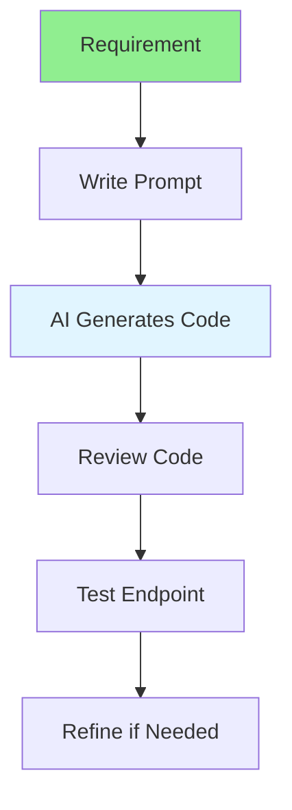

# 05.08 AI Backend Development / Phát triển Backend với AI

## Table of Contents / Mục lục
1. [Introduction / Giới thiệu](#introduction--giới-thiệu)
2. [AI Backend Development Flow / Luồng phát triển Backend AI](#ai-backend-development-flow--luồng-phát-triển-backend-ai)
3. [Use Cases / Trường hợp sử dụng](#use-cases--trường-hợp-sử-dụng)
4. [Best Practices / Thực hành tốt nhất](#best-practices--thực-hành-tốt-nhất)
5. [Summary / Tóm tắt](#summary--tóm-tắt)

---

## Introduction / Giới thiệu

### Overview / Tổng quan

**English**: AI assists in backend development by generating API endpoints, database queries, and business logic. Learn to use AI for efficient backend development.

**Vietnamese**: AI hỗ trợ phát triển backend bằng cách tạo API endpoints, truy vấn database và logic nghiệp vụ. Học cách sử dụng AI cho phát triển backend hiệu quả.

### AI Backend Development Flow / Luồng phát triển Backend AI



---

## AI Backend Development Flow / Luồng phát triển Backend AI

### Example 1: API Endpoint Generation / Ví dụ 1: Tạo API endpoint

```markdown
# Prompt for API Endpoint

Create a REST API endpoint for user management using Express.js and Prisma:
- GET /users - List all users with pagination
- POST /users - Create new user
- GET /users/:id - Get user by ID
- PUT /users/:id - Update user
- DELETE /users/:id - Delete user

Include:
- Input validation
- Error handling
- Proper HTTP status codes
- TypeScript types
- Prisma ORM queries

## Generated Code
```typescript
import { Router } from 'express';
import { PrismaClient } from '@prisma/client';

const router = Router();
const prisma = new PrismaClient();

router.get('/users', async (req, res) => {
  const page = parseInt(req.query.page as string) || 1;
  const limit = parseInt(req.query.limit as string) || 10;
  const skip = (page - 1) * limit;

  try {
    const [users, total] = await Promise.all([
      prisma.user.findMany({ skip, take: limit }),
      prisma.user.count()
    ]);
    res.json({ users, total, page, limit });
  } catch (error) {
    res.status(500).json({ error: 'Failed to fetch users' });
  }
});

// Additional endpoints...
```
```

---

## Best Practices / Thực hành tốt nhất

1. **Specify framework** - Indicate Express, NestJS, etc.
2. **Include validation** - Request input validation
3. **Error handling** - Proper error responses
4. **Security** - Authentication and authorization
5. **Review code** - Always review generated code

---

## Summary / Tóm tắt

### Key Takeaways / Điểm chính

- **API generation**: AI can create REST endpoints
- **Database queries**: Generate Prisma/TypeORM queries
- **Validation**: Include input validation
- **Error handling**: Proper error responses
- **Security**: Authentication and authorization

### Next Steps / Bước tiếp theo

- [05.09 AI Refactoring Suggestions](./05.09_AI_Refactoring_Suggestions.md) - Next: Refactoring

---

**Last Updated / Cập nhật lần cuối**: 2024

