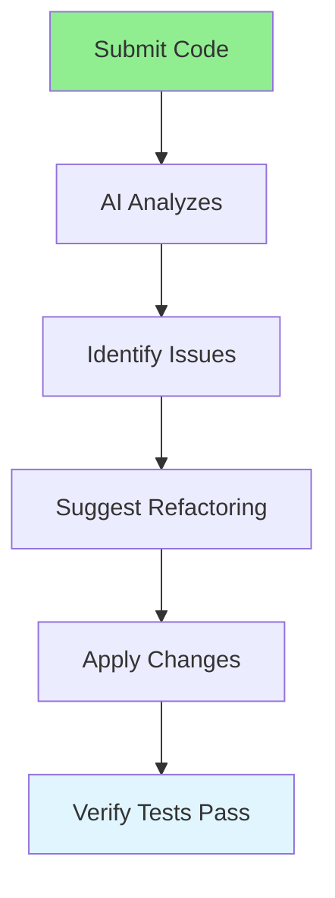

# 05.09 AI Refactoring Suggestions / Đề xuất refactoring AI

## Table of Contents / Mục lục
1. [Introduction / Giới thiệu](#introduction--giới-thiệu)
2. [AI Refactoring Flow / Luồng refactoring AI](#ai-refactoring-flow--luồng-refactoring-ai)
3. [Refactoring Types / Loại refactoring](#refactoring-types--loại-refactoring)
4. [Best Practices / Thực hành tốt nhất](#best-practices--thực-hành-tốt-nhất)
5. [Summary / Tóm tắt](#summary--tóm-tắt)

---

## Introduction / Giới thiệu

### Overview / Tổng quan

**English**: AI can suggest refactoring improvements to make code cleaner, more maintainable, and follow best practices. Learn to use AI for code refactoring suggestions.

**Vietnamese**: AI có thể đề xuất cải thiện refactoring để code sạch hơn, dễ bảo trì hơn và tuân theo thực hành tốt nhất. Học cách sử dụng AI cho đề xuất refactoring code.

### AI Refactoring Flow / Luồng refactoring AI



---

## AI Refactoring Flow / Luồng refactoring AI

### Example 1: Refactoring Request / Ví dụ 1: Yêu cầu refactoring

```markdown
# Refactoring Request

Please suggest refactoring improvements for this code:

```typescript
function processOrder(order) {
  let total = 0;
  for (let i = 0; i < order.items.length; i++) {
    total += order.items[i].price * order.items[i].quantity;
  }
  
  let discount = 0;
  if (order.customer.type === 'premium') {
    discount = total * 0.1;
  } else if (order.customer.type === 'vip') {
    discount = total * 0.15;
  }
  
  let tax = (total - discount) * 0.1;
  return total - discount + tax;
}
```

## AI Refactoring Suggestions

### Issues Identified:
1. No type safety
2. Magic numbers
3. Long function doing multiple things
4. No error handling

### Refactored Code:
```typescript
interface OrderItem {
  price: number;
  quantity: number;
}

interface Customer {
  type: 'regular' | 'premium' | 'vip';
}

interface Order {
  items: OrderItem[];
  customer: Customer;
}

const DISCOUNT_RATES = {
  premium: 0.1,
  vip: 0.15
} as const;

const TAX_RATE = 0.1;

function calculateSubtotal(items: OrderItem[]): number {
  return items.reduce((sum, item) => sum + item.price * item.quantity, 0);
}

function calculateDiscount(total: number, customerType: Customer['type']): number {
  const rate = DISCOUNT_RATES[customerType] || 0;
  return total * rate;
}

function calculateTax(amount: number): number {
  return amount * TAX_RATE;
}

function processOrder(order: Order): number {
  const subtotal = calculateSubtotal(order.items);
  const discount = calculateDiscount(subtotal, order.customer.type);
  const afterDiscount = subtotal - discount;
  const tax = calculateTax(afterDiscount);
  return afterDiscount + tax;
}
```
```

---

## Refactoring Types / Loại refactoring

### Example 2: Common Refactorings / Ví dụ 2: Refactoring phổ biến

```markdown
# Common Refactoring Suggestions

## Extract Function
- Long functions → Break into smaller functions
- Repeated code → Extract to reusable function

## Rename Variables
- Unclear names → Descriptive names
- Abbreviations → Full words

## Remove Duplication
- Duplicate code → Extract to function
- Similar logic → Parameterize function

## Simplify Conditionals
- Complex if-else → Early returns
- Nested conditions → Guard clauses

## Improve Type Safety
- `any` types → Specific types
- Missing types → Add TypeScript types
```

---

## Best Practices / Thực hành tốt nhất

1. **Review suggestions** - Evaluate AI suggestions
2. **Test after refactoring** - Ensure tests still pass
3. **Small steps** - Refactor incrementally
4. **Understand changes** - Know why changes are suggested
5. **Maintain functionality** - Don't break existing behavior

---

## Summary / Tóm tắt

### Key Takeaways / Điểm chính

- **Identify issues**: AI finds code smells
- **Suggest improvements**: AI proposes refactoring
- **Review carefully**: Evaluate all suggestions
- **Test thoroughly**: Verify after refactoring
- **Learn patterns**: Understand refactoring techniques

### Next Steps / Bước tiếp theo

- [05.10 AI Documentation](./05.10_AI_Documentation.md) - Next: Documentation

---

**Last Updated / Cập nhật lần cuối**: 2024


