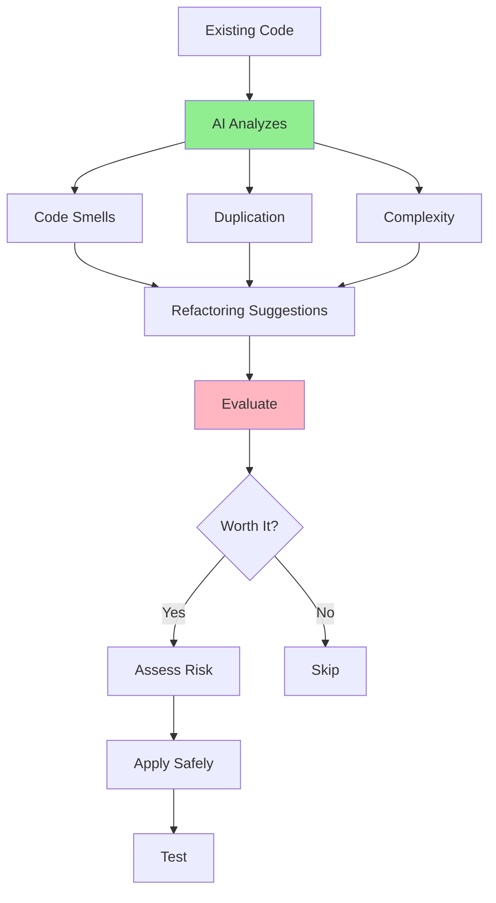

# 05.09 AI Refactoring Suggestions / Gợi ý refactor code với AI

## Table of Contents / Mục lục
1. [Introduction / Giới thiệu](#introduction--giới-thiệu)
2. [Refactoring Prompts / Prompt refactoring](#refactoring-prompts--prompt-refactoring)
3. [Evaluating Suggestions / Đánh giá gợi ý](#evaluating-suggestions--đánh-giá-gợi-ý)
4. [Best Practices / Thực hành tốt nhất](#best-practices--thực-hành-tốt-nhất)
5. [Summary / Tóm tắt](#summary--tóm-tắt)

---

## Introduction / Giới thiệu

### Overview / Tổng quan

**English**: AI can suggest refactoring opportunities to improve code structure. Learn to evaluate and apply refactoring suggestions safely.

**Vietnamese**: AI có thể đề xuất cơ hội refactoring để cải thiện cấu trúc code. Học cách đánh giá và áp dụng gợi ý refactoring an toàn.

### Refactoring Process / Quy trình refactoring



---

## Refactoring Prompts / Prompt refactoring

### Example 1: Refactoring Prompt Templates / Ví dụ 1: Mẫu prompt refactoring

```typescript
// Refactoring analysis prompt / Prompt phân tích refactoring
const refactoringPrompt = `
Analyze this code and suggest refactoring improvements:

\`\`\`typescript
${codeSnippet}
\`\`\`

Check for:
1. Code smells (long methods, large classes)
2. Code duplication
3. High complexity
4. Design improvements
5. SOLID principle violations

For each suggestion:
- Explain the issue
- Provide refactored code
- Explain benefits
- Assess risk level
`;

// Extract method suggestion / Gợi ý trích xuất phương thức
const extractMethodPrompt = `
This function is too long. Suggest how to refactor it by extracting methods:

\`\`\`typescript
function processOrder(order: Order): void {
  // 100+ lines of code
  // Validation, calculation, saving, email sending, etc.
}
\`\`\`

Suggest:
1. How to break it down
2. What methods to extract
3. Refactored code structure
`;
```

---

## Evaluating Suggestions / Đánh giá gợi ý

### Example 2: Evaluation Framework / Ví dụ 2: Khung đánh giá

```typescript
interface RefactoringSuggestion {
  issue: string;
  suggestion: string;
  benefits: string[];
  risks: string[];
  effort: 'Low' | 'Medium' | 'High';
  priority: 'High' | 'Medium' | 'Low';
  shouldApply: boolean;
  reason?: string;
}

// Example evaluation / Ví dụ đánh giá
const suggestions: RefactoringSuggestion[] = [
  {
    issue: 'Long method (150 lines)',
    suggestion: 'Extract validation, calculation, and notification into separate methods',
    benefits: [
      'Improved readability',
      'Easier testing',
      'Better maintainability'
    ],
    risks: [
      'Low risk - well-defined boundaries',
      'Need to update tests'
    ],
    effort: 'Medium',
    priority: 'High',
    shouldApply: true,
    reason: 'Significantly improves code quality with manageable risk'
  },
  {
    issue: 'Duplicate code in 3 places',
    suggestion: 'Extract to shared utility function',
    benefits: [
      'DRY principle',
      'Single source of truth',
      'Easier maintenance'
    ],
    risks: [
      'Need to verify all usages',
      'Potential breaking changes'
    ],
    effort: 'Low',
    priority: 'High',
    shouldApply: true,
    reason: 'Clear benefit, low effort, manageable risk'
  }
];
```

---

## Best Practices / Thực hành tốt nhất

1. **Evaluate carefully** - Consider benefits vs risks
2. **Test first** - Write tests before refactoring
3. **Apply incrementally** - Small, safe changes
4. **Verify functionality** - Ensure nothing breaks
5. **Document changes** - Record refactoring decisions

---

## Summary / Tóm tắt

### Key Takeaways / Điểm chính

- **Identify**: Code smells, duplication, complexity
- **Evaluate**: Benefits, risks, effort
- **Apply**: Safely, incrementally
- **Verify**: Test after refactoring

### Next Steps / Bước tiếp theo

- [05.10 AI Documentation](./05.10_AI_Documentation.md) - Next: Documentation

---

**Last Updated / Cập nhật lần cuối**: 2024

