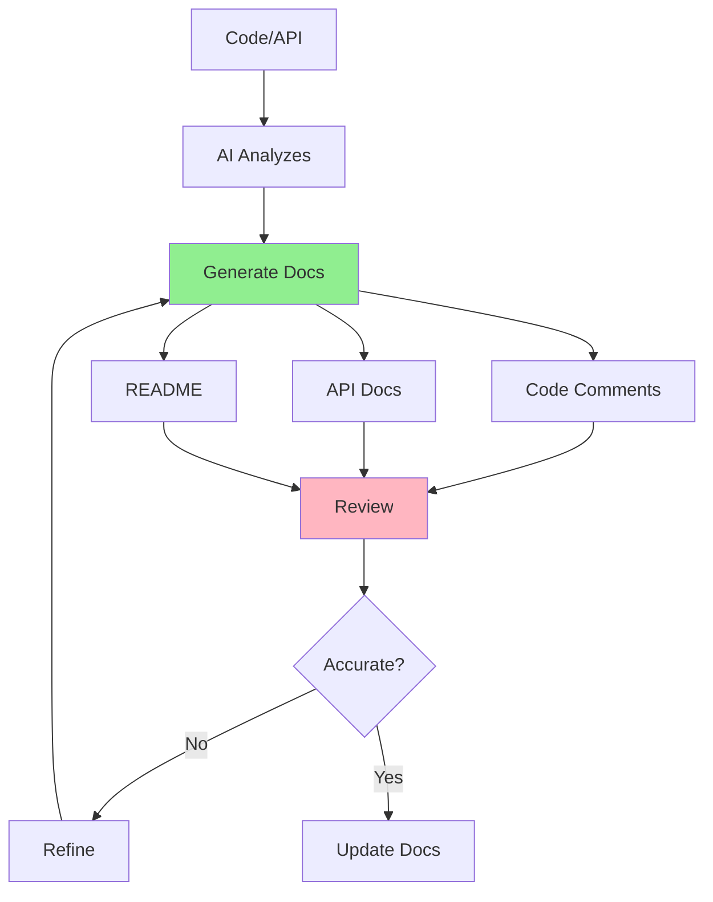

# 05.10 AI Documentation / Tạo tài liệu với AI

## Table of Contents / Mục lục
1. [Introduction / Giới thiệu](#introduction--giới-thiệu)
2. [Documentation Types / Loại tài liệu](#documentation-types--loại-tài-liệu)
3. [Documentation Prompts / Prompt tài liệu](#documentation-prompts--prompt-tài-liệu)
4. [Best Practices / Thực hành tốt nhất](#best-practices--thực-hành-tốt-nhất)
5. [Summary / Tóm tắt](#summary--tóm-tắt)

---

## Introduction / Giới thiệu

### Overview / Tổng quan

**English**: AI can generate documentation for code, APIs, and projects. Learn to use AI for documentation while ensuring accuracy and completeness.

**Vietnamese**: AI có thể tạo tài liệu cho code, API và dự án. Học cách sử dụng AI cho tài liệu trong khi đảm bảo tính chính xác và đầy đủ.

### Documentation Generation / Tạo tài liệu



---

## Documentation Types / Loại tài liệu

### Example 1: Documentation Prompts / Ví dụ 1: Prompt tài liệu

```typescript
// Code comments generation / Tạo comment code
const codeCommentsPrompt = `
Add JSDoc comments to this TypeScript function:

\`\`\`typescript
async function getUserOrders(userId: string, includeItems: boolean = false) {
  const user = await prisma.user.findUnique({ where: { id: userId } });
  if (!user) throw new NotFoundError('User not found');
  
  const orders = await prisma.order.findMany({
    where: { userId },
    include: includeItems ? { items: true } : undefined
  });
  
  return orders;
}
\`\`\`

Generate:
- Function description
- Parameter documentation
- Return type documentation
- Error documentation
- Usage examples
`;

// API documentation / Tài liệu API
const apiDocPrompt = `
Generate OpenAPI/Swagger documentation for this NestJS endpoint:

\`\`\`typescript
@Post('/users')
async createUser(@Body() dto: CreateUserDto) {
  return this.usersService.create(dto);
}
\`\`\`

Include:
- Endpoint description
- Request body schema
- Response schema
- Error responses
- Example requests/responses
`;

// README generation / Tạo README
const readmePrompt = `
Generate a comprehensive README.md for this project:

Project: E-commerce API
Tech Stack: NestJS, Prisma, PostgreSQL, TypeScript
Features: User management, Product catalog, Order processing

Include:
- Project description
- Installation instructions
- Environment variables
- API endpoints overview
- Development setup
- Contributing guidelines
`;
```

---

## Best Practices / Thực hành tốt nhất

1. **Review documentation** - Verify accuracy
2. **Keep updated** - Update when code changes
3. **Be clear** - Use simple language
4. **Include examples** - Show usage
5. **Verify completeness** - Cover all aspects

---

## Summary / Tóm tắt

### Key Takeaways / Điểm chính

- **Types**: Code comments, API docs, README
- **Review**: Always verify accuracy
- **Update**: Keep docs current
- **Examples**: Include usage examples

### Next Steps / Bước tiếp theo

- [05.11 AI Test Generation](./05.11_AI_Test_Generation.md) - Next: Test Generation

---

**Last Updated / Cập nhật lần cuối**: 2024

