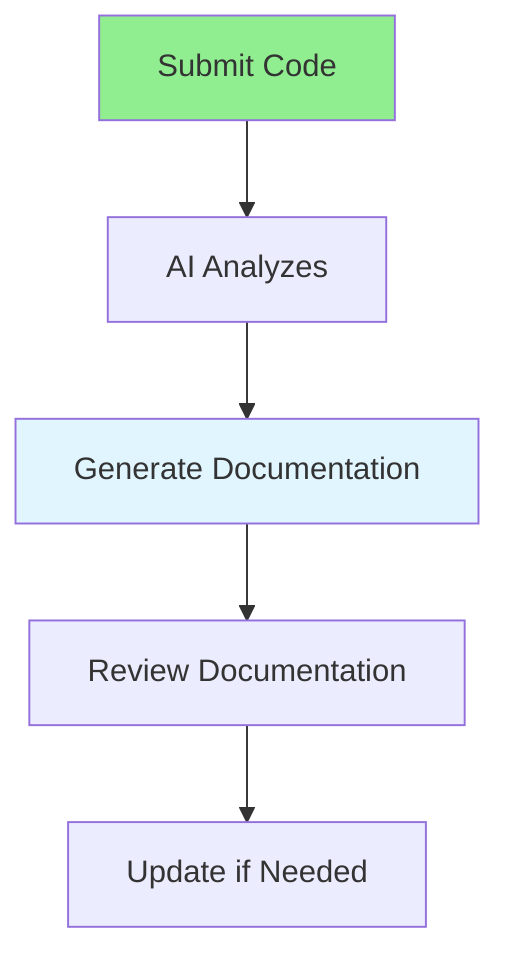

# 05.10 AI Documentation / Tài liệu hóa với AI

## Table of Contents / Mục lục
1. [Introduction / Giới thiệu](#introduction--giới-thiệu)
2. [AI Documentation Flow / Luồng tài liệu hóa AI](#ai-documentation-flow--luồng-tài-liệu-hóa-ai)
3. [Documentation Types / Loại tài liệu](#documentation-types--loại-tài-liệu)
4. [Best Practices / Thực hành tốt nhất](#best-practices--thực-hành-tốt-nhất)
5. [Summary / Tóm tắt](#summary--tóm-tắt)

---

## Introduction / Giới thiệu

### Overview / Tổng quan

**English**: AI can generate documentation from code, including comments, README files, and API documentation. Learn to use AI for efficient documentation.

**Vietnamese**: AI có thể tạo tài liệu từ code, bao gồm comment, file README và tài liệu API. Học cách sử dụng AI cho tài liệu hóa hiệu quả.

### AI Documentation Flow / Luồng tài liệu hóa AI



---

## AI Documentation Flow / Luồng tài liệu hóa AI

### Example 1: Code Documentation / Ví dụ 1: Tài liệu code

```markdown
# Documentation Request

Generate JSDoc documentation for this function:

```typescript
function calculateDiscount(total: number, customerType: string): number {
  if (customerType === 'premium') return total * 0.1;
  if (customerType === 'vip') return total * 0.15;
  return 0;
}
```

## Generated Documentation
```typescript
/**
 * Calculates discount based on order total and customer type.
 * 
 * @param total - The total order amount before discount
 * @param customerType - The type of customer ('premium' or 'vip')
 * @returns The discount amount (0 if customer is not premium or vip)
 * 
 * @example
 * ```typescript
 * const discount = calculateDiscount(100, 'premium'); // Returns 10
 * const discount = calculateDiscount(100, 'vip'); // Returns 15
 * const discount = calculateDiscount(100, 'regular'); // Returns 0
 * ```
 */
function calculateDiscount(total: number, customerType: string): number {
  // Implementation...
}
```
```

### Example 2: README Generation / Ví dụ 2: Tạo README

```markdown
# README Generation Request

Generate a README.md file for a Node.js Express API project with:
- User authentication
- CRUD operations for users
- JWT tokens
- Prisma ORM
- TypeScript

## Generated README
```markdown
# User Management API

RESTful API for user management built with Express.js, TypeScript, and Prisma.

## Features
- User authentication with JWT
- CRUD operations for users
- Password hashing with bcrypt
- Input validation
- Error handling

## Installation
\`\`\`bash
npm install
\`\`\`

## Usage
\`\`\`bash
npm run dev
\`\`\`

## API Endpoints
- POST /auth/register - Register new user
- POST /auth/login - Login user
- GET /users - List users
- GET /users/:id - Get user by ID
...
```
```

---

## Best Practices / Thực hành tốt nhất

1. **Provide context** - Give AI code and requirements
2. **Specify format** - Indicate documentation style
3. **Review generated docs** - Check for accuracy
4. **Update regularly** - Keep docs current with code
5. **Use for boilerplate** - Generate initial docs quickly

---

## Summary / Tóm tắt

### Key Takeaways / Điểm chính

- **Code comments**: Generate JSDoc comments
- **README files**: Create project documentation
- **API docs**: Generate API documentation
- **Review**: Always review generated docs
- **Maintain**: Keep docs updated with code

### Next Steps / Bước tiếp theo

- [05.11 AI Test Generation](./05.11_AI_Test_Generation.md) - Next: Test Generation

---

**Last Updated / Cập nhật lần cuối**: 2024

