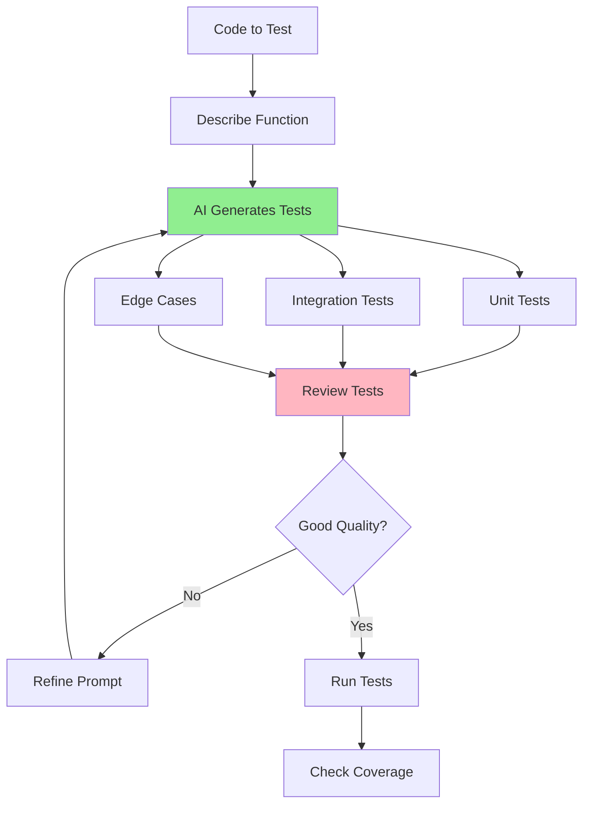

# 05.11 AI Test Generation / Tạo test cases với AI

## Table of Contents / Mục lục
1. [Introduction / Giới thiệu](#introduction--giới-thiệu)
2. [Test Generation Prompts / Prompt tạo test](#test-generation-prompts--prompt-tạo-test)
3. [Reviewing Generated Tests / Xem xét test đã tạo](#reviewing-generated-tests--xem-xét-test-đã-tạo)
4. [Best Practices / Thực hành tốt nhất](#best-practices--thực-hành-tốt-nhất)
5. [Summary / Tóm tắt](#summary--tóm-tắt)

---

## Introduction / Giới thiệu

### Overview / Tổng quan

**English**: AI can generate unit tests, integration tests, and test cases. Learn to use AI for test generation while ensuring quality and coverage.

**Vietnamese**: AI có thể tạo unit test, integration test và test case. Học cách sử dụng AI để tạo test trong khi đảm bảo chất lượng và coverage.

### Test Generation Process / Quy trình tạo test



---

## Test Generation Prompts / Prompt tạo test

### Example 1: Test Generation Templates / Ví dụ 1: Mẫu tạo test

```typescript
// Unit test generation / Tạo unit test
const unitTestPrompt = `
Generate comprehensive unit tests for this function:

\`\`\`typescript
async function calculateTotalPrice(
  items: CartItem[],
  discount: number = 0
): Promise<number> {
  if (items.length === 0) {
    throw new Error('Cart is empty');
  }
  
  const subtotal = items.reduce((sum, item) => {
    return sum + (item.price * item.quantity);
  }, 0);
  
  const total = subtotal * (1 - discount);
  return Math.round(total * 100) / 100;
}
\`\`\`

Generate tests using Jest that cover:
1. Happy path scenarios
2. Edge cases (empty cart, zero discount, 100% discount)
3. Error cases
4. Boundary values
5. Type validation

Include:
- Test descriptions
- Arrange-Act-Assert pattern
- Mock data
- Assertions
`;

// Integration test prompt / Prompt integration test
const integrationTestPrompt = `
Generate integration tests for this API endpoint:

\`\`\`typescript
@Post('/users')
async createUser(@Body() dto: CreateUserDto) {
  return this.usersService.create(dto);
}
\`\`\`

Test:
- Successful user creation
- Duplicate email handling
- Validation errors
- Database interactions
- Response format

Use:
- Supertest for HTTP testing
- Test database setup/teardown
- Proper test isolation
`;
```

---

## Reviewing Generated Tests / Xem xét test đã tạo

### Example 2: Test Quality Checklist / Ví dụ 2: Danh sách kiểm tra chất lượng test

```typescript
interface TestQualityChecklist {
  coverage: {
    checked: boolean;
    items: string[];
  };
  quality: {
    checked: boolean;
    items: string[];
  };
  maintainability: {
    checked: boolean;
    items: string[];
  };
}

const testChecklist: TestQualityChecklist = {
  coverage: {
    checked: false,
    items: [
      'All code paths are tested',
      'Edge cases are covered',
      'Error cases are tested',
      'Boundary values are tested'
    ]
  },
  quality: {
    checked: false,
    items: [
      'Tests are independent',
      'Tests are deterministic',
      'Tests use proper assertions',
      'Tests have clear descriptions'
    ]
  },
  maintainability: {
    checked: false,
    items: [
      'Tests are readable',
      'Test data is reusable',
      'Tests follow AAA pattern',
      'Tests are well-organized'
    ]
  }
};
```

---

## Best Practices / Thực hành tốt nhất

1. **Review test quality** - Check coverage and quality
2. **Verify coverage** - Ensure all paths tested
3. **Maintain tests** - Update when code changes
4. **Run tests** - Verify they pass
5. **Refactor tests** - Keep them maintainable

---

## Summary / Tóm tắt

### Key Takeaways / Điểm chính

- **Generate**: Unit, integration, edge case tests
- **Review**: Check quality and coverage
- **Maintain**: Update with code changes
- **Verify**: Run and validate tests

### Next Steps / Bước tiếp theo

- [05.12 AI Error Analysis](./05.12_AI_Error_Analysis.md) - Next: Error Analysis

---

**Last Updated / Cập nhật lần cuối**: 2024

