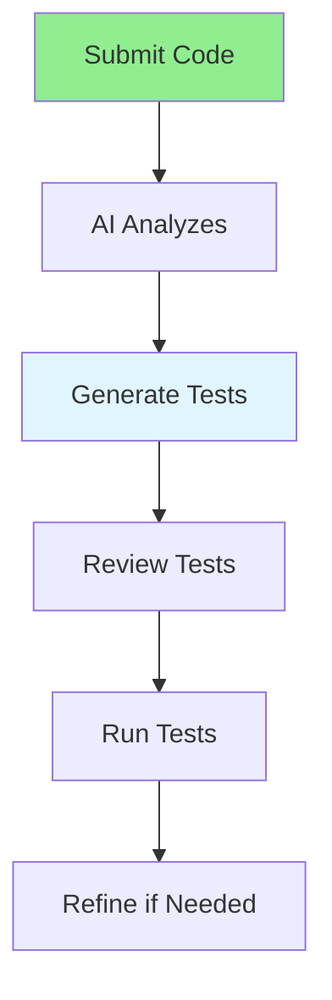

# 05.11 AI Test Generation / Tạo test với AI

## Table of Contents / Mục lục
1. [Introduction / Giới thiệu](#introduction--giới-thiệu)
2. [Test Generation Process / Quy trình tạo test](#test-generation-process--quy-trình-tạo-test)
3. [Test Types / Loại test](#test-types--loại-test)
4. [Best Practices / Thực hành tốt nhất](#best-practices--thực-hành-tốt-nhất)
5. [Summary / Tóm tắt](#summary--tóm-tắt)

---

## Introduction / Giới thiệu

### Overview / Tổng quan

**English**: AI can generate unit tests, integration tests, and test cases from code. Learn to use AI to create comprehensive test suites.

**Vietnamese**: AI có thể tạo unit test, integration test và test case từ code. Học cách sử dụng AI để tạo bộ test toàn diện.

### AI Test Generation Flow / Luồng tạo test AI



---

## Test Generation Process / Quy trình tạo test

### Example 1: Unit Test Generation / Ví dụ 1: Tạo unit test

```markdown
# Test Generation Request

Generate unit tests for this function:

```typescript
function calculateTotal(items: OrderItem[]): number {
  return items.reduce((sum, item) => sum + item.price * item.quantity, 0);
}
```

## Generated Tests
```typescript
import { calculateTotal } from './calculator';
import { OrderItem } from './types';

describe('calculateTotal', () => {
  it('should return 0 for empty array', () => {
    expect(calculateTotal([])).toBe(0);
  });

  it('should calculate total for single item', () => {
    const items: OrderItem[] = [{ price: 10, quantity: 2 }];
    expect(calculateTotal(items)).toBe(20);
  });

  it('should calculate total for multiple items', () => {
    const items: OrderItem[] = [
      { price: 10, quantity: 2 },
      { price: 5, quantity: 3 }
    ];
    expect(calculateTotal(items)).toBe(35);
  });

  it('should handle zero price', () => {
    const items: OrderItem[] = [{ price: 0, quantity: 5 }];
    expect(calculateTotal(items)).toBe(0);
  });
});
```
```

---

## Best Practices / Thực hành tốt nhất

1. **Cover edge cases** - Test boundary conditions
2. **Test error cases** - Include error scenarios
3. **Review generated tests** - Ensure they're meaningful
4. **Run tests** - Verify tests pass
5. **Maintain tests** - Update when code changes

---

## Summary / Tóm tắt

### Key Takeaways / Điểm chính

- **Unit tests**: Generate tests for functions
- **Integration tests**: Create API endpoint tests
- **Edge cases**: Include boundary conditions
- **Error cases**: Test error scenarios
- **Review**: Always review generated tests

### Next Steps / Bước tiếp theo

- [05.12 AI Error Analysis](./05.12_AI_Error_Analysis.md) - Next: Error Analysis

---

**Last Updated / Cập nhật lần cuối**: 2024


