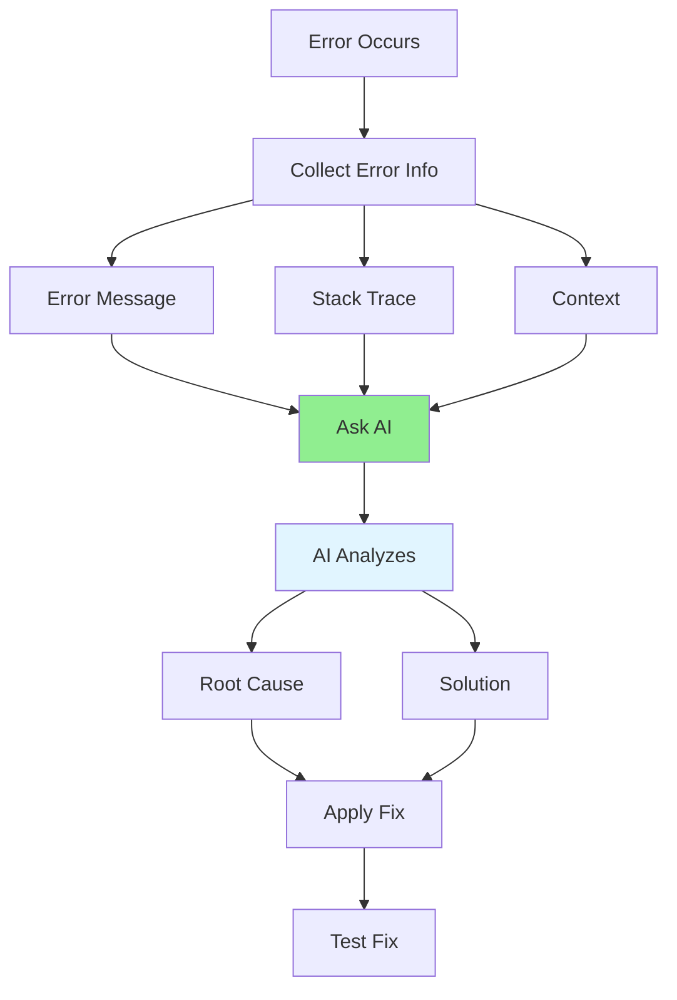

# 05.12 AI Error Message Analysis / Phân tích lỗi với AI

## Table of Contents / Mục lục
1. [Introduction / Giới thiệu](#introduction--giới-thiệu)
2. [Error Analysis Prompts / Prompt phân tích lỗi](#error-analysis-prompts--prompt-phân-tích-lỗi)
3. [Understanding Errors / Hiểu lỗi](#understanding-errors--hiểu-lỗi)
4. [Best Practices / Thực hành tốt nhất](#best-practices--thực-hành-tốt-nhất)
5. [Summary / Tóm tắt](#summary--tóm-tắt)

---

## Introduction / Giới thiệu

### Overview / Tổng quan

**English**: AI can help analyze error messages, understand root causes, and suggest solutions. Learn to use AI effectively for error analysis.

**Vietnamese**: AI có thể giúp phân tích thông báo lỗi, hiểu nguyên nhân gốc và đề xuất giải pháp. Học cách sử dụng AI hiệu quả để phân tích lỗi.

### Error Analysis Process / Quy trình phân tích lỗi



---

## Error Analysis Prompts / Prompt phân tích lỗi

### Example 1: Error Analysis Templates / Ví dụ 1: Mẫu phân tích lỗi

```typescript
// Comprehensive error analysis / Phân tích lỗi toàn diện
const errorAnalysisPrompt = `
I'm getting this error. Please help me understand and fix it:

Error Message:
${errorMessage}

Stack Trace:
${stackTrace}

Context:
- What I was trying to do: ${context}
- Framework: ${framework}
- Code snippet:
\`\`\`typescript
${codeSnippet}
\`\`\`

Please:
1. Explain what the error means
2. Identify the root cause
3. Suggest a fix with code example
4. Explain why the fix works
5. Provide prevention tips
`;

// TypeScript error example / Ví dụ lỗi TypeScript
const tsErrorPrompt = `
TypeScript Error:
Type 'string | undefined' is not assignable to type 'string'

Code:
\`\`\`typescript
function getUserName(user: User | undefined): string {
  return user.name; // Error here
}
\`\`\`

Explain the error and provide type-safe solutions.
`;

// Runtime error example / Ví dụ lỗi runtime
const runtimeErrorPrompt = `
Runtime Error:
Cannot read property 'map' of undefined

Code:
\`\`\`typescript
function processItems(items: Item[]): string[] {
  return items.map(item => item.name);
}

// Called with: processItems(undefined)
\`\`\`

Explain why this happens and how to fix it with proper error handling.
`;
```

---

## Understanding Errors / Hiểu lỗi

### Example 2: Error Categories / Ví dụ 2: Phân loại lỗi

```typescript
interface ErrorAnalysis {
  errorType: 'Type Error' | 'Runtime Error' | 'Logic Error' | 'Network Error' | 'Database Error';
  message: string;
  rootCause: string;
  solution: string;
  prevention: string[];
}

// Example analysis / Ví dụ phân tích
const errorAnalysis: ErrorAnalysis = {
  errorType: 'Type Error',
  message: "Type 'null' is not assignable to type 'User'",
  rootCause: 'Function expects User but can receive null, and TypeScript strict mode prevents this',
  solution: `
// Option 1: Handle null case
function getUserName(user: User | null): string {
  if (!user) {
    throw new Error('User is required');
  }
  return user.name;
}

// Option 2: Return optional
function getUserName(user: User | null): string | null {
  return user?.name ?? null;
}
  `,
  prevention: [
    'Use TypeScript strict mode',
    'Add null checks',
    'Use optional chaining',
    'Define proper types'
  ]
};
```

---

## Best Practices / Thực hành tốt nhất

1. **Provide full context** - Error message, stack trace, code
2. **Include environment** - Framework, versions
3. **Show what you tried** - Your debugging attempts
4. **Iterate questions** - Follow up for clarification
5. **Learn patterns** - Understand common error types

---

## Summary / Tóm tắt

### Key Takeaways / Điểm chính

- **Analyze**: Error messages and stack traces
- **Understand**: Root causes
- **Fix**: Apply solutions
- **Learn**: Prevent similar errors

### Next Steps / Bước tiếp theo

- [05.13 AI Code Explanation](./05.13_AI_Code_Explanation.md) - Next: Code Explanation

---

**Last Updated / Cập nhật lần cuối**: 2024

