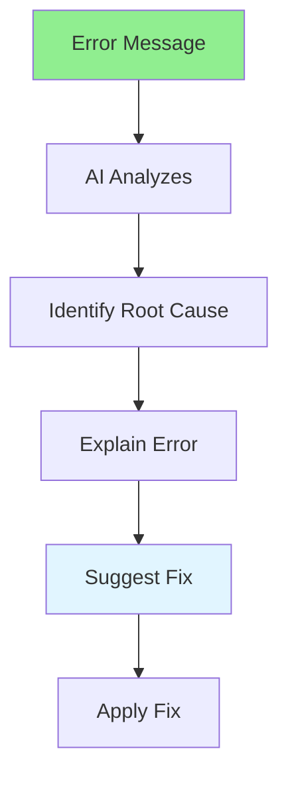

# 05.12 AI Error Analysis / Phân tích lỗi AI

## Table of Contents / Mục lục
1. [Introduction / Giới thiệu](#introduction--giới-thiệu)
2. [Error Analysis Process / Quy trình phân tích lỗi](#error-analysis-process--quy-trình-phân-tích-lỗi)
3. [Common Errors / Lỗi phổ biến](#common-errors--lỗi-phổ-biến)
4. [Best Practices / Thực hành tốt nhất](#best-practices--thực-hành-tốt-nhất)
5. [Summary / Tóm tắt](#summary--tóm-tắt)

---

## Introduction / Giới thiệu

### Overview / Tổng quan

**English**: AI can analyze error messages and stack traces to identify root causes and suggest fixes. Learn to use AI for effective error analysis.

**Vietnamese**: AI có thể phân tích thông báo lỗi và stack trace để xác định nguyên nhân gốc và đề xuất sửa chữa. Học cách sử dụng AI cho phân tích lỗi hiệu quả.

### AI Error Analysis Flow / Luồng phân tích lỗi AI



---

## Error Analysis Process / Quy trình phân tích lỗi

### Example 1: Error Analysis / Ví dụ 1: Phân tích lỗi

```markdown
# Error Analysis Request

Analyze this error:

```
TypeError: Cannot read property 'map' of undefined
at UserService.getUsers (UserService.ts:25:15)
at UserController.getAllUsers (UserController.ts:12:8)
```

Code:
```typescript
async getUsers(): Promise<User[]> {
  const users = await this.repository.findAll();
  return users.map(u => ({ ...u, fullName: `${u.firstName} ${u.lastName}` }));
}
```

## AI Error Analysis

### Root Cause
The `findAll()` method is returning `undefined` instead of an array, likely because:
1. Database query failed
2. Repository method returns undefined on error
3. No error handling

### Explanation
When `findAll()` returns `undefined`, calling `.map()` on `undefined` causes the error.

### Suggested Fix
```typescript
async getUsers(): Promise<User[]> {
  try {
    const users = await this.repository.findAll();
    if (!users) {
      return [];
    }
    return users.map(u => ({ ...u, fullName: `${u.firstName} ${u.lastName}` }));
  } catch (error) {
    console.error('Error fetching users:', error);
    throw new Error('Failed to fetch users');
  }
}
```
```

---

## Best Practices / Thực hành tốt nhất

1. **Provide full context** - Include error message and code
2. **Include stack trace** - Full error information
3. **Describe symptoms** - What's happening
4. **Test fixes** - Verify solutions work
5. **Learn patterns** - Understand common errors

---

## Summary / Tóm tắt

### Key Takeaways / Điểm chính

- **Error analysis**: AI can identify root causes
- **Context**: Provide error messages and code
- **Explanations**: AI explains why errors occur
- **Fixes**: AI suggests solutions
- **Learning**: Understand error patterns

### Next Steps / Bước tiếp theo

- [05.13 AI Code Explanation](./05.13_AI_Code_Explanation.md) - Next: Code Explanation

---

**Last Updated / Cập nhật lần cuối**: 2024

