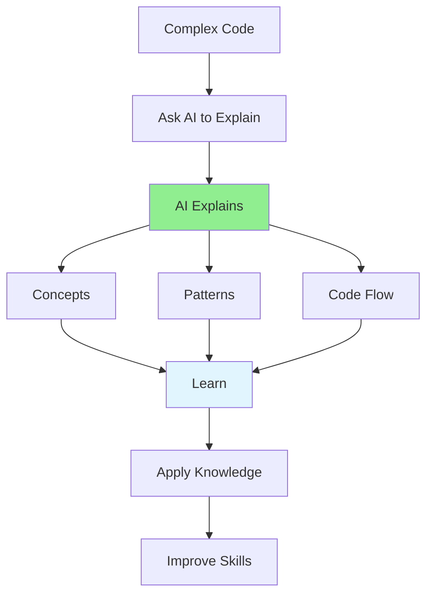

# 05.13 AI Code Explanation / Giải thích code với AI

## Table of Contents / Mục lục
1. [Introduction / Giới thiệu](#introduction--giới-thiệu)
2. [Explanation Prompts / Prompt giải thích](#explanation-prompts--prompt-giải-thích)
3. [Learning from Explanations / Học từ giải thích](#learning-from-explanations--học-từ-giải-thích)
4. [Best Practices / Thực hành tốt nhất](#best-practices--thực-hành-tốt-nhất)
5. [Summary / Tóm tắt](#summary--tóm-tắt)

---

## Introduction / Giới thiệu

### Overview / Tổng quan

**English**: AI can explain complex code, helping you understand patterns and learn new concepts. Use AI explanations to improve code comprehension skills.

**Vietnamese**: AI có thể giải thích code phức tạp, giúp bạn hiểu patterns và học khái niệm mới. Sử dụng giải thích AI để cải thiện kỹ năng hiểu code.

### Code Explanation Process / Quy trình giải thích code



---

## Explanation Prompts / Prompt giải thích

### Example 1: Explanation Templates / Ví dụ 1: Mẫu giải thích

```typescript
// Code explanation prompt / Prompt giải thích code
const explanationPrompt = `
Please explain this code in detail:

\`\`\`typescript
${codeSnippet}
\`\`\`

Explain:
1. What the code does (high-level overview)
2. How it works (step-by-step)
3. Key concepts and patterns used
4. Why it's written this way
5. Potential improvements

Use simple language and provide examples.
`;

// Pattern explanation / Giải thích pattern
const patternPrompt = `
Explain this design pattern implementation:

\`\`\`typescript
class UserService {
  constructor(
    private userRepository: UserRepository,
    private emailService: EmailService
  ) {}
  
  async createUser(data: CreateUserDto): Promise<User> {
    const user = await this.userRepository.create(data);
    await this.emailService.sendWelcomeEmail(user.email);
    return user;
  }
}
\`\`\`

Explain:
- What design pattern is used
- How dependency injection works here
- Benefits of this approach
- When to use this pattern
`;

// Algorithm explanation / Giải thích thuật toán
const algorithmPrompt = `
Explain this algorithm:

\`\`\`typescript
function binarySearch(arr: number[], target: number): number {
  let left = 0;
  let right = arr.length - 1;
  
  while (left <= right) {
    const mid = Math.floor((left + right) / 2);
    if (arr[mid] === target) return mid;
    if (arr[mid] < target) left = mid + 1;
    else right = mid - 1;
  }
  
  return -1;
}
\`\`\`

Explain:
- How the algorithm works
- Time and space complexity
- When to use it
- Step-by-step walkthrough with example
`;
```

---

## Learning from Explanations / Học từ giải thích

### Example 2: Learning Framework / Ví dụ 2: Khung học tập

```typescript
interface CodeExplanation {
  overview: string;
  stepByStep: string[];
  concepts: string[];
  patterns: string[];
  why: string; // Why written this way / Tại sao viết như vậy
  improvements?: string[];
}

// Example explanation / Ví dụ giải thích
const explanation: CodeExplanation = {
  overview: 'This function implements user authentication with JWT token generation',
  stepByStep: [
    '1. Validates email format using regex',
    '2. Finds user in database by email',
    '3. Compares password hash using bcrypt',
    '4. Generates JWT token if credentials valid',
    '5. Returns token and user info'
  ],
  concepts: [
    'JWT (JSON Web Tokens)',
    'Password hashing with bcrypt',
    'Async/await pattern',
    'Error handling'
  ],
  patterns: [
    'Service pattern',
    'Dependency injection',
    'Error-first approach'
  ],
  why: 'Uses bcrypt for secure password comparison and JWT for stateless authentication',
  improvements: [
    'Add rate limiting',
    'Implement refresh tokens',
    'Add logging'
  ]
};
```

---

## Best Practices / Thực hành tốt nhất

1. **Verify explanations** - Cross-check with documentation
2. **Learn concepts** - Understand underlying principles
3. **Apply knowledge** - Use in your own code
4. **Ask follow-ups** - Deepen understanding
5. **Practice** - Write similar code yourself

---

## Summary / Tóm tắt

### Key Takeaways / Điểm chính

- **Explain**: Complex code and patterns
- **Learn**: Concepts and best practices
- **Apply**: Knowledge to your code
- **Improve**: Code reading skills

### Next Steps / Bước tiếp theo

- [05.14 AI Best Practices](./05.14_AI_Best_Practices_Limitations.md) - Next: Best Practices

---

**Last Updated / Cập nhật lần cuối**: 2024

