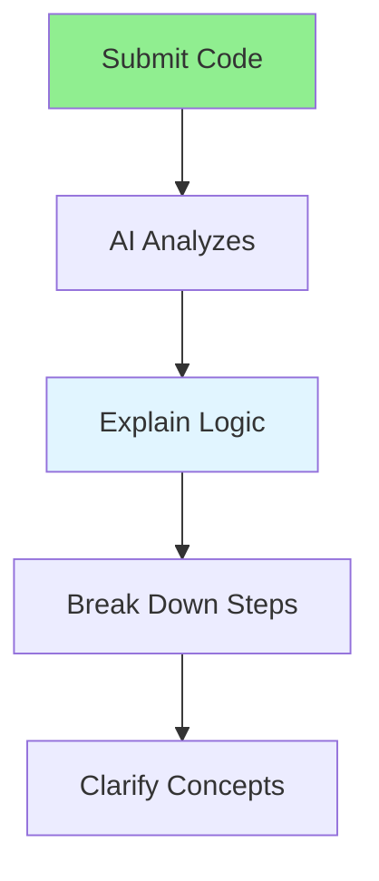

# 05.13 AI Code Explanation / Giải thích code với AI

## Table of Contents / Mục lục
1. [Introduction / Giới thiệu](#introduction--giới-thiệu)
2. [Code Explanation Process / Quy trình giải thích code](#code-explanation-process--quy-trình-giải-thích-code)
3. [Explanation Types / Loại giải thích](#explanation-types--loại-giải-thích)
4. [Best Practices / Thực hành tốt nhất](#best-practices--thực-hành-tốt-nhất)
5. [Summary / Tóm tắt](#summary--tóm-tắt)

---

## Introduction / Giới thiệu

### Overview / Tổng quan

**English**: AI can explain how code works, making complex code understandable. Learn to use AI for code explanation and learning.

**Vietnamese**: AI có thể giải thích cách code hoạt động, làm cho code phức tạp dễ hiểu. Học cách sử dụng AI để giải thích code và học tập.

### AI Code Explanation Flow / Luồng giải thích code AI



---

## Code Explanation Process / Quy trình giải thích code

### Example 1: Code Explanation / Ví dụ 1: Giải thích code

```markdown
# Code Explanation Request

Explain how this code works:

```typescript
function debounce<T extends (...args: any[]) => any>(
  func: T,
  wait: number
): (...args: Parameters<T>) => void {
  let timeout: NodeJS.Timeout;
  return function executedFunction(...args: Parameters<T>) {
    const later = () => {
      clearTimeout(timeout);
      func(...args);
    };
    clearTimeout(timeout);
    timeout = setTimeout(later, wait);
  };
}
```

## AI Explanation

### Overview
This function implements a debounce pattern that delays function execution until after a specified time has passed since the last invocation.

### Step-by-Step Explanation
1. **Function signature**: Takes a function and wait time, returns a debounced version
2. **Timeout variable**: Stores the timeout ID to cancel previous calls
3. **Returned function**: The debounced version that will be called
4. **Later function**: Executes the original function after delay
5. **Clear previous**: Cancels any pending execution
6. **Set new timeout**: Schedules new execution after wait time

### Use Case
Useful for search inputs, resize handlers, scroll events - anywhere you want to limit how often a function runs.
```

---

## Best Practices / Thực hành tốt nhất

1. **Ask specific questions** - What do you want to understand?
2. **Request step-by-step** - Ask for detailed breakdown
3. **Ask about concepts** - Understand underlying patterns
4. **Request examples** - See how code is used
5. **Learn patterns** - Understand design patterns used

---

## Summary / Tóm tắt

### Key Takeaways / Điểm chính

- **Code explanation**: AI explains how code works
- **Step-by-step**: Detailed breakdown of logic
- **Concepts**: Understand underlying patterns
- **Examples**: See usage examples
- **Learning**: Use for understanding complex code

### Next Steps / Bước tiếp theo

- [05.14 AI Best Practices & Limitations](./05.14_AI_Best_Practices_Limitations.md) - Next: Best Practices

---

**Last Updated / Cập nhật lần cuối**: 2024


