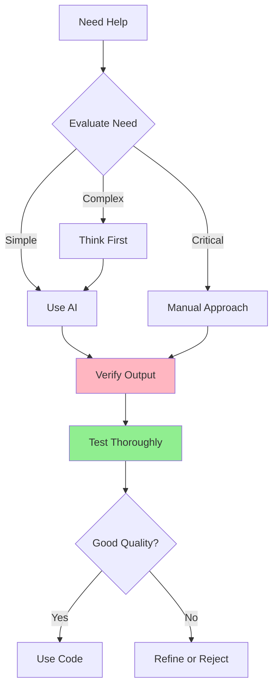

# 05.14 AI Best Practices and Limitations / Thực hành tốt nhất và Giới hạn của AI

## Table of Contents / Mục lục
1. [Introduction / Giới thiệu](#introduction--giới-thiệu)
2. [Best Practices / Thực hành tốt nhất](#best-practices--thực-hành-tốt-nhất)
3. [AI Limitations / Giới hạn của AI](#ai-limitations--giới-hạn-của-ai)
4. [When NOT to Use AI / Khi nào không dùng AI](#when-not-to-use-ai--khi-nào-không-dùng-ai)
5. [Summary / Tóm tắt](#summary--tóm-tắt)

---

## Introduction / Giới thiệu

### Overview / Tổng quan

**English**: Understanding AI best practices and limitations is crucial for professional use. Learn when and how to use AI effectively while maintaining code quality.

**Vietnamese**: Hiểu thực hành tốt nhất và giới hạn của AI rất quan trọng cho việc sử dụng chuyên nghiệp. Học khi nào và cách sử dụng AI hiệu quả trong khi duy trì chất lượng code.

### AI Usage Guidelines / Hướng dẫn sử dụng AI



---

## Best Practices / Thực hành tốt nhất

### Example 1: Best Practices Checklist / Ví dụ 1: Danh sách thực hành tốt nhất

```typescript
interface AIBestPractices {
  verify: {
    checked: boolean;
    items: string[];
  };
  understand: {
    checked: boolean;
    items: string[];
  };
  test: {
    checked: boolean;
    items: string[];
  };
  maintain: {
    checked: boolean;
    items: string[];
  };
}

const bestPractices: AIBestPractices = {
  verify: {
    checked: false,
    items: [
      'Always verify AI output',
      "Don't blindly trust AI",
      'Cross-check with documentation',
      'Review code thoroughly'
    ]
  },
  understand: {
    checked: false,
    items: [
      'Understand code before using',
      'Learn from AI suggestions',
      'Know why code works',
      'Ask questions if unclear'
    ]
  },
  test: {
    checked: false,
    items: [
      'Test all AI-generated code',
      'Write unit tests',
      'Test edge cases',
      'Verify in production-like environment'
    ]
  },
  maintain: {
    checked: false,
    items: [
      'Maintain code quality standards',
      'Follow project conventions',
      'Keep code readable',
      'Document complex logic'
    ]
  }
};
```

---

## AI Limitations / Giới hạn của AI

### Example 2: Common Limitations / Ví dụ 2: Giới hạn phổ biến

```typescript
interface AILimitations {
  accuracy: {
    issue: string;
    example: string;
    mitigation: string;
  };
  context: {
    issue: string;
    example: string;
    mitigation: string;
  };
  outdated: {
    issue: string;
    example: string;
    mitigation: string;
  };
}

const limitations: AILimitations = {
  accuracy: {
    issue: 'AI may generate incorrect code',
    example: 'May suggest deprecated APIs or wrong syntax',
    mitigation: 'Always verify with official documentation and test code'
  },
  context: {
    issue: 'AI may not understand full project context',
    example: 'May suggest solutions that conflict with project architecture',
    mitigation: 'Provide detailed context and review suggestions critically'
  },
  outdated: {
    issue: 'AI training data may be outdated',
    example: 'May not know about latest framework versions or best practices',
    mitigation: 'Check for latest documentation and verify recommendations'
  }
};
```

---

## When NOT to Use AI / Khi nào không dùng AI

### Example 3: When to Avoid AI / Ví dụ 3: Khi nào tránh AI

```typescript
// ❌ Don't use AI for / Không dùng AI cho
const avoidAI = [
  'Critical security code without review',
  'Business logic without understanding',
  'Production code without testing',
  'Code you cannot understand',
  'Time-sensitive fixes without verification'
];

// ✅ Use AI for / Dùng AI cho
const useAI = [
  'Code generation with review',
  'Learning and understanding',
  'Code suggestions and improvements',
  'Documentation generation',
  'Test case generation'
];
```

---

## Best Practices / Thực hành tốt nhất

1. **Verify output** - Never trust blindly
2. **Understand code** - Know what it does
3. **Test thoroughly** - Verify functionality
4. **Maintain quality** - Follow standards
5. **Learn continuously** - Improve skills

---

## Summary / Tóm tắt

### Key Takeaways / Điểm chính

- **Verify**: Always check AI output
- **Understand**: Know what code does
- **Test**: Verify before using
- **Limitations**: Be aware of AI constraints
- **Use wisely**: Know when to use AI

### Next Steps / Bước tiếp theo

- [05.15 AI Tools Comparison](./05.15_AI_Tools_Comparison.md) - Next: Tools Comparison

---

**Last Updated / Cập nhật lần cuối**: 2024

