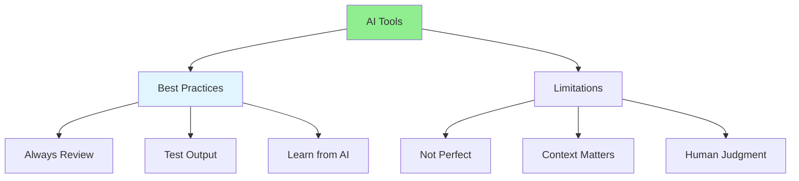

# 05.14 AI Best Practices & Limitations / Thực hành tốt nhất & Giới hạn AI

## Table of Contents / Mục lục
1. [Introduction / Giới thiệu](#introduction--giới-thiệu)
2. [Best Practices / Thực hành tốt nhất](#best-practices--thực-hành-tốt-nhất)
3. [Limitations / Giới hạn](#limitations--giới-hạn)
4. [Summary / Tóm tắt](#summary--tóm-tắt)

---

## Introduction / Giới thiệu

### Overview / Tổng quan

**English**: Understanding AI best practices and limitations helps use AI tools effectively. Learn when to use AI and when to rely on human judgment.

**Vietnamese**: Hiểu thực hành tốt nhất và giới hạn AI giúp sử dụng công cụ AI hiệu quả. Học khi nào sử dụng AI và khi nào dựa vào phán đoán con người.

### AI Best Practices and Limitations / Thực hành tốt nhất và giới hạn AI



---

## Best Practices / Thực hành tốt nhất

### Example 1: Best Practices / Ví dụ 1: Thực hành tốt nhất

```markdown
# AI Best Practices

## 1. Always Review Generated Code
- AI can make mistakes
- Code may not follow your standards
- Security issues may exist
- Performance may not be optimal

## 2. Provide Clear Context
- Specify technology stack
- Include requirements
- Mention constraints
- Provide examples

## 3. Test All Generated Code
- Run unit tests
- Test edge cases
- Verify functionality
- Check performance

## 4. Use AI as Assistant, Not Replacement
- AI augments your skills
- You still need to understand code
- Human judgment is essential
- Combine AI with expertise

## 5. Learn from AI Suggestions
- Understand why AI suggests changes
- Learn new patterns
- Improve your coding skills
- Build knowledge base
```

---

## Limitations / Giới hạn

### Example 2: AI Limitations / Ví dụ 2: Giới hạn AI

```markdown
# AI Limitations

## 1. May Generate Incorrect Code
- Logic errors possible
- May not handle edge cases
- Can introduce bugs
- Always test thoroughly

## 2. Context Understanding
- May miss business context
- Doesn't understand project history
- May suggest inappropriate solutions
- Requires human oversight

## 3. Security Concerns
- May suggest insecure patterns
- Doesn't know your security policies
- May miss vulnerabilities
- Security review still needed

## 4. Performance
- May not optimize for your use case
- Doesn't know your constraints
- May suggest inefficient solutions
- Performance testing required

## 5. Code Style
- May not match your style guide
- Doesn't know team conventions
- May use different patterns
- Code review still necessary
```

---

## Summary / Tóm tắt

### Key Takeaways / Điểm chính

- **Review always**: Never blindly trust AI output
- **Test thoroughly**: Verify all generated code
- **Provide context**: Give AI enough information
- **Understand limitations**: Know when AI may fail
- **Use wisely**: AI as assistant, not replacement

### Next Steps / Bước tiếp theo

- [05.15 AI Tools Comparison](./05.15_AI_Tools_Comparison.md) - Next: Tools Comparison

---

**Last Updated / Cập nhật lần cuối**: 2024


