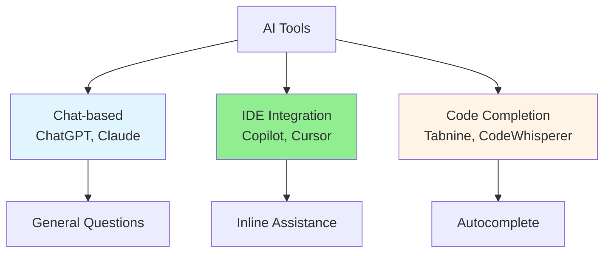

# 05.15 AI Tools Comparison / So sánh các công cụ AI

## Table of Contents / Mục lục
1. [Introduction / Giới thiệu](#introduction--giới-thiệu)
2. [Popular AI Tools / Công cụ AI phổ biến](#popular-ai-tools--công-cụ-ai-phổ-biến)
3. [Tool Comparison / So sánh công cụ](#tool-comparison--so-sánh-công-cụ)
4. [Choosing the Right Tool / Chọn công cụ phù hợp](#choosing-the-right-tool--chọn-công-cụ-phù-hợp)
5. [Best Practices / Thực hành tốt nhất](#best-practices--thực-hành-tốt-nhất)
6. [Summary / Tóm tắt](#summary--tóm-tắt)

---

## Introduction / Giới thiệu

### Overview / Tổng quan

**English**: Different AI tools have different strengths. Understanding tool features helps choose the right tool for your needs and use them effectively.

**Vietnamese**: Các công cụ AI khác nhau có điểm mạnh khác nhau. Hiểu tính năng công cụ giúp chọn đúng công cụ cho nhu cầu và sử dụng hiệu quả.

### AI Tools Landscape / Bối cảnh công cụ AI



---

## Popular AI Tools / Công cụ AI phổ biến

### Example 1: Tool Features / Ví dụ 1: Tính năng công cụ

```typescript
interface AITool {
  name: string;
  type: 'Chat' | 'IDE Integration' | 'Code Completion';
  features: string[];
  pricing: 'Free' | 'Paid' | 'Freemium';
  bestFor: string[];
  limitations: string[];
}

// Tool comparisons / So sánh công cụ
const tools: AITool[] = [
  {
    name: 'ChatGPT',
    type: 'Chat',
    features: [
      'Conversational interface',
      'Code generation',
      'Code explanation',
      'Error analysis',
      'General programming help'
    ],
    pricing: 'Freemium',
    bestFor: [
      'Learning and understanding',
      'Code explanation',
      'General questions',
      'Debugging help'
    ],
    limitations: [
      'No direct IDE integration',
      'May have outdated knowledge',
      'Requires copy-paste'
    ]
  },
  {
    name: 'GitHub Copilot',
    type: 'IDE Integration',
    features: [
      'Inline code suggestions',
      'Autocomplete',
      'Multiple language support',
      'IDE integration'
    ],
    pricing: 'Paid',
    bestFor: [
      'Fast code generation',
      'Inline assistance',
      'Boilerplate code',
      'Quick implementations'
    ],
    limitations: [
      'Requires subscription',
      'May suggest incorrect code',
      'Needs review'
    ]
  },
  {
    name: 'Cursor',
    type: 'IDE Integration',
    features: [
      'AI-powered editor',
      'Code generation',
      'Refactoring assistance',
      'Chat interface in IDE'
    ],
    pricing: 'Freemium',
    bestFor: [
      'Full IDE experience',
      'Code refactoring',
      'Project-wide changes',
      'AI-first development'
    ],
    limitations: [
      'Learning curve',
      'May be overwhelming',
      'Requires good prompts'
    ]
  }
];
```

---

## Tool Comparison / So sánh công cụ

### Example 2: Comparison Matrix / Ví dụ 2: Ma trận so sánh

```typescript
interface ToolComparison {
  feature: string;
  chatgpt: 'Excellent' | 'Good' | 'Fair' | 'Poor';
  copilot: 'Excellent' | 'Good' | 'Fair' | 'Poor';
  cursor: 'Excellent' | 'Good' | 'Fair' | 'Poor';
  tabnine: 'Excellent' | 'Good' | 'Fair' | 'Poor';
}

const comparison: ToolComparison[] = [
  {
    feature: 'Code Generation',
    chatgpt: 'Excellent',
    copilot: 'Excellent',
    cursor: 'Excellent',
    tabnine: 'Good'
  },
  {
    feature: 'IDE Integration',
    chatgpt: 'Poor',
    copilot: 'Excellent',
    cursor: 'Excellent',
    tabnine: 'Excellent'
  },
  {
    feature: 'Code Explanation',
    chatgpt: 'Excellent',
    copilot: 'Fair',
    cursor: 'Good',
    tabnine: 'Poor'
  },
  {
    feature: 'Error Debugging',
    chatgpt: 'Excellent',
    copilot: 'Good',
    cursor: 'Good',
    tabnine: 'Fair'
  },
  {
    feature: 'Cost',
    chatgpt: 'Good',
    copilot: 'Fair',
    cursor: 'Good',
    tabnine: 'Good'
  }
];
```

---

## Choosing the Right Tool / Chọn công cụ phù hợp

### Example 3: Selection Guide / Ví dụ 3: Hướng dẫn chọn

```typescript
interface ToolSelection {
  useCase: string;
  recommendedTool: string;
  reason: string;
}

const selectionGuide: ToolSelection[] = [
  {
    useCase: 'Learning new concepts',
    recommendedTool: 'ChatGPT',
    reason: 'Best for explanations and learning'
  },
  {
    useCase: 'Quick code generation while coding',
    recommendedTool: 'GitHub Copilot',
    reason: 'Seamless IDE integration'
  },
  {
    useCase: 'Full AI-powered development',
    recommendedTool: 'Cursor',
    reason: 'Complete IDE experience with AI'
  },
  {
    useCase: 'Budget-conscious autocomplete',
    recommendedTool: 'Tabnine',
    reason: 'Good free tier, decent suggestions'
  }
];
```

---

## Best Practices / Thực hành tốt nhất

1. **Try multiple tools** - Find what works for you
2. **Use appropriate tool** - Right tool for the task
3. **Combine tools** - Use different tools for different needs
4. **Stay updated** - Tools evolve rapidly
5. **Evaluate regularly** - Reassess tool choices

---

## Summary / Tóm tắt

### Key Takeaways / Điểm chính

- **ChatGPT**: Best for learning and explanations
- **Copilot**: Best for inline code generation
- **Cursor**: Best for AI-first development
- **Choose**: Based on your needs and workflow

### Next Steps / Bước tiếp theo

- Complete Group 05: AI-Assisted Coding ✅
- Move to [Group 06: Database Analysis](../Group-06-Database-Analysis/) - Coming soon

---

**Last Updated / Cập nhật lần cuối**: 2024

