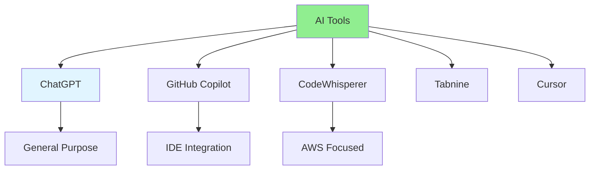

# 05.15 AI Tools Comparison / So sánh công cụ AI

## Table of Contents / Mục lục
1. [Introduction / Giới thiệu](#introduction--giới-thiệu)
2. [AI Tools Overview / Tổng quan công cụ AI](#ai-tools-overview--tổng-quan-công-cụ-ai)
3. [Comparison / So sánh](#comparison--so-sánh)
4. [Best Practices / Thực hành tốt nhất](#best-practices--thực-hành-tốt-nhất)
5. [Summary / Tóm tắt](#summary--tóm-tắt)

---

## Introduction / Giới thiệu

### Overview / Tổng quan

**English**: Different AI tools have different strengths. Learn to compare and choose the right AI tool for your needs.

**Vietnamese**: Các công cụ AI khác nhau có điểm mạnh khác nhau. Học cách so sánh và chọn công cụ AI phù hợp với nhu cầu.

### AI Tools Comparison / So sánh công cụ AI



---

## AI Tools Overview / Tổng quan công cụ AI

### Example 1: Tool Comparison Table / Ví dụ 1: Bảng so sánh công cụ

```markdown
# AI Coding Tools Comparison

| Tool | Type | Best For | Strengths | Limitations |
|------|------|----------|-----------|-------------|
| **ChatGPT** | Chat-based | General coding help, explanations | Versatile, good explanations | Not IDE-integrated, may be slower |
| **GitHub Copilot** | IDE plugin | Code completion, inline suggestions | Fast, context-aware | Subscription required |
| **Amazon CodeWhisperer** | IDE plugin | AWS development | AWS-focused, free tier | Less general-purpose |
| **Tabnine** | IDE plugin | Code completion | Privacy-focused, fast | Less conversational |
| **Cursor** | AI-powered IDE | Full development workflow | Integrated AI editor | Newer, smaller community |

## Use Cases

### ChatGPT
- Code explanations
- Learning concepts
- Debugging help
- Architecture discussions

### GitHub Copilot
- Code completion
- Function generation
- Test generation
- Quick snippets

### CodeWhisperer
- AWS services
- Cloud development
- Security scanning
- Code suggestions

### Tabnine
- Privacy-sensitive projects
- Fast autocomplete
- Team collaboration
- Code completion

### Cursor
- Full AI-powered development
- Code editing with AI
- Refactoring assistance
- Integrated workflow
```

---

## Best Practices / Thực hành tốt nhất

1. **Try multiple tools** - Find what works for you
2. **Use for right tasks** - Match tool to use case
3. **Combine tools** - Use different tools for different needs
4. **Stay updated** - Tools improve over time
5. **Consider cost** - Evaluate pricing vs value

---

## Summary / Tóm tắt

### Key Takeaways / Điểm chính

- **Different strengths**: Each tool has unique features
- **Choose wisely**: Match tool to your needs
- **Combine**: Use multiple tools
- **Stay updated**: Tools evolve
- **Cost consideration**: Evaluate pricing

### Next Steps / Bước tiếp theo

- ✅ Complete Group 05: AI-Assisted Coding
- Move to [Group 06: Database Analysis](../Group-06-Database-Analysis/) - Coming next

---

**Last Updated / Cập nhật lần cuối**: 2024


