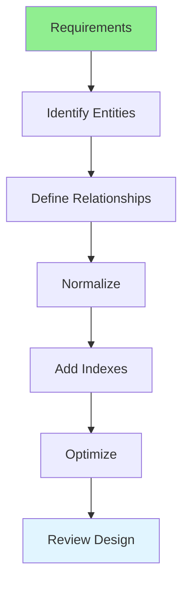

# 06.01 Database Design / Thiết kế Database

## Table of Contents / Mục lục
1. [Introduction / Giới thiệu](#introduction--giới-thiệu)
2. [Database Design Process / Quy trình thiết kế Database](#database-design-process--quy-trình-thiết-kế-database)
3. [Design Principles / Nguyên tắc thiết kế](#design-principles--nguyên-tắc-thiết-kế)
4. [Best Practices / Thực hành tốt nhất](#best-practices--thực-hành-tốt-nhất)
5. [Summary / Tóm tắt](#summary--tóm-tắt)

---

## Introduction / Giới thiệu

### Overview / Tổng quan

**English**: Database design is crucial for application performance and data integrity. Learn to design efficient, normalized databases that meet application requirements.

**Vietnamese**: Thiết kế database rất quan trọng cho hiệu suất ứng dụng và tính toàn vẹn dữ liệu. Học cách thiết kế database hiệu quả, chuẩn hóa đáp ứng yêu cầu ứng dụng.

### Database Design Process / Quy trình thiết kế Database



---

## Database Design Process / Quy trình thiết kế Database

### Example 1: Entity Identification / Ví dụ 1: Xác định thực thể

```sql
-- E-commerce database design / Thiết kế database thương mại điện tử

-- Users table / Bảng users
CREATE TABLE users (
  id UUID PRIMARY KEY DEFAULT gen_random_uuid(),
  email VARCHAR(255) UNIQUE NOT NULL,
  password_hash VARCHAR(255) NOT NULL,
  first_name VARCHAR(100),
  last_name VARCHAR(100),
  created_at TIMESTAMP DEFAULT CURRENT_TIMESTAMP,
  updated_at TIMESTAMP DEFAULT CURRENT_TIMESTAMP
);

-- Products table / Bảng products
CREATE TABLE products (
  id UUID PRIMARY KEY DEFAULT gen_random_uuid(),
  name VARCHAR(255) NOT NULL,
  description TEXT,
  price DECIMAL(10, 2) NOT NULL,
  stock_quantity INTEGER DEFAULT 0,
  category_id UUID REFERENCES categories(id),
  created_at TIMESTAMP DEFAULT CURRENT_TIMESTAMP
);

-- Orders table / Bảng orders
CREATE TABLE orders (
  id UUID PRIMARY KEY DEFAULT gen_random_uuid(),
  user_id UUID REFERENCES users(id),
  total_amount DECIMAL(10, 2) NOT NULL,
  status VARCHAR(50) DEFAULT 'pending',
  created_at TIMESTAMP DEFAULT CURRENT_TIMESTAMP
);

-- Order items table / Bảng order items
CREATE TABLE order_items (
  id UUID PRIMARY KEY DEFAULT gen_random_uuid(),
  order_id UUID REFERENCES orders(id),
  product_id UUID REFERENCES products(id),
  quantity INTEGER NOT NULL,
  price DECIMAL(10, 2) NOT NULL,
  PRIMARY KEY (id)
);
```

---

## Design Principles / Nguyên tắc thiết kế

### Example 2: Design Best Practices / Ví dụ 2: Thực hành tốt nhất thiết kế

```sql
-- Design principles / Nguyên tắc thiết kế

-- 1. Use appropriate data types / Sử dụng kiểu dữ liệu phù hợp
CREATE TABLE users (
  id UUID PRIMARY KEY,  -- UUID for distributed systems
  age INTEGER,          -- INTEGER, not VARCHAR
  email VARCHAR(255),   -- VARCHAR with appropriate length
  created_at TIMESTAMP  -- TIMESTAMP for dates
);

-- 2. Add indexes for frequently queried columns / Thêm index cho cột thường truy vấn
CREATE INDEX idx_users_email ON users(email);
CREATE INDEX idx_orders_user_id ON orders(user_id);
CREATE INDEX idx_orders_created_at ON orders(created_at);

-- 3. Use foreign keys for referential integrity / Sử dụng foreign key cho tính toàn vẹn tham chiếu
ALTER TABLE orders 
ADD CONSTRAINT fk_orders_user 
FOREIGN KEY (user_id) REFERENCES users(id) ON DELETE CASCADE;

-- 4. Add constraints / Thêm ràng buộc
ALTER TABLE products 
ADD CONSTRAINT check_price_positive 
CHECK (price > 0);

ALTER TABLE users 
ADD CONSTRAINT check_email_format 
CHECK (email ~* '^[A-Za-z0-9._%+-]+@[A-Za-z0-9.-]+\.[A-Z|a-z]{2,}$');
```

---

## Best Practices / Thực hành tốt nhất

1. **Normalize properly** - Follow 3NF for most cases
2. **Use appropriate types** - Choose right data types
3. **Add indexes** - Index frequently queried columns
4. **Foreign keys** - Maintain referential integrity
5. **Constraints** - Add data validation constraints

---

## Summary / Tóm tắt

### Key Takeaways / Điểm chính

- **Entity identification**: Identify all entities and attributes
- **Relationships**: Define relationships between entities
- **Normalization**: Normalize to reduce redundancy
- **Indexes**: Add indexes for performance
- **Constraints**: Use constraints for data integrity

### Next Steps / Bước tiếp theo

- [06.02 Database Analysis](./06.02_Database_Analysis.md) - Next: Database Analysis

---

**Last Updated / Cập nhật lần cuối**: 2024


