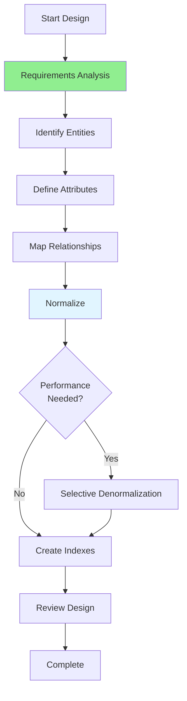

# 06.01 Database Design / Thiết kế cơ sở dữ liệu

## Table of Contents / Mục lục
1. [Introduction / Giới thiệu](#introduction--giới-thiệu)
2. [Design Process / Quy trình thiết kế](#design-process--quy-trình-thiết-kế)
3. [Entity Identification / Xác định thực thể](#entity-identification--xác-định-thực-thể)
4. [Relationship Mapping / Ánh xạ quan hệ](#relationship-mapping--ánh-xạ-quan-hệ)
5. [Normalization Decisions / Quyết định chuẩn hóa](#normalization-decisions--quyết-định-chuẩn-hóa)
6. [Best Practices / Thực hành tốt nhất](#best-practices--thực-hành-tốt-nhất)
7. [Summary / Tóm tắt](#summary--tóm-tắt)

---

## Introduction / Giới thiệu

### Overview / Tổng quan

**English**: Database design is the foundation of a well-functioning application. A good design ensures data integrity, performance, and scalability.

**Vietnamese**: Thiết kế database là nền tảng của ứng dụng hoạt động tốt. Thiết kế tốt đảm bảo tính toàn vẹn dữ liệu, hiệu năng và khả năng mở rộng.

### Database Design Process / Quy trình thiết kế database



---

## Design Process / Quy trình thiết kế

### Example 1: Design Steps / Ví dụ 1: Các bước thiết kế

```typescript
interface DatabaseDesign {
  requirements: {
    functional: string[];
    nonFunctional: {
      performance: string;
      scalability: string;
      security: string;
    };
  };
  entities: Entity[];
  relationships: Relationship[];
  normalization: '1NF' | '2NF' | '3NF' | 'BCNF';
  denormalization?: {
    table: string;
    reason: string;
  }[];
}

interface Entity {
  name: string;
  attributes: Attribute[];
  primaryKey: string;
  indexes: string[];
}

interface Attribute {
  name: string;
  type: string;
  constraints: string[]; // NOT NULL, UNIQUE, etc.
}

// Example: E-commerce database design / Ví dụ: Thiết kế database thương mại điện tử
const ecommerceDesign: DatabaseDesign = {
  requirements: {
    functional: [
      'Store user information',
      'Manage product catalog',
      'Process orders',
      'Track inventory'
    ],
    nonFunctional: {
      performance: 'Support 10,000 concurrent users',
      scalability: 'Handle 1M+ products',
      security: 'Encrypt sensitive data'
    }
  },
  entities: [
    {
      name: 'users',
      attributes: [
        { name: 'id', type: 'UUID', constraints: ['PRIMARY KEY', 'NOT NULL'] },
        { name: 'email', type: 'VARCHAR(255)', constraints: ['UNIQUE', 'NOT NULL'] },
        { name: 'name', type: 'VARCHAR(255)', constraints: ['NOT NULL'] },
        { name: 'password_hash', type: 'VARCHAR(255)', constraints: ['NOT NULL'] },
        { name: 'created_at', type: 'TIMESTAMP', constraints: ['NOT NULL'] }
      ],
      primaryKey: 'id',
      indexes: ['email']
    },
    {
      name: 'products',
      attributes: [
        { name: 'id', type: 'UUID', constraints: ['PRIMARY KEY'] },
        { name: 'name', type: 'VARCHAR(255)', constraints: ['NOT NULL'] },
        { name: 'price', type: 'DECIMAL(10,2)', constraints: ['NOT NULL'] },
        { name: 'stock', type: 'INTEGER', constraints: ['NOT NULL', 'DEFAULT 0'] }
      ],
      primaryKey: 'id',
      indexes: ['name']
    }
  ],
  relationships: [
    {
      from: 'orders',
      to: 'users',
      type: 'Many-to-One',
      foreignKey: 'user_id'
    }
  ],
  normalization: '3NF'
};
```

---

## Entity Identification / Xác định thực thể

### Example 2: Identifying Entities / Ví dụ 2: Xác định thực thể

```typescript
// Entity identification process / Quy trình xác định thực thể
function identifyEntities(requirements: string[]): Entity[] {
  // Analyze requirements to extract entities / Phân tích yêu cầu để trích xuất thực thể
  const entities: Entity[] = [];
  
  // Example: From "Users can place orders" / Ví dụ: Từ "Users có thể đặt hàng"
  // Extract: User, Order entities / Trích xuất: Thực thể User, Order
  
  return entities;
}

// Example entities / Ví dụ thực thể
const entities = [
  {
    name: 'User',
    description: 'System users who can place orders',
    attributes: ['id', 'email', 'name', 'password']
  },
  {
    name: 'Product',
    description: 'Items available for purchase',
    attributes: ['id', 'name', 'price', 'description', 'stock']
  },
  {
    name: 'Order',
    description: 'User purchase orders',
    attributes: ['id', 'user_id', 'total', 'status', 'created_at']
  }
];
```

---

## Best Practices / Thực hành tốt nhất

1. **Start normalized** - Begin with 3NF
2. **Denormalize selectively** - Only when performance needed
3. **Plan for growth** - Consider scalability
4. **Document design** - ER diagrams and notes
5. **Review regularly** - Refine as needed

---

## Summary / Tóm tắt

### Key Takeaways / Điểm chính

- **Process**: Requirements → Entities → Relationships → Normalize
- **Start normalized**: Begin with 3NF
- **Denormalize**: Only when needed for performance
- **Document**: Keep design documented

### Next Steps / Bước tiếp theo

- [06.02 Database Analysis](./06.02_Database_Analysis.md) - Next: Database Analysis

---

**Last Updated / Cập nhật lần cuối**: 2024

