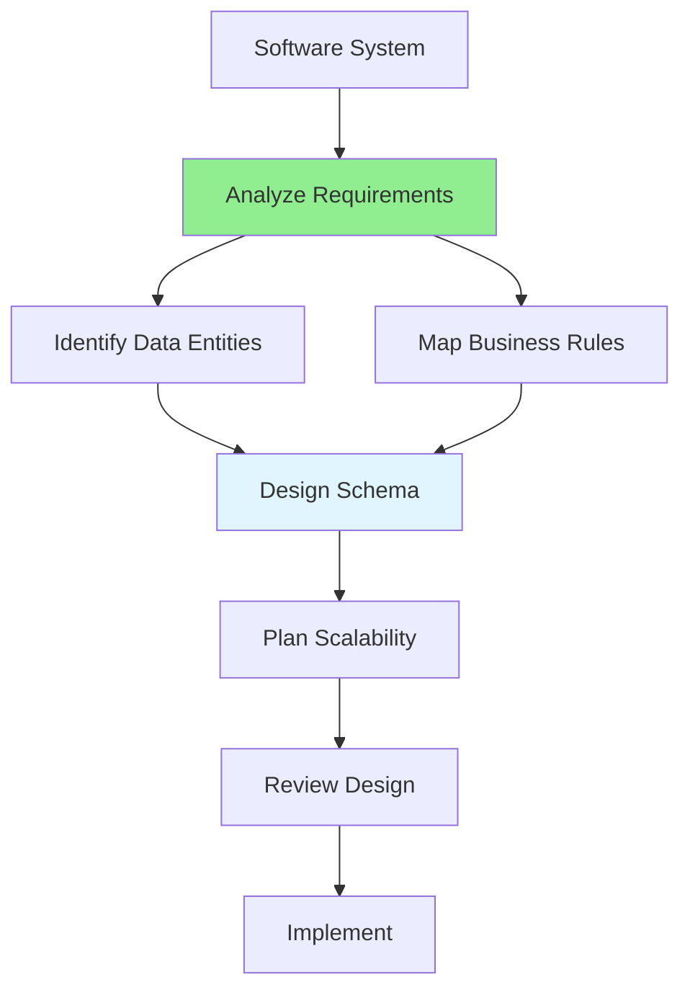

# 06.02 Database Analysis / Phân tích database cho hệ thống phần mềm

## Table of Contents / Mục lục
1. [Introduction / Giới thiệu](#introduction--giới-thiệu)
2. [Requirements Analysis / Phân tích yêu cầu](#requirements-analysis--phân-tích-yêu-cầu)
3. [Schema Design / Thiết kế schema](#schema-design--thiết-kế-schema)
4. [Scalability Planning / Lập kế hoạch mở rộng](#scalability-planning--lập-kế-hoạch-mở-rộng)
5. [Best Practices / Thực hành tốt nhất](#best-practices--thực-hành-tốt-nhất)
6. [Summary / Tóm tắt](#summary--tóm-tắt)

---

## Introduction / Giới thiệu

### Overview / Tổng quan

**English**: Analyzing database requirements for software systems involves identifying data entities, mapping business rules, and planning for scalability.

**Vietnamese**: Phân tích yêu cầu database cho hệ thống phần mềm bao gồm xác định thực thể dữ liệu, ánh xạ quy tắc nghiệp vụ và lập kế hoạch mở rộng.

### Analysis Process / Quy trình phân tích



---

## Requirements Analysis / Phân tích yêu cầu

### Example 1: System Analysis / Ví dụ 1: Phân tích hệ thống

```typescript
// E-commerce system analysis / Phân tích hệ thống thương mại điện tử
interface SystemAnalysis {
  systemType: string;
  dataEntities: DataEntity[];
  businessRules: BusinessRule[];
  scalability: ScalabilityPlan;
}

interface DataEntity {
  name: string;
  purpose: string;
  estimatedSize: string; // e.g., "1M records" / ví dụ: "1M bản ghi"
  growthRate: string; // e.g., "10% monthly" / ví dụ: "10% mỗi tháng"
}

const ecommerceAnalysis: SystemAnalysis = {
  systemType: 'E-commerce Platform',
  dataEntities: [
    {
      name: 'users',
      purpose: 'Store customer information',
      estimatedSize: '100K users',
      growthRate: '5% monthly'
    },
    {
      name: 'products',
      purpose: 'Product catalog',
      estimatedSize: '50K products',
      growthRate: '2% monthly'
    },
    {
      name: 'orders',
      purpose: 'Order records',
      estimatedSize: '1M orders',
      growthRate: '15% monthly'
    }
  ],
  businessRules: [
    {
      rule: 'One user can have many orders',
      implementation: 'Foreign key: orders.user_id → users.id'
    },
    {
      rule: 'Order total must match sum of order items',
      implementation: 'Database constraint or application logic'
    }
  ],
  scalability: {
    current: '10K users, 1K products',
    target: '1M users, 100K products',
    strategy: 'Horizontal scaling with read replicas'
  }
};
```

---

## Schema Design / Thiết kế schema

### Example 2: Schema Definition / Ví dụ 2: Định nghĩa schema

```sql
-- E-commerce schema example / Ví dụ schema thương mại điện tử
CREATE TABLE users (
  id UUID PRIMARY KEY DEFAULT gen_random_uuid(),
  email VARCHAR(255) UNIQUE NOT NULL,
  name VARCHAR(255) NOT NULL,
  password_hash VARCHAR(255) NOT NULL,
  created_at TIMESTAMP DEFAULT CURRENT_TIMESTAMP,
  updated_at TIMESTAMP DEFAULT CURRENT_TIMESTAMP
);

CREATE TABLE products (
  id UUID PRIMARY KEY DEFAULT gen_random_uuid(),
  name VARCHAR(255) NOT NULL,
  description TEXT,
  price DECIMAL(10, 2) NOT NULL,
  stock INTEGER DEFAULT 0,
  category_id UUID REFERENCES categories(id),
  created_at TIMESTAMP DEFAULT CURRENT_TIMESTAMP
);

CREATE TABLE orders (
  id UUID PRIMARY KEY DEFAULT gen_random_uuid(),
  user_id UUID NOT NULL REFERENCES users(id),
  total DECIMAL(10, 2) NOT NULL,
  status VARCHAR(50) NOT NULL,
  created_at TIMESTAMP DEFAULT CURRENT_TIMESTAMP
);

-- Indexes for performance / Index cho hiệu năng
CREATE INDEX idx_orders_user_id ON orders(user_id);
CREATE INDEX idx_orders_created_at ON orders(created_at);
CREATE INDEX idx_products_category_id ON products(category_id);
```

---

## Best Practices / Thực hành tốt nhất

1. **Think ahead** - Plan for future growth
2. **Map business rules** - Translate to database constraints
3. **Design for scale** - Consider partitioning, sharding
4. **Document decisions** - Record design rationale
5. **Review regularly** - Refine as system evolves

---

## Summary / Tóm tắt

### Key Takeaways / Điểm chính

- **Analyze**: Identify entities and business rules
- **Design**: Create scalable schema
- **Plan**: Consider future growth
- **Document**: Record design decisions

### Next Steps / Bước tiếp theo

- [06.03 Database Normalization](./06.03_Database_Normalization.md) - Next: Normalization

---

**Last Updated / Cập nhật lần cuối**: 2024

