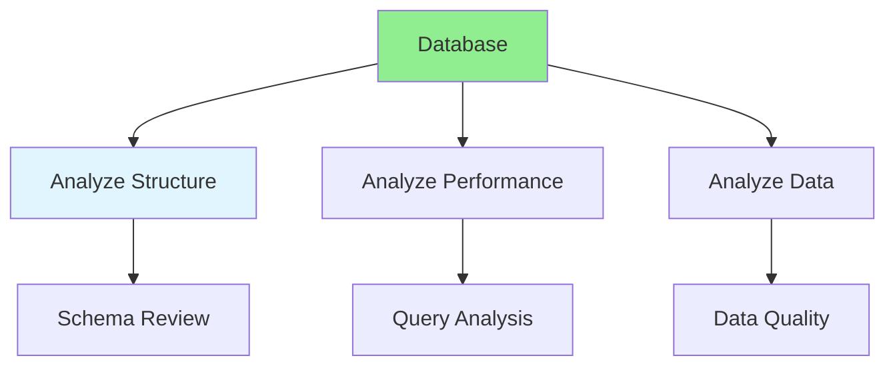

# 06.02 Database Analysis / Phân tích Database

## Table of Contents / Mục lục
1. [Introduction / Giới thiệu](#introduction--giới-thiệu)
2. [Analysis Process / Quy trình phân tích](#analysis-process--quy-trình-phân-tích)
3. [Analysis Techniques / Kỹ thuật phân tích](#analysis-techniques--kỹ-thuật-phân-tích)
4. [Best Practices / Thực hành tốt nhất](#best-practices--thực-hành-tốt-nhất)
5. [Summary / Tóm tắt](#summary--tóm-tắt)

---

## Introduction / Giới thiệu

### Overview / Tổng quan

**English**: Database analysis examines database structure, performance, and data quality. Learn to analyze existing databases for optimization opportunities.

**Vietnamese**: Phân tích database kiểm tra cấu trúc, hiệu suất và chất lượng dữ liệu. Học cách phân tích database hiện có để tìm cơ hội tối ưu.

### Database Analysis Process / Quy trình phân tích Database



---

## Analysis Process / Quy trình phân tích

### Example 1: Schema Analysis / Ví dụ 1: Phân tích schema

```sql
-- Analyze database schema / Phân tích schema database

-- List all tables / Liệt kê tất cả bảng
SELECT table_name, table_type 
FROM information_schema.tables 
WHERE table_schema = 'public';

-- Analyze table structure / Phân tích cấu trúc bảng
SELECT 
  column_name,
  data_type,
  is_nullable,
  column_default
FROM information_schema.columns
WHERE table_name = 'users'
ORDER BY ordinal_position;

-- Check indexes / Kiểm tra index
SELECT 
  indexname,
  indexdef
FROM pg_indexes
WHERE tablename = 'users';

-- Check foreign keys / Kiểm tra foreign key
SELECT
  tc.table_name,
  kcu.column_name,
  ccu.table_name AS foreign_table_name,
  ccu.column_name AS foreign_column_name
FROM information_schema.table_constraints AS tc
JOIN information_schema.key_column_usage AS kcu
  ON tc.constraint_name = kcu.constraint_name
JOIN information_schema.constraint_column_usage AS ccu
  ON ccu.constraint_name = tc.constraint_name
WHERE tc.constraint_type = 'FOREIGN KEY';
```

### Example 2: Performance Analysis / Ví dụ 2: Phân tích hiệu suất

```sql
-- Analyze query performance / Phân tích hiệu suất truy vấn

-- Explain query plan / Giải thích kế hoạch truy vấn
EXPLAIN ANALYZE
SELECT u.*, o.total_amount
FROM users u
JOIN orders o ON u.id = o.user_id
WHERE u.email = 'user@example.com';

-- Find slow queries / Tìm truy vấn chậm
SELECT 
  query,
  calls,
  total_time,
  mean_time,
  max_time
FROM pg_stat_statements
ORDER BY mean_time DESC
LIMIT 10;

-- Check table sizes / Kiểm tra kích thước bảng
SELECT 
  schemaname,
  tablename,
  pg_size_pretty(pg_total_relation_size(schemaname||'.'||tablename)) AS size
FROM pg_tables
WHERE schemaname = 'public'
ORDER BY pg_total_relation_size(schemaname||'.'||tablename) DESC;
```

---

## Best Practices / Thực hành tốt nhất

1. **Regular analysis** - Analyze database periodically
2. **Monitor performance** - Track query performance
3. **Review schema** - Check for optimization opportunities
4. **Data quality** - Verify data integrity
5. **Document findings** - Record analysis results

---

## Summary / Tóm tắt

### Key Takeaways / Điểm chính

- **Schema analysis**: Review table structure and relationships
- **Performance analysis**: Identify slow queries
- **Data quality**: Check data integrity
- **Regular reviews**: Analyze periodically
- **Documentation**: Record findings

### Next Steps / Bước tiếp theo

- [06.03 Database Normalization](./06.03_Database_Normalization.md) - Next: Normalization

---

**Last Updated / Cập nhật lần cuối**: 2024

