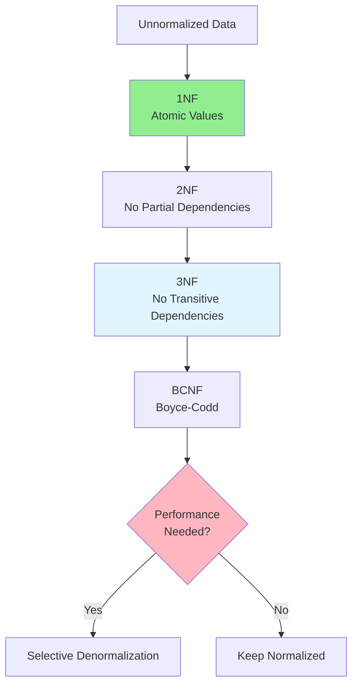

# 06.03 Database Normalization / Chuẩn hóa Database - 1NF, 2NF, 3NF, BCNF

## Table of Contents / Mục lục
1. [Introduction / Giới thiệu](#introduction--giới-thiệu)
2. [First Normal Form (1NF) / Dạng chuẩn 1](#first-normal-form-1nf--dạng-chuẩn-1)
3. [Second Normal Form (2NF) / Dạng chuẩn 2](#second-normal-form-2nf--dạng-chuẩn-2)
4. [Third Normal Form (3NF) / Dạng chuẩn 3](#third-normal-form-3nf--dạng-chuẩn-3)
5. [BCNF / Dạng chuẩn Boyce-Codd](#bcnf--dạng-chuẩn-boyce-codd)
6. [When to Denormalize / Khi nào denormalize](#when-to-denormalize--khi-nào-denormalize)
7. [Best Practices / Thực hành tốt nhất](#best-practices--thực-hành-tốt-nhất)
8. [Summary / Tóm tắt](#summary--tóm-tắt)

---

## Introduction / Giới thiệu

### Overview / Tổng quan

**English**: Database normalization reduces redundancy and improves data integrity. Understanding normalization forms helps design efficient databases.

**Vietnamese**: Chuẩn hóa database giảm dư thừa và cải thiện tính toàn vẹn dữ liệu. Hiểu các dạng chuẩn hóa giúp thiết kế database hiệu quả.

### Normalization Levels / Các mức chuẩn hóa



---

## First Normal Form (1NF) / Dạng chuẩn 1

### Example 1: 1NF Example / Ví dụ 1: Ví dụ 1NF

```sql
-- ❌ Not 1NF: Multiple values in one column / Không 1NF: Nhiều giá trị trong một cột
CREATE TABLE orders (
  id INT PRIMARY KEY,
  customer_name VARCHAR(255),
  products VARCHAR(500) -- "Product1, Product2, Product3" / "Sản phẩm1, Sản phẩm2, Sản phẩm3"
);

-- ✅ 1NF: Atomic values / 1NF: Giá trị nguyên tử
CREATE TABLE orders (
  id INT PRIMARY KEY,
  customer_name VARCHAR(255),
  order_date DATE
);

CREATE TABLE order_items (
  id INT PRIMARY KEY,
  order_id INT REFERENCES orders(id),
  product_name VARCHAR(255),
  quantity INT
);
```

---

## Second Normal Form (2NF) / Dạng chuẩn 2

### Example 2: 2NF Example / Ví dụ 2: Ví dụ 2NF

```sql
-- ❌ Not 2NF: Partial dependency / Không 2NF: Phụ thuộc một phần
CREATE TABLE order_items (
  order_id INT,
  product_id INT,
  product_name VARCHAR(255), -- Depends only on product_id / Chỉ phụ thuộc product_id
  quantity INT,
  price DECIMAL(10,2),
  PRIMARY KEY (order_id, product_id)
);

-- ✅ 2NF: No partial dependencies / 2NF: Không có phụ thuộc một phần
CREATE TABLE order_items (
  order_id INT,
  product_id INT,
  quantity INT,
  price DECIMAL(10,2),
  PRIMARY KEY (order_id, product_id),
  FOREIGN KEY (product_id) REFERENCES products(id)
);

CREATE TABLE products (
  id INT PRIMARY KEY,
  name VARCHAR(255),
  description TEXT
);
```

---

## Third Normal Form (3NF) / Dạng chuẩn 3

### Example 3: 3NF Example / Ví dụ 3: Ví dụ 3NF

```sql
-- ❌ Not 3NF: Transitive dependency / Không 3NF: Phụ thuộc bắc cầu
CREATE TABLE employees (
  id INT PRIMARY KEY,
  name VARCHAR(255),
  department_id INT,
  department_name VARCHAR(255), -- Depends on department_id / Phụ thuộc department_id
  department_location VARCHAR(255) -- Depends on department_id / Phụ thuộc department_id
);

-- ✅ 3NF: No transitive dependencies / 3NF: Không có phụ thuộc bắc cầu
CREATE TABLE employees (
  id INT PRIMARY KEY,
  name VARCHAR(255),
  department_id INT,
  FOREIGN KEY (department_id) REFERENCES departments(id)
);

CREATE TABLE departments (
  id INT PRIMARY KEY,
  name VARCHAR(255),
  location VARCHAR(255)
);
```

---

## When to Denormalize / Khi nào denormalize

### Example 4: Denormalization Decision / Ví dụ 4: Quyết định denormalize

```sql
-- Normalized (3NF) / Chuẩn hóa (3NF)
CREATE TABLE orders (
  id INT PRIMARY KEY,
  user_id INT,
  total DECIMAL(10,2)
);

CREATE TABLE users (
  id INT PRIMARY KEY,
  name VARCHAR(255),
  email VARCHAR(255)
);

-- Denormalized for performance / Denormalize cho hiệu năng
CREATE TABLE orders (
  id INT PRIMARY KEY,
  user_id INT,
  user_name VARCHAR(255), -- Denormalized / Denormalize
  user_email VARCHAR(255), -- Denormalized / Denormalize
  total DECIMAL(10,2)
);

-- Reason: Frequently accessed together, read-heavy workload
-- Lý do: Thường truy cập cùng nhau, tải đọc nhiều
```

---

## Best Practices / Thực hành tốt nhất

1. **Start with 3NF** - Normalize first
2. **Denormalize selectively** - Only when performance needed
3. **Measure impact** - Profile before/after
4. **Document decisions** - Record why denormalized
5. **Maintain consistency** - Update denormalized data

---

## Summary / Tóm tắt

### Key Takeaways / Điểm chính

- **1NF**: Atomic values
- **2NF**: No partial dependencies
- **3NF**: No transitive dependencies
- **BCNF**: Stronger than 3NF
- **Denormalize**: When performance requires it

### Next Steps / Bước tiếp theo

- [06.04 ER Diagrams](./06.04_ER_Diagrams.md) - Next: ER Diagrams

---

**Last Updated / Cập nhật lần cuối**: 2024

