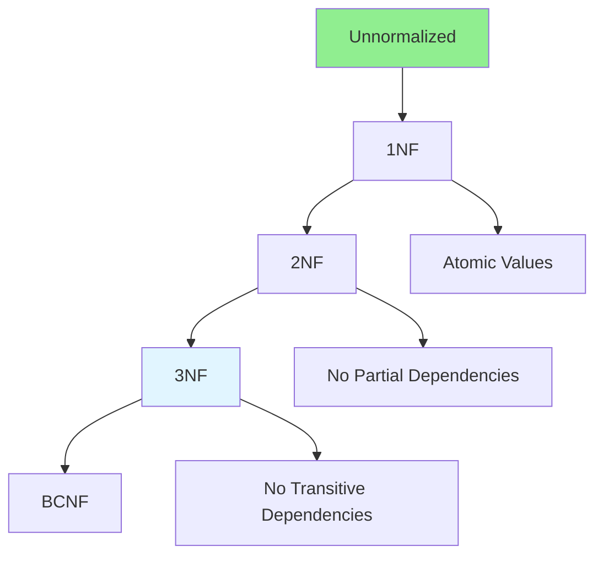

# 06.03 Database Normalization / Chuẩn hóa Database

## Table of Contents / Mục lục
1. [Introduction / Giới thiệu](#introduction--giới-thiệu)
2. [Normalization Process / Quy trình chuẩn hóa](#normalization-process--quy-trình-chuẩn-hóa)
3. [Normal Forms / Dạng chuẩn](#normal-forms--dạng-chuẩn)
4. [Best Practices / Thực hành tốt nhất](#best-practices--thực-hành-tốt-nhất)
5. [Summary / Tóm tắt](#summary--tóm-tắt)

---

## Introduction / Giới thiệu

### Overview / Tổng quan

**English**: Database normalization reduces data redundancy and improves data integrity. Learn normalization techniques from 1NF to 3NF and when to denormalize.

**Vietnamese**: Chuẩn hóa database giảm dư thừa dữ liệu và cải thiện tính toàn vẹn dữ liệu. Học kỹ thuật chuẩn hóa từ 1NF đến 3NF và khi nào nên denormalize.

### Normalization Process / Quy trình chuẩn hóa



---

## Normalization Process / Quy trình chuẩn hóa

### Example 1: Normalization Example / Ví dụ 1: Ví dụ chuẩn hóa

```sql
-- Before normalization / Trước chuẩn hóa
CREATE TABLE orders (
  order_id INT,
  customer_name VARCHAR(100),
  customer_email VARCHAR(100),
  product_name VARCHAR(100),
  product_price DECIMAL(10,2),
  quantity INT,
  order_date DATE
);

-- After 1NF: Atomic values / Sau 1NF: Giá trị nguyên tử
-- Already atomic / Đã nguyên tử

-- After 2NF: Remove partial dependencies / Sau 2NF: Loại bỏ phụ thuộc một phần
CREATE TABLE orders (
  order_id INT PRIMARY KEY,
  customer_id INT,
  order_date DATE
);

CREATE TABLE order_items (
  order_id INT,
  product_id INT,
  quantity INT,
  price DECIMAL(10,2),
  PRIMARY KEY (order_id, product_id),
  FOREIGN KEY (order_id) REFERENCES orders(order_id),
  FOREIGN KEY (product_id) REFERENCES products(product_id)
);

-- After 3NF: Remove transitive dependencies / Sau 3NF: Loại bỏ phụ thuộc bắc cầu
CREATE TABLE customers (
  customer_id INT PRIMARY KEY,
  name VARCHAR(100),
  email VARCHAR(100)
);

CREATE TABLE products (
  product_id INT PRIMARY KEY,
  name VARCHAR(100),
  price DECIMAL(10,2)
);

CREATE TABLE orders (
  order_id INT PRIMARY KEY,
  customer_id INT,
  order_date DATE,
  FOREIGN KEY (customer_id) REFERENCES customers(customer_id)
);
```

---

## Best Practices / Thực hành tốt nhất

1. **Normalize to 3NF** - Usually sufficient for most cases
2. **Consider denormalization** - For performance when needed
3. **Balance** - Normalization vs performance trade-off
4. **Document decisions** - Record normalization choices
5. **Review regularly** - Revisit design as needs change

---

## Summary / Tóm tắt

### Key Takeaways / Điểm chính

- **1NF**: Atomic values, no repeating groups
- **2NF**: 1NF + no partial dependencies
- **3NF**: 2NF + no transitive dependencies
- **Balance**: Normalization vs performance
- **Denormalize**: When performance requires it

### Next Steps / Bước tiếp theo

- [06.04 ER Diagrams](./06.04_ER_Diagrams.md) - Next: ER Diagrams

---

**Last Updated / Cập nhật lần cuối**: 2024


