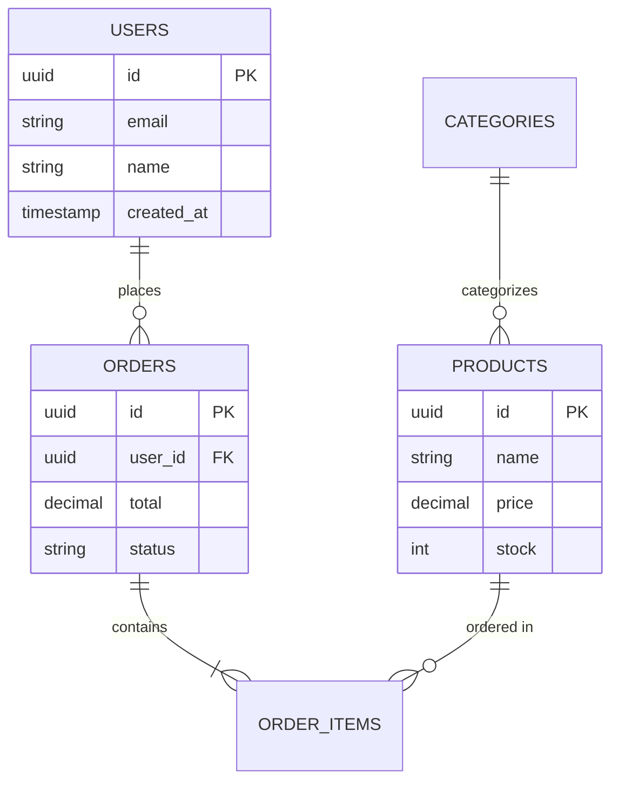

# 06.04 ER Diagrams / Sơ đồ thực thể-quan hệ

## Table of Contents / Mục lục
1. [Introduction / Giới thiệu](#introduction--giới-thiệu)
2. [ER Diagram Components / Thành phần ER Diagram](#er-diagram-components--thành-phần-er-diagram)
3. [Relationship Types / Loại quan hệ](#relationship-types--loại-quan-hệ)
4. [Creating ER Diagrams / Tạo ER Diagram](#creating-er-diagrams--tạo-er-diagram)
5. [Best Practices / Thực hành tốt nhất](#best-practices--thực-hành-tốt-nhất)
6. [Summary / Tóm tắt](#summary--tóm-tắt)

---

## Introduction / Giới thiệu

### Overview / Tổng quan

**English**: ER (Entity-Relationship) diagrams visualize database structure and relationships. They help understand and communicate database design.

**Vietnamese**: Sơ đồ ER (Entity-Relationship) trực quan hóa cấu trúc và quan hệ database. Chúng giúp hiểu và giao tiếp thiết kế database.

### ER Diagram Structure / Cấu trúc ER Diagram



---

## ER Diagram Components / Thành phần ER Diagram

### Example 1: Components / Ví dụ 1: Thành phần

```typescript
interface ERDiagram {
  entities: Entity[];
  relationships: Relationship[];
  attributes: Attribute[];
}

interface Entity {
  name: string;
  attributes: Attribute[];
  primaryKey: string;
}

interface Relationship {
  from: string; // Entity name / Tên thực thể
  to: string;
  type: 'One-to-One' | 'One-to-Many' | 'Many-to-Many';
  cardinality: string; // e.g., "1:N" / ví dụ: "1:N"
}

// Example / Ví dụ
const erDiagram: ERDiagram = {
  entities: [
    {
      name: 'User',
      attributes: ['id', 'email', 'name'],
      primaryKey: 'id'
    },
    {
      name: 'Order',
      attributes: ['id', 'user_id', 'total'],
      primaryKey: 'id'
    }
  ],
  relationships: [
    {
      from: 'User',
      to: 'Order',
      type: 'One-to-Many',
      cardinality: '1:N'
    }
  ]
};
```

---

## Relationship Types / Loại quan hệ

### Example 2: Relationship Examples / Ví dụ 2: Ví dụ quan hệ

```sql
-- One-to-Many: User to Orders / Một-nhiều: User đến Orders
CREATE TABLE users (
  id UUID PRIMARY KEY
);

CREATE TABLE orders (
  id UUID PRIMARY KEY,
  user_id UUID REFERENCES users(id) -- Many orders per user / Nhiều đơn hàng mỗi user
);

-- Many-to-Many: Products to Categories / Nhiều-nhiều: Products đến Categories
CREATE TABLE products (
  id UUID PRIMARY KEY
);

CREATE TABLE categories (
  id UUID PRIMARY KEY
);

CREATE TABLE product_categories (
  product_id UUID REFERENCES products(id),
  category_id UUID REFERENCES categories(id),
  PRIMARY KEY (product_id, category_id)
);
```

---

## Best Practices / Thực hành tốt nhất

1. **Use standard notation** - Consistent symbols
2. **Show all relationships** - Complete picture
3. **Include key attributes** - Important fields
4. **Keep it readable** - Not too cluttered
5. **Update regularly** - Keep in sync with schema

---

## Summary / Tóm tắt

### Key Takeaways / Điểm chính

- **Entities**: Tables/collections
- **Relationships**: How entities connect
- **Attributes**: Fields/columns
- **Visualize**: Database structure clearly

### Next Steps / Bước tiếp theo

- [06.05 Index Optimization](./06.05_Index_Optimization.md) - Next: Index Optimization

---

**Last Updated / Cập nhật lần cuối**: 2024

