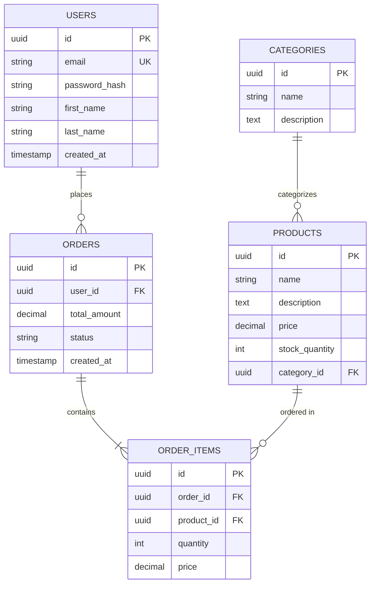

# 06.04 ER Diagrams / Sơ đồ ER

## Table of Contents / Mục lục
1. [Introduction / Giới thiệu](#introduction--giới-thiệu)
2. [ER Diagram Components / Thành phần sơ đồ ER](#er-diagram-components--thành-phần-sơ-đồ-er)
3. [Creating ER Diagrams / Tạo sơ đồ ER](#creating-er-diagrams--tạo-sơ-đồ-er)
4. [Best Practices / Thực hành tốt nhất](#best-practices--thực-hành-tốt-nhất)
5. [Summary / Tóm tắt](#summary--tóm-tắt)

---

## Introduction / Giới thiệu

### Overview / Tổng quan

**English**: ER (Entity-Relationship) diagrams visualize database structure. Learn to create ER diagrams to design and document database schemas.

**Vietnamese**: Sơ đồ ER (Entity-Relationship) trực quan hóa cấu trúc database. Học cách tạo sơ đồ ER để thiết kế và tài liệu hóa schema database.

### ER Diagram Example / Ví dụ sơ đồ ER



---

## ER Diagram Components / Thành phần sơ đồ ER

### Example 1: ER Diagram Elements / Ví dụ 1: Phần tử sơ đồ ER

```markdown
# ER Diagram Elements

## Entities (Entities)
- Represent tables / Đại diện cho bảng
- Shown as rectangles / Hiển thị dưới dạng hình chữ nhật
- Example: Users, Orders, Products

## Attributes (Thuộc tính)
- Represent columns / Đại diện cho cột
- Shown inside entity boxes / Hiển thị trong hộp entity
- Example: id, email, name

## Relationships (Quan hệ)
- Represent foreign keys / Đại diện cho foreign key
- Shown as lines connecting entities / Hiển thị dưới dạng đường nối entities
- Types: One-to-One, One-to-Many, Many-to-Many

## Cardinality (Bản số)
- One-to-One: 1:1
- One-to-Many: 1:N
- Many-to-Many: M:N
```

---

## Creating ER Diagrams / Tạo sơ đồ ER

### Example 2: ER Diagram Tools / Ví dụ 2: Công cụ sơ đồ ER

```markdown
# ER Diagram Tools

## Online Tools
- **dbdiagram.io**: Web-based, supports PostgreSQL, MySQL
- **draw.io**: Free, supports multiple formats
- **Lucidchart**: Professional, collaborative

## Code-based
- **Mermaid**: Markdown-based diagrams
- **PlantUML**: Text-based UML diagrams
- **Prisma**: Generates ER from schema

## Example: Mermaid ER Diagram
\`\`\`mermaid
erDiagram
    USER ||--o{ ORDER : places
    ORDER ||--|{ ORDER_ITEM : contains
\`\`\`
```

---

## Best Practices / Thực hành tốt nhất

1. **Start with entities** - Identify all entities first
2. **Define relationships** - Map relationships clearly
3. **Use standard notation** - Follow ER diagram conventions
4. **Keep updated** - Update diagrams when schema changes
5. **Document** - Add notes for complex relationships

---

## Summary / Tóm tắt

### Key Takeaways / Điểm chính

- **Entities**: Represent database tables
- **Attributes**: Represent table columns
- **Relationships**: Show how tables connect
- **Cardinality**: Defines relationship types
- **Tools**: Use appropriate diagramming tools

### Next Steps / Bước tiếp theo

- [06.05 Index Optimization](./06.05_Index_Optimization.md) - Next: Index Optimization

---

**Last Updated / Cập nhật lần cuối**: 2024


