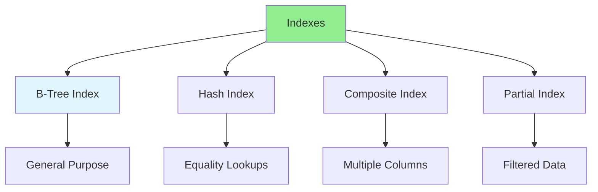

# 06.05 Index Optimization / Tối ưu Index

## Table of Contents / Mục lục
1. [Introduction / Giới thiệu](#introduction--giới-thiệu)
2. [Index Types / Loại Index](#index-types--loại-index)
3. [Index Optimization / Tối ưu Index](#index-optimization--tối-ưu-index)
4. [Best Practices / Thực hành tốt nhất](#best-practices--thực-hành-tốt-nhất)
5. [Summary / Tóm tắt](#summary--tóm-tắt)

---

## Introduction / Giới thiệu

### Overview / Tổng quan

**English**: Indexes speed up database queries. Learn to create, optimize, and maintain indexes for better query performance.

**Vietnamese**: Index tăng tốc truy vấn database. Học cách tạo, tối ưu và bảo trì index để có hiệu suất truy vấn tốt hơn.

### Index Types and Usage / Loại Index và cách sử dụng



---

## Index Types / Loại Index

### Example 1: Creating Indexes / Ví dụ 1: Tạo Index

```sql
-- Single column index / Index một cột
CREATE INDEX idx_users_email ON users(email);

-- Composite index / Index tổng hợp
CREATE INDEX idx_orders_user_date ON orders(user_id, created_at);

-- Unique index / Index duy nhất
CREATE UNIQUE INDEX idx_users_email_unique ON users(email);

-- Partial index / Index một phần
CREATE INDEX idx_active_users ON users(email) WHERE status = 'active';

-- Index on expression / Index trên biểu thức
CREATE INDEX idx_users_lower_email ON users(LOWER(email));
```

### Example 2: Index Analysis / Ví dụ 2: Phân tích Index

```sql
-- Check index usage / Kiểm tra sử dụng index
SELECT 
  schemaname,
  tablename,
  indexname,
  idx_scan as index_scans,
  idx_tup_read as tuples_read,
  idx_tup_fetch as tuples_fetched
FROM pg_stat_user_indexes
WHERE schemaname = 'public'
ORDER BY idx_scan DESC;

-- Find unused indexes / Tìm index không sử dụng
SELECT 
  schemaname,
  tablename,
  indexname
FROM pg_stat_user_indexes
WHERE idx_scan = 0
AND schemaname = 'public';

-- Analyze index size / Phân tích kích thước index
SELECT 
  indexname,
  pg_size_pretty(pg_relation_size(indexname::regclass)) AS size
FROM pg_indexes
WHERE schemaname = 'public'
ORDER BY pg_relation_size(indexname::regclass) DESC;
```

---

## Index Optimization / Tối ưu Index

### Example 3: Index Best Practices / Ví dụ 3: Thực hành tốt nhất Index

```sql
-- Index frequently queried columns / Index cột thường truy vấn
CREATE INDEX idx_orders_status ON orders(status);
CREATE INDEX idx_orders_created_at ON orders(created_at);

-- Index foreign keys / Index foreign key
CREATE INDEX idx_orders_user_id ON orders(user_id);

-- Composite index for multiple conditions / Index tổng hợp cho nhiều điều kiện
CREATE INDEX idx_orders_user_status ON orders(user_id, status);

-- Covering index / Index bao phủ (includes all needed columns)
CREATE INDEX idx_orders_covering ON orders(user_id) INCLUDE (total_amount, status);
```

---

## Best Practices / Thực hành tốt nhất

1. **Index foreign keys** - Speed up JOINs
2. **Index WHERE clauses** - Columns in WHERE conditions
3. **Index ORDER BY** - Columns used for sorting
4. **Monitor usage** - Remove unused indexes
5. **Balance** - Don't over-index (slows writes)

---

## Summary / Tóm tắt

### Key Takeaways / Điểm chính

- **Index types**: B-Tree, Hash, Composite, Partial
- **Create wisely**: Index frequently queried columns
- **Monitor**: Track index usage
- **Remove unused**: Drop indexes that aren't used
- **Balance**: Indexes speed reads but slow writes

### Next Steps / Bước tiếp theo

- [06.06 JOIN Optimization](./06.06_JOIN_Optimization.md) - Next: JOIN Optimization

---

**Last Updated / Cập nhật lần cuối**: 2024

