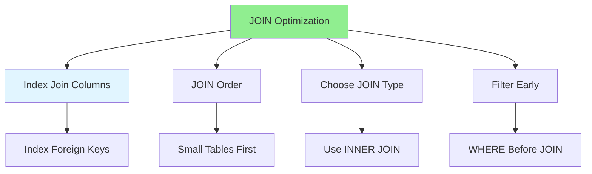

# 06.06 JOIN Optimization / Tối ưu JOIN

## Table of Contents / Mục lục
1. [Introduction / Giới thiệu](#introduction--giới-thiệu)
2. [JOIN Types / Loại JOIN](#join-types--loại-join)
3. [JOIN Optimization Strategies / Chiến lược tối ưu JOIN](#join-optimization-strategies--chiến-lược-tối-ưu-join)
4. [Best Practices / Thực hành tốt nhất](#best-practices--thực-hành-tốt-nhất)
5. [Summary / Tóm tắt](#summary--tóm-tắt)

---

## Introduction / Giới thiệu

### Overview / Tổng quan

**English**: JOIN operations combine data from multiple tables. Learn to optimize JOINs for better query performance.

**Vietnamese**: Thao tác JOIN kết hợp dữ liệu từ nhiều bảng. Học cách tối ưu JOIN để có hiệu suất truy vấn tốt hơn.

### JOIN Optimization Strategies / Chiến lược tối ưu JOIN



---

## JOIN Types / Loại JOIN

### Example 1: JOIN Examples / Ví dụ 1: Ví dụ JOIN

```sql
-- INNER JOIN / INNER JOIN
SELECT u.name, o.total_amount
FROM users u
INNER JOIN orders o ON u.id = o.user_id;

-- LEFT JOIN / LEFT JOIN
SELECT u.name, o.total_amount
FROM users u
LEFT JOIN orders o ON u.id = o.user_id;

-- RIGHT JOIN / RIGHT JOIN
SELECT u.name, o.total_amount
FROM users u
RIGHT JOIN orders o ON u.id = o.user_id;

-- Multiple JOINs / Nhiều JOIN
SELECT u.name, o.total_amount, p.name as product_name
FROM users u
INNER JOIN orders o ON u.id = o.user_id
INNER JOIN order_items oi ON o.id = oi.order_id
INNER JOIN products p ON oi.product_id = p.id;
```

### Example 2: JOIN Optimization / Ví dụ 2: Tối ưu JOIN

```sql
-- Optimized JOIN with indexes / JOIN tối ưu với index
-- Ensure foreign keys are indexed / Đảm bảo foreign key được index
CREATE INDEX idx_orders_user_id ON orders(user_id);
CREATE INDEX idx_order_items_order_id ON order_items(order_id);
CREATE INDEX idx_order_items_product_id ON order_items(product_id);

-- Filter before JOIN / Lọc trước JOIN
SELECT u.name, o.total_amount
FROM users u
INNER JOIN orders o ON u.id = o.user_id
WHERE u.status = 'active'  -- Filter early / Lọc sớm
  AND o.created_at > '2024-01-01';

-- Use appropriate JOIN type / Sử dụng loại JOIN phù hợp
-- Use INNER JOIN when possible / Sử dụng INNER JOIN khi có thể
SELECT u.name, o.total_amount
FROM users u
INNER JOIN orders o ON u.id = o.user_id;  -- Faster than LEFT JOIN
```

---

## Best Practices / Thực hành tốt nhất

1. **Index join columns** - Index foreign keys
2. **Filter early** - Use WHERE before JOIN
3. **Choose right JOIN** - Use INNER when possible
4. **JOIN order** - Start with smallest table
5. **Limit results** - Use LIMIT when appropriate

---

## Summary / Tóm tắt

### Key Takeaways / Điểm chính

- **JOIN types**: INNER, LEFT, RIGHT, FULL
- **Index join columns**: Index foreign keys
- **Filter early**: WHERE before JOIN
- **JOIN order**: Smallest table first
- **Choose wisely**: Use appropriate JOIN type

### Next Steps / Bước tiếp theo

- [06.07 Subquery vs CTE](./06.07_Subquery_vs_CTE.md) - Next: Subquery vs CTE

---

**Last Updated / Cập nhật lần cuối**: 2024

