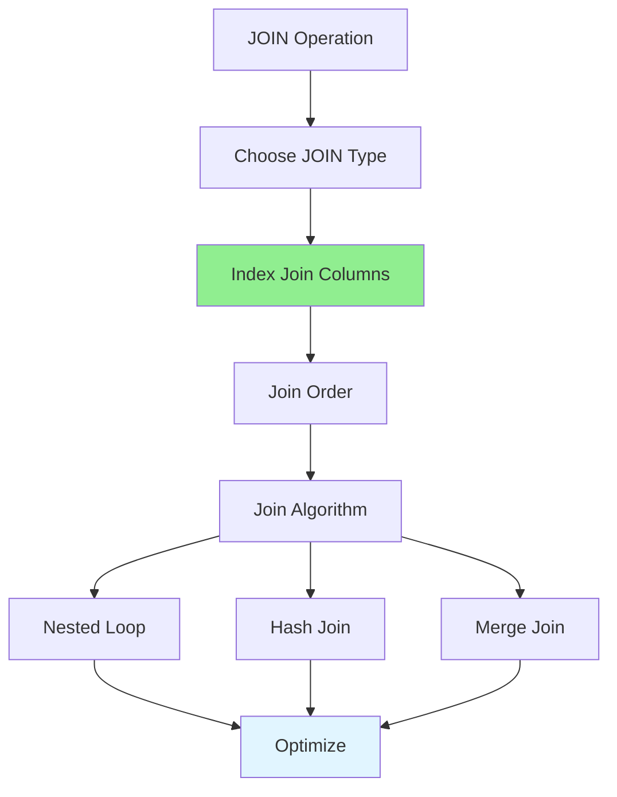

# 06.06 JOIN Optimization / Tối ưu hóa JOIN

## Table of Contents / Mục lục
1. [Introduction / Giới thiệu](#introduction--giới-thiệu)
2. [JOIN Types / Loại JOIN](#join-types--loại-join)
3. [JOIN Optimization / Tối ưu hóa JOIN](#join-optimization--tối-ưu-hóa-join)
4. [Best Practices / Thực hành tốt nhất](#best-practices--thực-hành-tốt-nhất)
5. [Summary / Tóm tắt](#summary--tóm-tắt)

---

## Introduction / Giới thiệu

### Overview / Tổng quan

**English**: JOIN operations can be expensive. Optimizing JOINs improves query performance significantly.

**Vietnamese**: Thao tác JOIN có thể tốn kém. Tối ưu hóa JOIN cải thiện đáng kể hiệu năng truy vấn.

### JOIN Optimization Strategies / Chiến lược tối ưu hóa JOIN



---

## JOIN Types / Loại JOIN

### Example 1: JOIN Examples / Ví dụ 1: Ví dụ JOIN

```sql
-- INNER JOIN: Only matching rows / Chỉ hàng khớp
SELECT u.name, o.total
FROM users u
INNER JOIN orders o ON u.id = o.user_id;

-- LEFT JOIN: All left rows + matching right / Tất cả hàng trái + khớp phải
SELECT u.name, o.total
FROM users u
LEFT JOIN orders o ON u.id = o.user_id;

-- RIGHT JOIN: All right rows + matching left / Tất cả hàng phải + khớp trái
SELECT u.name, o.total
FROM users u
RIGHT JOIN orders o ON u.id = o.user_id;

-- ❌ Bad: Cartesian product / Xấu: Tích Descartes
SELECT * FROM users, orders; -- No join condition / Không có điều kiện join

-- ✅ Good: Proper JOIN / Tốt: JOIN đúng
SELECT * FROM users u
JOIN orders o ON u.id = o.user_id;
```

---

## JOIN Optimization / Tối ưu hóa JOIN

### Example 2: Optimization Techniques / Ví dụ 2: Kỹ thuật tối ưu hóa

```sql
-- ✅ Good: Index on join columns / Tốt: Index trên cột join
CREATE INDEX idx_orders_user_id ON orders(user_id);

-- Optimized query / Truy vấn tối ưu
SELECT u.name, o.total
FROM users u
INNER JOIN orders o ON u.id = o.user_id
WHERE u.active = true;

-- ✅ Good: Join smallest table first / Tốt: Join bảng nhỏ nhất trước
-- If orders is smaller than users / Nếu orders nhỏ hơn users
SELECT u.name, o.total
FROM orders o  -- Smaller table first / Bảng nhỏ trước
INNER JOIN users u ON o.user_id = u.id;

-- ✅ Good: Use WHERE to filter before JOIN / Tốt: Dùng WHERE để lọc trước JOIN
SELECT u.name, o.total
FROM users u
INNER JOIN orders o ON u.id = o.user_id
WHERE o.created_at > '2024-01-01'; -- Filter early / Lọc sớm
```

---

## Best Practices / Thực hành tốt nhất

1. **Index join columns** - Foreign keys and join keys
2. **Choose right JOIN type** - INNER vs LEFT vs RIGHT
3. **Join order matters** - Smaller tables first
4. **Filter early** - Use WHERE before JOIN
5. **Avoid Cartesian products** - Always use join conditions

---

## Summary / Tóm tắt

### Key Takeaways / Điểm chính

- **Index**: Join columns for performance
- **Type**: Choose appropriate JOIN type
- **Order**: Join smaller tables first
- **Filter**: Use WHERE early

### Next Steps / Bước tiếp theo

- [06.07 Subquery vs CTE](./06.07_Subquery_vs_CTE.md) - Next: Subquery vs CTE

---

**Last Updated / Cập nhật lần cuối**: 2024

