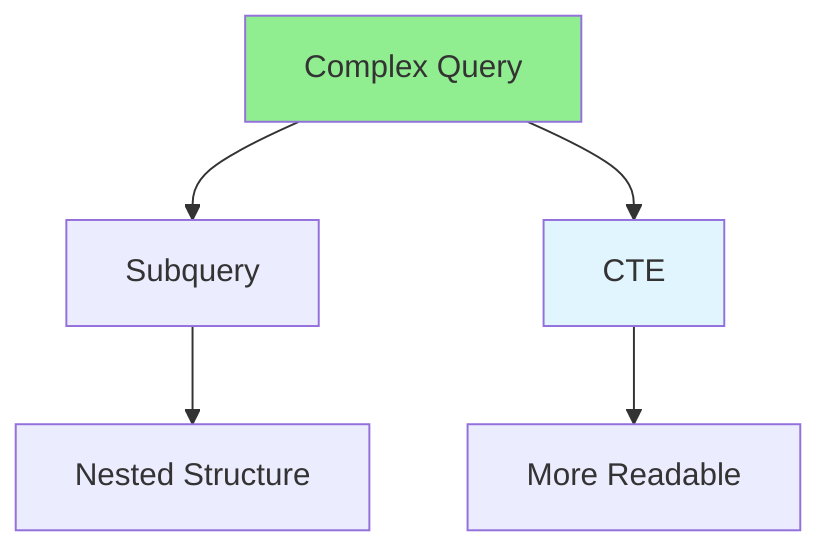

# 06.07 Subquery vs CTE / Subquery vs CTE

## Table of Contents / Mục lục
1. [Introduction / Giới thiệu](#introduction--giới-thiệu)
2. [Subqueries / Subquery](#subqueries--subquery)
3. [CTEs (Common Table Expressions) / CTE](#ctes-common-table-expressions--cte)
4. [Comparison / So sánh](#comparison--so-sánh)
5. [Best Practices / Thực hành tốt nhất](#best-practices--thực-hành-tốt-nhất)
6. [Summary / Tóm tắt](#summary--tóm-tắt)

---

## Introduction / Giới thiệu

### Overview / Tổng quan

**English**: Subqueries and CTEs both allow complex queries. Learn when to use subqueries vs CTEs for readable and performant queries.

**Vietnamese**: Subquery và CTE đều cho phép truy vấn phức tạp. Học khi nào sử dụng subquery vs CTE cho truy vấn dễ đọc và hiệu suất tốt.

### Subquery vs CTE / Subquery vs CTE



---

## Subqueries / Subquery

### Example 1: Subquery Examples / Ví dụ 1: Ví dụ Subquery

```sql
-- Subquery in WHERE / Subquery trong WHERE
SELECT * FROM users
WHERE id IN (
  SELECT user_id FROM orders
  WHERE total_amount > 1000
);

-- Subquery in SELECT / Subquery trong SELECT
SELECT 
  name,
  (SELECT COUNT(*) FROM orders WHERE user_id = users.id) as order_count
FROM users;

-- Correlated subquery / Subquery tương quan
SELECT * FROM orders o1
WHERE total_amount > (
  SELECT AVG(total_amount)
  FROM orders o2
  WHERE o2.user_id = o1.user_id
);
```

---

## CTEs (Common Table Expressions) / CTE

### Example 2: CTE Examples / Ví dụ 2: Ví dụ CTE

```sql
-- Simple CTE / CTE đơn giản
WITH active_users AS (
  SELECT * FROM users WHERE status = 'active'
)
SELECT * FROM active_users;

-- Multiple CTEs / Nhiều CTE
WITH 
  high_value_orders AS (
    SELECT user_id, SUM(total_amount) as total
    FROM orders
    GROUP BY user_id
    HAVING SUM(total_amount) > 1000
  ),
  user_details AS (
    SELECT u.*, hvo.total
    FROM users u
    INNER JOIN high_value_orders hvo ON u.id = hvo.user_id
  )
SELECT * FROM user_details;

-- Recursive CTE / CTE đệ quy
WITH RECURSIVE category_tree AS (
  SELECT id, name, parent_id, 1 as level
  FROM categories
  WHERE parent_id IS NULL
  
  UNION ALL
  
  SELECT c.id, c.name, c.parent_id, ct.level + 1
  FROM categories c
  INNER JOIN category_tree ct ON c.parent_id = ct.id
)
SELECT * FROM category_tree;
```

---

## Comparison / So sánh

### Example 3: When to Use Each / Ví dụ 3: Khi nào sử dụng mỗi loại

```sql
-- Use CTE when: / Sử dụng CTE khi:
-- - Query is complex / Truy vấn phức tạp
-- - Need to reference multiple times / Cần tham chiếu nhiều lần
-- - Want better readability / Muốn dễ đọc hơn

WITH monthly_sales AS (
  SELECT 
    DATE_TRUNC('month', created_at) as month,
    SUM(total_amount) as total
  FROM orders
  GROUP BY DATE_TRUNC('month', created_at)
)
SELECT 
  month,
  total,
  LAG(total) OVER (ORDER BY month) as previous_month
FROM monthly_sales;

-- Use subquery when: / Sử dụng subquery khi:
-- - Simple one-time use / Sử dụng một lần đơn giản
-- - Correlated subquery needed / Cần subquery tương quan
-- - EXISTS check / Kiểm tra EXISTS

SELECT * FROM users
WHERE EXISTS (
  SELECT 1 FROM orders
  WHERE orders.user_id = users.id
  AND orders.created_at > '2024-01-01'
);
```

---

## Best Practices / Thực hành tốt nhất

1. **Use CTE** - For complex, multi-step queries
2. **Use subquery** - For simple, one-time filters
3. **Consider performance** - Test both approaches
4. **Readability** - CTEs are often more readable
5. **Reusability** - CTEs can be referenced multiple times

---

## Summary / Tóm tắt

### Key Takeaways / Điểm chính

- **CTE**: More readable, can reference multiple times
- **Subquery**: Simpler for one-time use
- **Performance**: Test both, depends on database
- **Readability**: CTEs are often clearer
- **Choose**: Based on complexity and readability needs

### Next Steps / Bước tiếp theo

- [06.08 N+1 Query Problem](./06.08_N_Plus_1_Query_Problem.md) - Next: N+1 Problem

---

**Last Updated / Cập nhật lần cuối**: 2024


