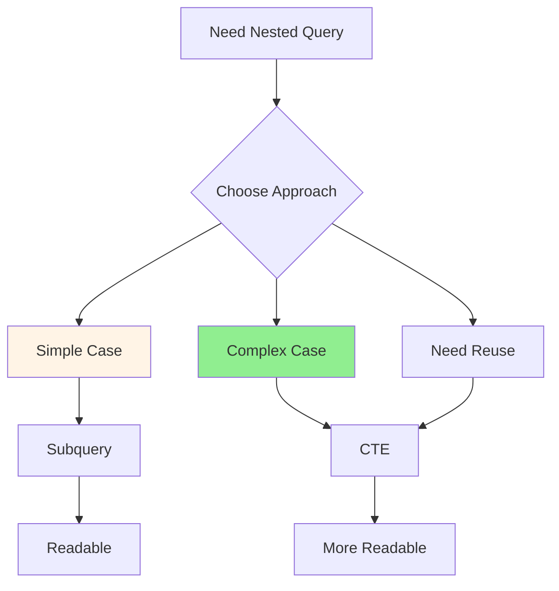

# 06.07 Subquery vs CTE / Subquery vs CTE - Khi nào dùng gì

## Table of Contents / Mục lục
1. [Introduction / Giới thiệu](#introduction--giới-thiệu)
2. [Subqueries / Subquery](#subqueries--subquery)
3. [CTEs (Common Table Expressions) / CTE](#ctes-common-table-expressions--cte)
4. [When to Use What / Khi nào dùng gì](#when-to-use-what--khi-nào-dùng-gì)
5. [Best Practices / Thực hành tốt nhất](#best-practices--thực-hành-tốt-nhất)
6. [Summary / Tóm tắt](#summary--tóm-tắt)

---

## Introduction / Giới thiệu

### Overview / Tổng quan

**English**: Both subqueries and CTEs solve similar problems but have different use cases. Understanding when to use each improves query readability and performance.

**Vietnamese**: Cả subquery và CTE giải quyết vấn đề tương tự nhưng có use case khác nhau. Hiểu khi nào dùng mỗi loại cải thiện khả năng đọc và hiệu năng truy vấn.

### Subquery vs CTE Comparison / So sánh Subquery vs CTE



---

## Subqueries / Subquery

### Example 1: Subquery Examples / Ví dụ 1: Ví dụ Subquery

```sql
-- Scalar subquery / Subquery vô hướng
SELECT name, 
       (SELECT COUNT(*) FROM orders WHERE user_id = users.id) as order_count
FROM users;

-- Correlated subquery / Subquery tương quan
SELECT u.name
FROM users u
WHERE EXISTS (
  SELECT 1 FROM orders o 
  WHERE o.user_id = u.id AND o.total > 1000
);

-- Subquery in WHERE / Subquery trong WHERE
SELECT * FROM products
WHERE price > (SELECT AVG(price) FROM products);

-- ❌ Bad: Nested subqueries / Xấu: Subquery lồng nhau
SELECT * FROM users
WHERE id IN (
  SELECT user_id FROM orders
  WHERE id IN (
    SELECT order_id FROM order_items
    WHERE product_id = 123
  )
);
```

---

## CTEs (Common Table Expressions) / CTE

### Example 2: CTE Examples / Ví dụ 2: Ví dụ CTE

```sql
-- ✅ Good: CTE for readability / Tốt: CTE cho khả năng đọc
WITH user_orders AS (
  SELECT user_id, COUNT(*) as order_count, SUM(total) as total_spent
  FROM orders
  GROUP BY user_id
),
active_users AS (
  SELECT id, name, email
  FROM users
  WHERE active = true
)
SELECT au.name, uo.order_count, uo.total_spent
FROM active_users au
LEFT JOIN user_orders uo ON au.id = uo.user_id
ORDER BY uo.total_spent DESC;

-- Recursive CTE / CTE đệ quy
WITH RECURSIVE category_tree AS (
  -- Base case / Trường hợp cơ sở
  SELECT id, name, parent_id, 0 as level
  FROM categories
  WHERE parent_id IS NULL
  
  UNION ALL
  
  -- Recursive case / Trường hợp đệ quy
  SELECT c.id, c.name, c.parent_id, ct.level + 1
  FROM categories c
  INNER JOIN category_tree ct ON c.parent_id = ct.id
)
SELECT * FROM category_tree;
```

---

## When to Use What / Khi nào dùng gì

### Example 3: Decision Guide / Ví dụ 3: Hướng dẫn quyết định

```typescript
interface QueryDecision {
  scenario: string;
  use: 'Subquery' | 'CTE';
  reason: string;
}

const decisions: QueryDecision[] = [
  {
    scenario: 'Simple one-time filter',
    use: 'Subquery',
    reason: 'More concise, no need for CTE'
  },
  {
    scenario: 'Complex multi-step query',
    use: 'CTE',
    reason: 'Better readability, easier to understand'
  },
  {
    scenario: 'Need to reference result multiple times',
    use: 'CTE',
    reason: 'CTE can be referenced multiple times in query'
  },
  {
    scenario: 'Recursive queries',
    use: 'CTE',
    reason: 'CTE supports recursion, subqueries do not'
  }
];
```

---

## Best Practices / Thực hành tốt nhất

1. **Use subqueries** - For simple, one-time filters
2. **Use CTEs** - For complex, multi-step queries
3. **CTE for reuse** - When result needed multiple times
4. **CTE for readability** - Complex nested logic
5. **Profile both** - Performance may vary

---

## Summary / Tóm tắt

### Key Takeaways / Điểm chính

- **Subquery**: Simple cases, one-time use
- **CTE**: Complex queries, readability, reuse
- **Choose**: Based on complexity and needs

### Next Steps / Bước tiếp theo

- [06.08 N+1 Query Problem](./06.08_N_Plus_1_Query_Problem.md) - Next: N+1 Problem

---

**Last Updated / Cập nhật lần cuối**: 2024

