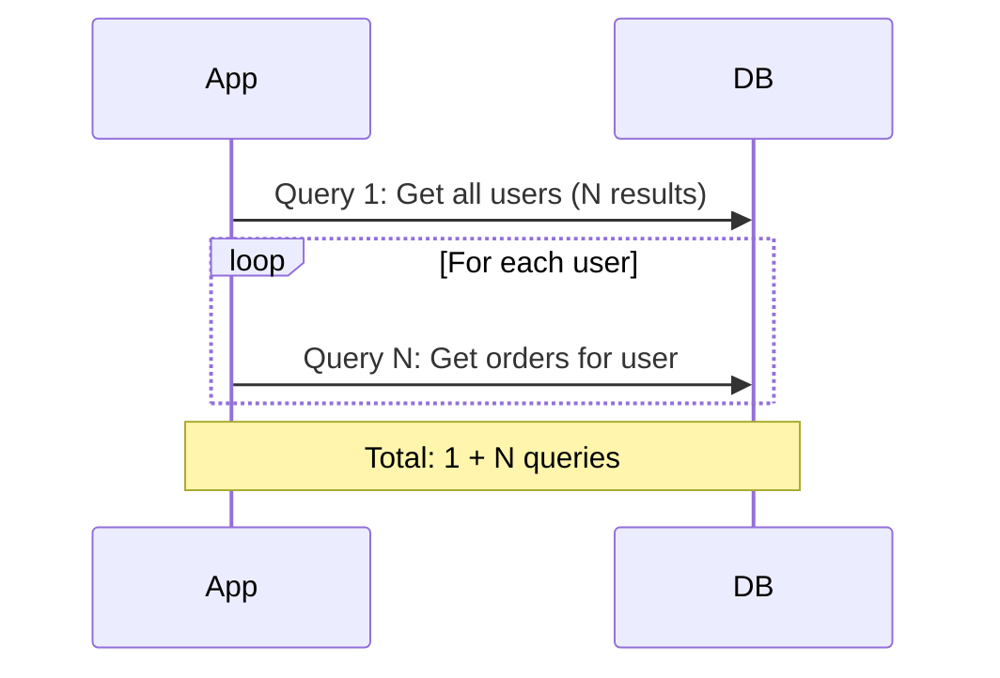

# 06.08 N+1 Query Problem / Vấn đề truy vấn N+1

## Table of Contents / Mục lục
1. [Introduction / Giới thiệu](#introduction--giới-thiệu)
2. [Understanding N+1 Problem / Hiểu vấn đề N+1](#understanding-n1-problem--hiểu-vấn-đề-n1)
3. [Solutions / Giải pháp](#solutions--giải-pháp)
4. [Best Practices / Thực hành tốt nhất](#best-practices--thực-hành-tốt-nhất)
5. [Summary / Tóm tắt](#summary--tóm-tắt)

---

## Introduction / Giới thiệu

### Overview / Tổng quan

**English**: N+1 query problem occurs when fetching related data causes multiple queries. Learn to identify and fix N+1 problems for better performance.

**Vietnamese**: Vấn đề truy vấn N+1 xảy ra khi lấy dữ liệu liên quan gây ra nhiều truy vấn. Học cách xác định và sửa vấn đề N+1 để có hiệu suất tốt hơn.

### N+1 Query Problem / Vấn đề truy vấn N+1



---

## Understanding N+1 Problem / Hiểu vấn đề N+1

### Example 1: N+1 Problem Example / Ví dụ 1: Ví dụ vấn đề N+1

```typescript
// N+1 Problem / Vấn đề N+1
async function getUsersWithOrders() {
  // Query 1: Get all users / Truy vấn 1: Lấy tất cả users
  const users = await prisma.user.findMany();
  
  // Queries 2 to N+1: Get orders for each user / Truy vấn 2 đến N+1: Lấy orders cho mỗi user
  for (const user of users) {
    user.orders = await prisma.order.findMany({
      where: { userId: user.id }
    });
  }
  // Total: 1 + N queries (N = number of users) / Tổng: 1 + N truy vấn
  return users;
}

// Solution: Use include / Giải pháp: Sử dụng include
async function getUsersWithOrdersOptimized() {
  // Single query with JOIN / Một truy vấn với JOIN
  return await prisma.user.findMany({
    include: {
      orders: true
    }
  });
  // Total: 1 query / Tổng: 1 truy vấn
}
```

### Example 2: Detecting N+1 / Ví dụ 2: Phát hiện N+1

```typescript
// Enable query logging / Bật ghi log truy vấn
const prisma = new PrismaClient({
  log: ['query', 'info', 'warn', 'error']
});

// Watch for patterns / Theo dõi mẫu
// Pattern: Multiple similar queries / Mẫu: Nhiều truy vấn tương tự
// SELECT * FROM orders WHERE user_id = '1'
// SELECT * FROM orders WHERE user_id = '2'
// SELECT * FROM orders WHERE user_id = '3'
// ... (N queries)

// Solution: Batch query / Giải pháp: Truy vấn theo lô
async function getUsersWithOrdersBatch() {
  const users = await prisma.user.findMany();
  const userIds = users.map(u => u.id);
  
  // Single query for all orders / Một truy vấn cho tất cả orders
  const allOrders = await prisma.order.findMany({
    where: { userId: { in: userIds } }
  });
  
  // Group orders by user / Nhóm orders theo user
  const ordersByUser = allOrders.reduce((acc, order) => {
    if (!acc[order.userId]) acc[order.userId] = [];
    acc[order.userId].push(order);
    return acc;
  }, {} as Record<string, any[]>);
  
  // Attach orders to users / Gắn orders vào users
  return users.map(user => ({
    ...user,
    orders: ordersByUser[user.id] || []
  }));
}
```

---

## Solutions / Giải pháp

### Example 3: ORM Solutions / Ví dụ 3: Giải pháp ORM

```typescript
// Prisma: Use include / Prisma: Sử dụng include
const users = await prisma.user.findMany({
  include: {
    orders: {
      include: {
        items: true  // Nested include / Include lồng nhau
      }
    }
  }
});

// TypeORM: Use relations / TypeORM: Sử dụng relations
const users = await userRepository.find({
  relations: ['orders', 'orders.items']
});

// Sequelize: Use include / Sequelize: Sử dụng include
const users = await User.findAll({
  include: [{
    model: Order,
    include: [OrderItem]
  }]
});
```

---

## Best Practices / Thực hành tốt nhất

1. **Use eager loading** - Include relations in initial query
2. **Monitor queries** - Enable query logging
3. **Use data loaders** - For GraphQL applications
4. **Batch queries** - Group related queries
5. **Profile regularly** - Identify N+1 problems early

---

## Summary / Tóm tắt

### Key Takeaways / Điểm chính

- **N+1 problem**: 1 query + N queries for related data
- **Detection**: Monitor query logs
- **Solution**: Use JOINs or eager loading
- **ORM**: Use include/relations
- **Performance**: Significant improvement with fix

### Next Steps / Bước tiếp theo

- [06.09 Transaction Management](./06.09_Transaction_Management.md) - Next: Transactions

---

**Last Updated / Cập nhật lần cuối**: 2024


