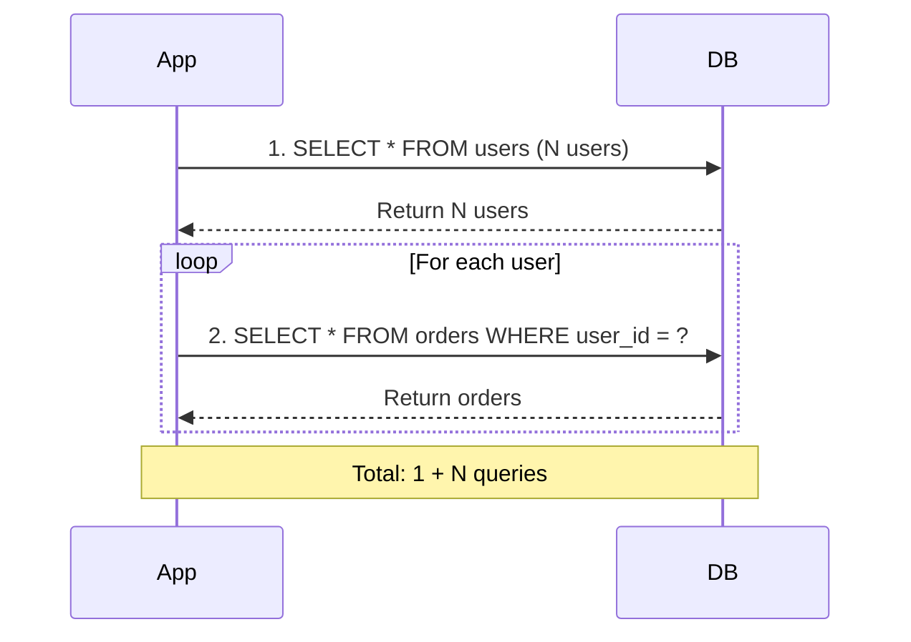

# 06.08 N+1 Query Problem / Vấn đề N+1 queries

## Table of Contents / Mục lục
1. [Introduction / Giới thiệu](#introduction--giới-thiệu)
2. [Understanding N+1 Problem / Hiểu vấn đề N+1](#understanding-n1-problem--hiểu-vấn-đề-n1)
3. [Detecting N+1 Problems / Phát hiện vấn đề N+1](#detecting-n1-problems--phát-hiện-vấn-đề-n1)
4. [Solutions / Giải pháp](#solutions--giải-pháp)
5. [Best Practices / Thực hành tốt nhất](#best-practices--thực-hành-tốt-nhất)
6. [Summary / Tóm tắt](#summary--tóm-tắt)

---

## Introduction / Giới thiệu

### Overview / Tổng quan

**English**: The N+1 query problem occurs when you fetch N records and then make N additional queries for related data. This significantly impacts performance.

**Vietnamese**: Vấn đề N+1 query xảy ra khi bạn lấy N bản ghi và sau đó thực hiện N truy vấn bổ sung cho dữ liệu liên quan. Điều này ảnh hưởng đáng kể đến hiệu năng.

### N+1 Problem Visualization / Hình ảnh vấn đề N+1



---

## Understanding N+1 Problem / Hiểu vấn đề N+1

### Example 1: N+1 Problem / Ví dụ 1: Vấn đề N+1

```typescript
// ❌ Bad: N+1 queries / Xấu: N+1 queries
async function getUsersWithOrdersBad() {
  const users = await prisma.user.findMany(); // 1 query / 1 truy vấn
  
  for (const user of users) {
    // N queries / N truy vấn
    user.orders = await prisma.order.findMany({
      where: { userId: user.id }
    });
  }
  return users; // Total: 1 + N queries / Tổng: 1 + N truy vấn
}

// ✅ Good: Single query with JOIN / Tốt: Một truy vấn với JOIN
async function getUsersWithOrdersGood() {
  return prisma.user.findMany({
    include: {
      orders: true // Eager loading / Tải sẵn
  }); // 1 query with JOIN / 1 truy vấn với JOIN
}

// ✅ Better: Batch loading / Tốt hơn: Tải theo lô
async function getUsersWithOrdersBetter() {
  const users = await prisma.user.findMany();
  const userIds = users.map(u => u.id);
  
  // Single query for all orders / Một truy vấn cho tất cả orders
  const allOrders = await prisma.order.findMany({
    where: { userId: { in: userIds } }
  });
  
  // Map orders to users / Ánh xạ orders với users
  const ordersByUser = new Map();
  allOrders.forEach(order => {
    if (!ordersByUser.has(order.userId)) {
      ordersByUser.set(order.userId, []);
    }
    ordersByUser.get(order.userId).push(order);
  });
  
  users.forEach(user => {
    user.orders = ordersByUser.get(user.id) || [];
  });
  
  return users; // Total: 2 queries / Tổng: 2 truy vấn
}
```

---

## Detecting N+1 Problems / Phát hiện vấn đề N+1

### Example 2: Detection Methods / Ví dụ 2: Phương pháp phát hiện

```typescript
// Query logging / Ghi log truy vấn
prisma.$on('query', (e) => {
  console.log('Query: ' + e.query);
  console.log('Duration: ' + e.duration + 'ms');
});

// Profiling / Phân tích
async function profileQueries() {
  const start = performance.now();
  await getUsersWithOrdersBad();
  const end = performance.now();
  console.log(`Total time: ${end - start}ms`);
  // If time is high and query count is high, likely N+1 / Nếu thời gian cao và số truy vấn cao, có thể là N+1
}
```

---

## Solutions / Giải pháp

### Example 3: ORM Solutions / Ví dụ 3: Giải pháp ORM

```typescript
// Prisma: Eager loading / Prisma: Tải sẵn
const users = await prisma.user.findMany({
  include: {
    orders: {
      include: {
        items: true // Nested include / Include lồng nhau
      }
    }
  }
});

// TypeORM: Relations / TypeORM: Quan hệ
const users = await userRepository.find({
  relations: ['orders', 'orders.items']
});

// Sequelize: Include / Sequelize: Include
const users = await User.findAll({
  include: [{
    model: Order,
    include: [OrderItem]
  }]
});
```

---

## Best Practices / Thực hành tốt nhất

1. **Use eager loading** - Include relations in initial query
2. **Batch loading** - Load related data in batches
3. **Monitor queries** - Log and profile queries
4. **Use DataLoader** - For GraphQL applications
5. **Review code** - Check loops with database calls

---

## Summary / Tóm tắt

### Key Takeaways / Điểm chính

- **Problem**: 1 + N queries instead of 1-2 queries
- **Solution**: Eager loading, batch loading, JOIN queries
- **Detect**: Query logging, profiling
- **Prevent**: Review code patterns

### Next Steps / Bước tiếp theo

- [06.09 Transaction Management](./06.09_Transaction_Management.md) - Next: Transactions

---

**Last Updated / Cập nhật lần cuối**: 2024

