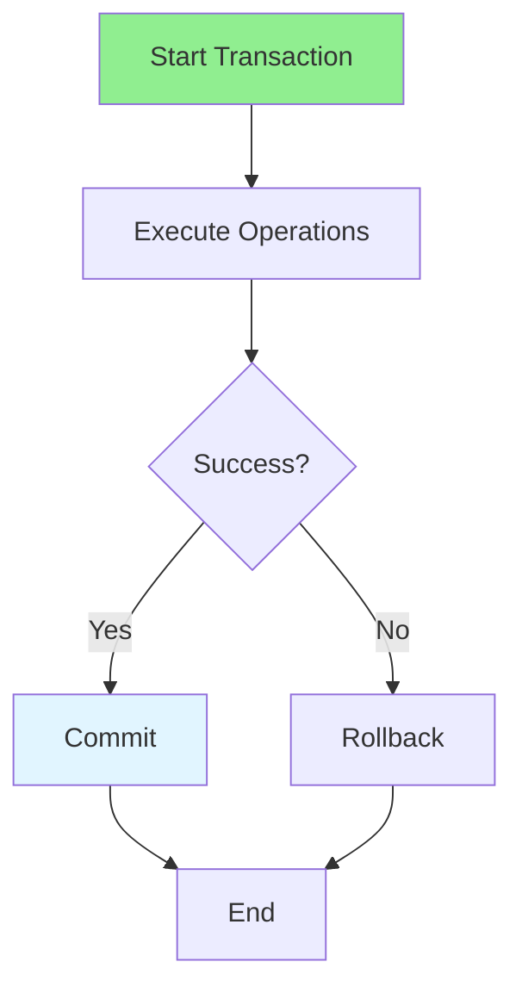

# 06.09 Transaction Management / Quản lý giao dịch

## Table of Contents / Mục lục
1. [Introduction / Giới thiệu](#introduction--giới-thiệu)
2. [Transaction Basics / Cơ bản giao dịch](#transaction-basics--cơ-bản-giao-dịch)
3. [Transaction Management / Quản lý giao dịch](#transaction-management--quản-lý-giao-dịch)
4. [Best Practices / Thực hành tốt nhất](#best-practices--thực-hành-tốt-nhất)
5. [Summary / Tóm tắt](#summary--tóm-tắt)

---

## Introduction / Giới thiệu

### Overview / Tổng quan

**English**: Transactions ensure data consistency by grouping operations that must succeed or fail together. Learn to use transactions for data integrity.

**Vietnamese**: Giao dịch đảm bảo tính nhất quán dữ liệu bằng cách nhóm các thao tác phải thành công hoặc thất bại cùng nhau. Học cách sử dụng giao dịch cho tính toàn vẹn dữ liệu.

### Transaction Management / Quản lý giao dịch



---

## Transaction Basics / Cơ bản giao dịch

### Example 1: Basic Transactions / Ví dụ 1: Giao dịch cơ bản

```typescript
// Prisma transaction / Giao dịch Prisma
async function transferMoney(fromId: string, toId: string, amount: number) {
  return await prisma.$transaction(async (tx) => {
    // Debit from sender / Ghi nợ người gửi
    await tx.account.update({
      where: { id: fromId },
      data: { balance: { decrement: amount } }
    });
    
    // Credit to receiver / Ghi có người nhận
    await tx.account.update({
      where: { id: toId },
      data: { balance: { increment: amount } }
    });
    
    // Create transaction record / Tạo bản ghi giao dịch
    return await tx.transaction.create({
      data: {
        fromAccountId: fromId,
        toAccountId: toId,
        amount
      }
    });
  });
}

// Raw SQL transaction / Giao dịch SQL thô
async function transferMoneyRaw(fromId: string, toId: string, amount: number) {
  await prisma.$executeRaw`
    BEGIN;
    UPDATE accounts SET balance = balance - ${amount} WHERE id = ${fromId};
    UPDATE accounts SET balance = balance + ${amount} WHERE id = ${toId};
    COMMIT;
  `;
}
```

### Example 2: Transaction with Error Handling / Ví dụ 2: Giao dịch với xử lý lỗi

```typescript
// Transaction with error handling / Giao dịch với xử lý lỗi
async function createOrderWithItems(orderData: any, items: any[]) {
  try {
    return await prisma.$transaction(async (tx) => {
      // Create order / Tạo order
      const order = await tx.order.create({
        data: orderData
      });
      
      // Create order items / Tạo order items
      await tx.orderItem.createMany({
        data: items.map(item => ({
          ...item,
          orderId: order.id
        }))
      });
      
      // Update product stock / Cập nhật tồn kho sản phẩm
      for (const item of items) {
        await tx.product.update({
          where: { id: item.productId },
          data: { stockQuantity: { decrement: item.quantity } }
        });
      }
      
      return order;
    });
  } catch (error) {
    // Transaction automatically rolls back / Giao dịch tự động rollback
    console.error('Transaction failed:', error);
    throw error;
  }
}
```

---

## Best Practices / Thực hành tốt nhất

1. **Keep transactions short** - Minimize lock time
2. **Handle errors** - Always catch and handle errors
3. **Use appropriate isolation** - Choose isolation level
4. **Avoid long transactions** - Don't hold locks too long
5. **Test rollback** - Verify rollback works correctly

---

## Summary / Tóm tắt

### Key Takeaways / Điểm chính

- **ACID**: Atomicity, Consistency, Isolation, Durability
- **Use transactions**: For related operations
- **Error handling**: Always handle errors
- **Keep short**: Minimize transaction duration
- **Test**: Verify commit and rollback

### Next Steps / Bước tiếp theo

- [06.10 Lazy vs Eager Loading](./06.10_Lazy_vs_Eager_Loading.md) - Next: Lazy vs Eager

---

**Last Updated / Cập nhật lần cuối**: 2024

