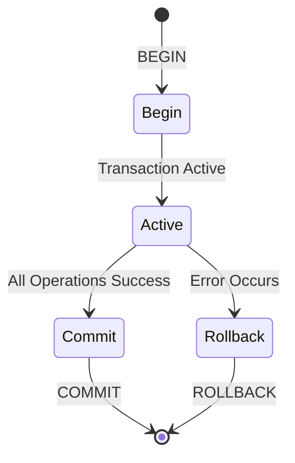

# 06.09 Transaction Management / Quản lý giao dịch

## Table of Contents / Mục lục
1. [Introduction / Giới thiệu](#introduction--giới-thiệu)
2. [ACID Properties / Thuộc tính ACID](#acid-properties--thuộc-tính-acid)
3. [Transaction Implementation / Triển khai transaction](#transaction-implementation--triển-khai-transaction)
4. [Isolation Levels / Mức cô lập](#isolation-levels--mức-cô-lập)
5. [Best Practices / Thực hành tốt nhất](#best-practices--thực-hành-tốt-nhất)
6. [Summary / Tóm tắt](#summary--tóm-tắt)

---

## Introduction / Giới thiệu

### Overview / Tổng quan

**English**: Transactions ensure data consistency and reliability. Understanding ACID properties and transaction management is crucial for database operations.

**Vietnamese**: Transaction đảm bảo tính nhất quán và độ tin cậy dữ liệu. Hiểu thuộc tính ACID và quản lý transaction rất quan trọng cho thao tác database.

### Transaction Lifecycle / Vòng đời transaction



---

## ACID Properties / Thuộc tính ACID

### Example 1: ACID Explained / Ví dụ 1: Giải thích ACID

```typescript
// ACID Properties / Thuộc tính ACID
interface ACIDProperties {
  atomicity: {
    description: string;
    example: string;
  };
  consistency: {
    description: string;
    example: string;
  };
  isolation: {
    description: string;
    example: string;
  };
  durability: {
    description: string;
    example: string;
  };
}

const acid: ACIDProperties = {
  atomicity: {
    description: 'All operations succeed or all fail',
    example: 'Transfer money: debit and credit must both complete or both fail'
  },
  consistency: {
    description: 'Database remains in valid state',
    example: 'Account balance cannot be negative'
  },
  isolation: {
    description: 'Concurrent transactions don\'t interfere',
    example: 'Two transfers don\'t see each other\'s intermediate state'
  },
  durability: {
    description: 'Committed changes persist',
    example: 'After COMMIT, data survives system crash'
  }
};
```

---

## Transaction Implementation / Triển khai transaction

### Example 2: Transaction Examples / Ví dụ 2: Ví dụ transaction

```sql
-- Basic transaction / Transaction cơ bản
BEGIN;
  UPDATE accounts SET balance = balance - 100 WHERE id = 1;
  UPDATE accounts SET balance = balance + 100 WHERE id = 2;
COMMIT;

-- Transaction with error handling / Transaction với xử lý lỗi
BEGIN;
  UPDATE accounts SET balance = balance - 100 WHERE id = 1;
  UPDATE accounts SET balance = balance + 100 WHERE id = 2;
  
  -- If error occurs / Nếu có lỗi
  IF error THEN
    ROLLBACK;
  ELSE
    COMMIT;
  END IF;

-- Savepoint / Điểm lưu
BEGIN;
  UPDATE accounts SET balance = balance - 100 WHERE id = 1;
  SAVEPOINT sp1;
  UPDATE accounts SET balance = balance + 100 WHERE id = 2;
  -- Can rollback to savepoint / Có thể rollback đến savepoint
  ROLLBACK TO sp1;
COMMIT;
```

### Example 3: Prisma Transactions / Ví dụ 3: Transaction Prisma

```typescript
// Prisma transaction / Transaction Prisma
await prisma.$transaction(async (tx) => {
  // All operations in transaction / Tất cả thao tác trong transaction
  await tx.account.update({
    where: { id: 1 },
    data: { balance: { decrement: 100 } }
  });
  
  await tx.account.update({
    where: { id: 2 },
    data: { balance: { increment: 100 } }
  });
  
  // If any operation fails, all rollback / Nếu bất kỳ thao tác nào thất bại, tất cả rollback
});

// TypeORM transaction / Transaction TypeORM
await dataSource.transaction(async (manager) => {
  await manager.update(Account, { id: 1 }, { balance: () => 'balance - 100' });
  await manager.update(Account, { id: 2 }, { balance: () => 'balance + 100' });
});
```

---

## Isolation Levels / Mức cô lập

### Example 4: Isolation Levels / Ví dụ 4: Mức cô lập

```sql
-- Set isolation level / Đặt mức cô lập
SET TRANSACTION ISOLATION LEVEL READ COMMITTED;

-- Isolation levels / Mức cô lập
-- READ UNCOMMITTED: Can read uncommitted data / Có thể đọc dữ liệu chưa commit
-- READ COMMITTED: Only read committed data / Chỉ đọc dữ liệu đã commit
-- REPEATABLE READ: Consistent reads within transaction / Đọc nhất quán trong transaction
-- SERIALIZABLE: Highest isolation / Cô lập cao nhất
```

---

## Best Practices / Thực hành tốt nhất

1. **Keep transactions short** - Minimize lock time
2. **Handle errors** - Always use try-catch
3. **Avoid long transactions** - Don't hold locks too long
4. **Use appropriate isolation** - Balance consistency and performance
5. **Test rollback** - Verify error handling works

---

## Summary / Tóm tắt

### Key Takeaways / Điểm chính

- **ACID**: Atomicity, Consistency, Isolation, Durability
- **Implement**: BEGIN, COMMIT, ROLLBACK
- **Isolation**: Choose appropriate level
- **Keep short**: Minimize transaction duration

### Next Steps / Bước tiếp theo

- [06.10 Lazy vs Eager Loading](./06.10_Lazy_vs_Eager_Loading.md) - Next: Loading Strategies

---

**Last Updated / Cập nhật lần cuối**: 2024

