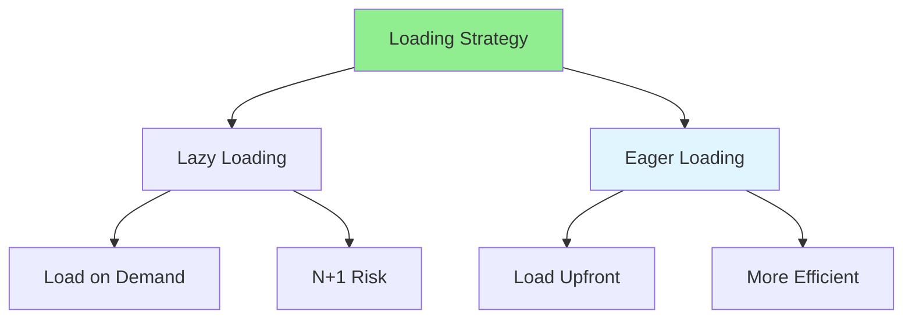

# 06.10 Lazy vs Eager Loading / Lazy vs Eager Loading

## Table of Contents / Mục lục
1. [Introduction / Giới thiệu](#introduction--giới-thiệu)
2. [Lazy Loading / Lazy Loading](#lazy-loading--lazy-loading)
3. [Eager Loading / Eager Loading](#eager-loading--eager-loading)
4. [Comparison / So sánh](#comparison--so-sánh)
5. [Best Practices / Thực hành tốt nhất](#best-practices--thực-hành-tốt-nhất)
6. [Summary / Tóm tắt](#summary--tóm-tắt)

---

## Introduction / Giới thiệu

### Overview / Tổng quan

**English**: Lazy loading loads data on demand, eager loading loads related data upfront. Learn when to use each approach for optimal performance.

**Vietnamese**: Lazy loading tải dữ liệu theo yêu cầu, eager loading tải dữ liệu liên quan trước. Học khi nào sử dụng mỗi cách tiếp cận để có hiệu suất tối ưu.

### Lazy vs Eager Loading / Lazy vs Eager Loading



---

## Lazy Loading / Lazy Loading

### Example 1: Lazy Loading / Ví dụ 1: Lazy Loading

```typescript
// Lazy loading / Lazy loading
const user = await prisma.user.findUnique({
  where: { id: '123' }
});

// Load orders when accessed / Tải orders khi truy cập
const orders = await prisma.order.findMany({
  where: { userId: user.id }
});

// Problem: N+1 queries if done in loop / Vấn đề: N+1 truy vấn nếu làm trong vòng lặp
const users = await prisma.user.findMany();
for (const user of users) {
  const orders = await prisma.order.findMany({
    where: { userId: user.id }
  }); // N queries / N truy vấn
}
```

---

## Eager Loading / Eager Loading

### Example 2: Eager Loading / Ví dụ 2: Eager Loading

```typescript
// Eager loading with include / Eager loading với include
const user = await prisma.user.findUnique({
  where: { id: '123' },
  include: {
    orders: true  // Load orders immediately / Tải orders ngay lập tức
  }
});

// Nested eager loading / Eager loading lồng nhau
const users = await prisma.user.findMany({
  include: {
    orders: {
      include: {
        items: true  // Load order items too / Tải order items luôn
      }
    }
  }
});

// Single query with JOINs / Một truy vấn với JOINs
// Much more efficient / Hiệu quả hơn nhiều
```

---

## Comparison / So sánh

### Example 3: When to Use Each / Ví dụ 3: Khi nào sử dụng mỗi loại

```typescript
// Use Eager Loading when: / Sử dụng Eager Loading khi:
// - You know you'll need related data / Bạn biết sẽ cần dữ liệu liên quan
// - Loading multiple records / Tải nhiều bản ghi
// - Want to avoid N+1 / Muốn tránh N+1

const users = await prisma.user.findMany({
  include: { orders: true }  // Eager load / Eager load
});

// Use Lazy Loading when: / Sử dụng Lazy Loading khi:
// - Related data may not be needed / Dữ liệu liên quan có thể không cần
// - Loading single record / Tải một bản ghi
// - Conditional loading / Tải có điều kiện

const user = await prisma.user.findUnique({
  where: { id: '123' }
});

if (user.needsOrders) {
  const orders = await prisma.order.findMany({
    where: { userId: user.id }
  });
}
```

---

## Best Practices / Thực hành tốt nhất

1. **Use eager loading** - When you know you'll need related data
2. **Avoid N+1** - Use include/relations for multiple records
3. **Lazy for conditionals** - When data may not be needed
4. **Profile queries** - Monitor query patterns
5. **Balance** - Don't over-eager load unnecessary data

---

## Summary / Tóm tắt

### Key Takeaways / Điểm chính

- **Lazy**: Load on demand, risk of N+1
- **Eager**: Load upfront, more efficient
- **Choose**: Based on data access patterns
- **Avoid N+1**: Use eager loading for multiple records
- **Balance**: Don't load unnecessary data

### Next Steps / Bước tiếp theo

- [06.11 Database Connection Pooling](./06.11_Database_Connection_Pooling.md) - Next: Connection Pooling

---

**Last Updated / Cập nhật lần cuối**: 2024


