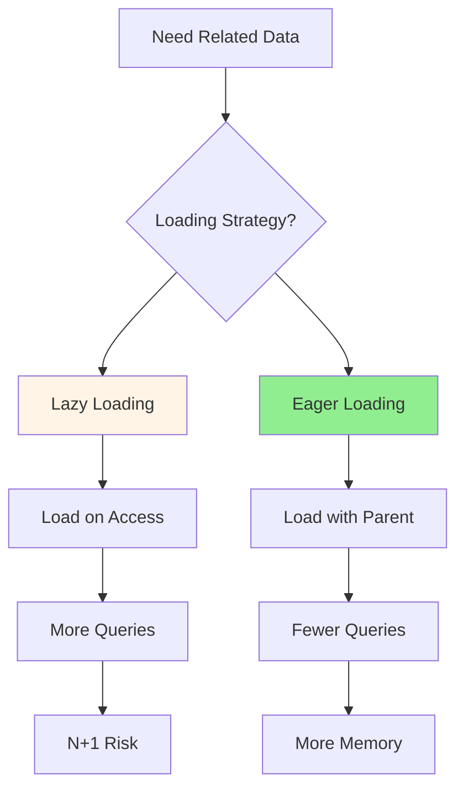

# 06.10 Lazy vs Eager Loading / Lazy Loading vs Eager Loading

## Table of Contents / Mục lục
1. [Introduction / Giới thiệu](#introduction--giới-thiệu)
2. [Lazy Loading / Tải lười](#lazy-loading--tải-lười)
3. [Eager Loading / Tải sẵn](#eager-loading--tải-sẵn)
4. [When to Use What / Khi nào dùng gì](#when-to-use-what--khi-nào-dùng-gì)
5. [Best Practices / Thực hành tốt nhất](#best-practices--thực-hành-tốt-nhất)
6. [Summary / Tóm tắt](#summary--tóm-tắt)

---

## Introduction / Giới thiệu

### Overview / Tổng quan

**English**: Lazy loading loads data on-demand, while eager loading loads related data upfront. Choosing the right strategy impacts performance and memory usage.

**Vietnamese**: Lazy loading tải dữ liệu theo yêu cầu, trong khi eager loading tải dữ liệu liên quan trước. Chọn đúng chiến lược ảnh hưởng đến hiệu năng và sử dụng bộ nhớ.

### Loading Strategies / Chiến lược tải



---

## Lazy Loading / Tải lười

### Example 1: Lazy Loading / Ví dụ 1: Lazy Loading

```typescript
// Lazy loading (default in most ORMs) / Lazy loading (mặc định trong hầu hết ORM)
const user = await prisma.user.findUnique({
  where: { id: userId }
});

// Related data loaded when accessed / Dữ liệu liên quan được tải khi truy cập
const orders = await user.orders; // Separate query / Truy vấn riêng

// TypeORM lazy loading / Lazy loading TypeORM
@Entity()
export class User {
  @OneToMany(() => Order, order => order.user, { lazy: true })
  orders: Order[];
}

const user = await userRepository.findOne(userId);
const orders = await user.orders; // Loaded on access / Tải khi truy cập
```

---

## Eager Loading / Tải sẵn

### Example 2: Eager Loading / Ví dụ 2: Eager Loading

```typescript
// Prisma eager loading / Eager loading Prisma
const user = await prisma.user.findUnique({
  where: { id: userId },
  include: {
    orders: {
      include: {
        items: true // Nested eager loading / Eager loading lồng nhau
      }
    }
  }
}); // All data loaded in one query / Tất cả dữ liệu tải trong một truy vấn

// TypeORM eager loading / Eager loading TypeORM
@Entity()
export class User {
  @OneToMany(() => Order, order => order.user, { eager: true })
  orders: Order[];
}

const user = await userRepository.findOne(userId);
// Orders already loaded / Orders đã được tải
```

---

## When to Use What / Khi nào dùng gì

### Example 3: Decision Guide / Ví dụ 3: Hướng dẫn quyết định

```typescript
interface LoadingDecision {
  scenario: string;
  use: 'Lazy' | 'Eager';
  reason: string;
}

const decisions: LoadingDecision[] = [
  {
    scenario: 'Always need related data',
    use: 'Eager',
    reason: 'Avoid N+1 queries, load everything upfront'
  },
  {
    scenario: 'Sometimes need related data',
    use: 'Lazy',
    reason: 'Save memory, load only when needed'
  },
  {
    scenario: 'Large related collections',
    use: 'Lazy',
    reason: 'Avoid loading unnecessary data'
  },
  {
    scenario: 'Small, frequently accessed relations',
    use: 'Eager',
    reason: 'Performance benefit outweighs memory cost'
  }
];
```

---

## Best Practices / Thực hành tốt nhất

1. **Eager load** - When data is always needed
2. **Lazy load** - When data is sometimes needed
3. **Avoid N+1** - Use eager loading or batch loading
4. **Consider memory** - Large collections should be lazy
5. **Profile** - Measure performance impact

---

## Summary / Tóm tắt

### Key Takeaways / Điểm chính

- **Lazy**: Load on-demand, save memory
- **Eager**: Load upfront, avoid N+1
- **Choose**: Based on usage patterns
- **Balance**: Performance vs memory

### Next Steps / Bước tiếp theo

- [06.11 Connection Pooling](./06.11_Database_Connection_Pooling.md) - Next: Connection Pooling

---

**Last Updated / Cập nhật lần cuối**: 2024

