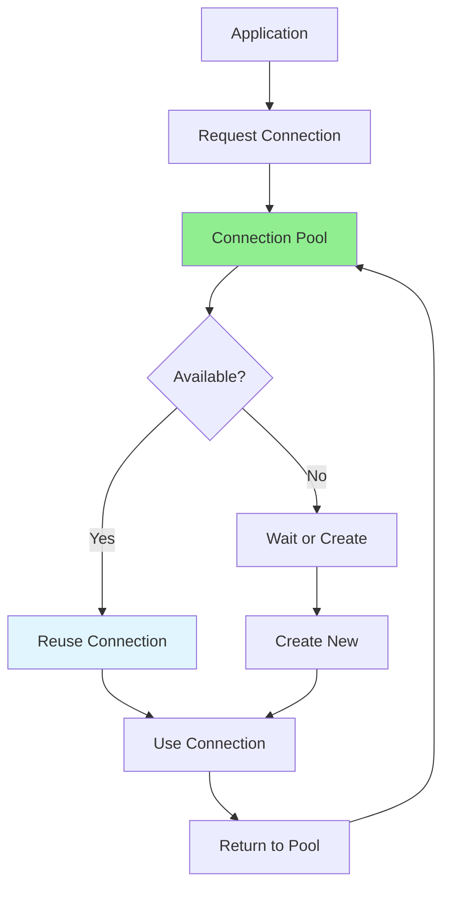

# 06.11 Database Connection Pooling / Connection Pooling

## Table of Contents / Mục lục
1. [Introduction / Giới thiệu](#introduction--giới-thiệu)
2. [Connection Pool Concepts / Khái niệm Connection Pool](#connection-pool-concepts--khái-niệm-connection-pool)
3. [Configuration / Cấu hình](#configuration--cấu-hình)
4. [Best Practices / Thực hành tốt nhất](#best-practices--thực-hành-tốt-nhất)
5. [Summary / Tóm tắt](#summary--tóm-tắt)

---

## Introduction / Giới thiệu

### Overview / Tổng quan

**English**: Connection pooling reuses database connections, reducing overhead and improving performance. Proper pool configuration is essential for scalable applications.

**Vietnamese**: Connection pooling tái sử dụng kết nối database, giảm overhead và cải thiện hiệu năng. Cấu hình pool đúng cách rất quan trọng cho ứng dụng có thể mở rộng.

### Connection Pool Flow / Luồng Connection Pool



---

## Connection Pool Concepts / Khái niệm Connection Pool

### Example 1: Pool Configuration / Ví dụ 1: Cấu hình Pool

```typescript
// Prisma connection pool / Connection pool Prisma
// In schema.prisma or DATABASE_URL / Trong schema.prisma hoặc DATABASE_URL
datasource db {
  provider = "postgresql"
  url      = env("DATABASE_URL")
  // Connection pool settings / Cài đặt connection pool
  // ?connection_limit=10&pool_timeout=20
}

// TypeORM connection pool / Connection pool TypeORM
const dataSource = new DataSource({
  type: 'postgres',
  host: 'localhost',
  port: 5432,
  username: 'user',
  password: 'password',
  database: 'mydb',
  extra: {
    // Connection pool settings / Cài đặt connection pool
    max: 10, // Maximum connections / Số kết nối tối đa
    min: 2,  // Minimum connections / Số kết nối tối thiểu
    idleTimeoutMillis: 30000, // Idle timeout / Thời gian chờ không hoạt động
    connectionTimeoutMillis: 2000 // Connection timeout / Thời gian chờ kết nối
  }
});

// HikariCP (Java/Node.js) / HikariCP
const poolConfig = {
  maximumPoolSize: 10,
  minimumIdle: 2,
  connectionTimeout: 30000,
  idleTimeout: 600000,
  maxLifetime: 1800000
};
```

---

## Configuration / Cấu hình

### Example 2: Pool Size Calculation / Ví dụ 2: Tính toán kích thước pool

```typescript
// Pool size calculation / Tính toán kích thước pool
interface PoolSizeCalculation {
  formula: string;
  example: {
    threads: number;
    connectionsPerThread: number;
    recommendedSize: number;
  };
}

const poolSize: PoolSizeCalculation = {
  formula: 'Pool Size = (Number of Threads) × (Connections per Thread)',
  example: {
    threads: 4, // CPU cores / Số lõi CPU
    connectionsPerThread: 2,
    recommendedSize: 8 // 4 × 2 = 8 / 4 × 2 = 8
  }
};

// Best practice: Start with small pool / Thực hành tốt: Bắt đầu với pool nhỏ
const recommendedPool = {
  small: { min: 2, max: 5 },
  medium: { min: 5, max: 10 },
  large: { min: 10, max: 20 }
};
```

---

## Best Practices / Thực hành tốt nhất

1. **Right pool size** - Based on application needs
2. **Monitor connections** - Track pool usage
3. **Handle errors** - Proper connection error handling
4. **Close properly** - Return connections to pool
5. **Tune gradually** - Adjust based on metrics

---

## Summary / Tóm tắt

### Key Takeaways / Điểm chính

- **Pool**: Reuse connections
- **Size**: Based on threads and needs
- **Monitor**: Track usage and performance
- **Tune**: Adjust based on metrics

### Next Steps / Bước tiếp theo

- [06.12 SQL vs NoSQL](./06.12_SQL_vs_NoSQL.md) - Next: SQL vs NoSQL

---

**Last Updated / Cập nhật lần cuối**: 2024

