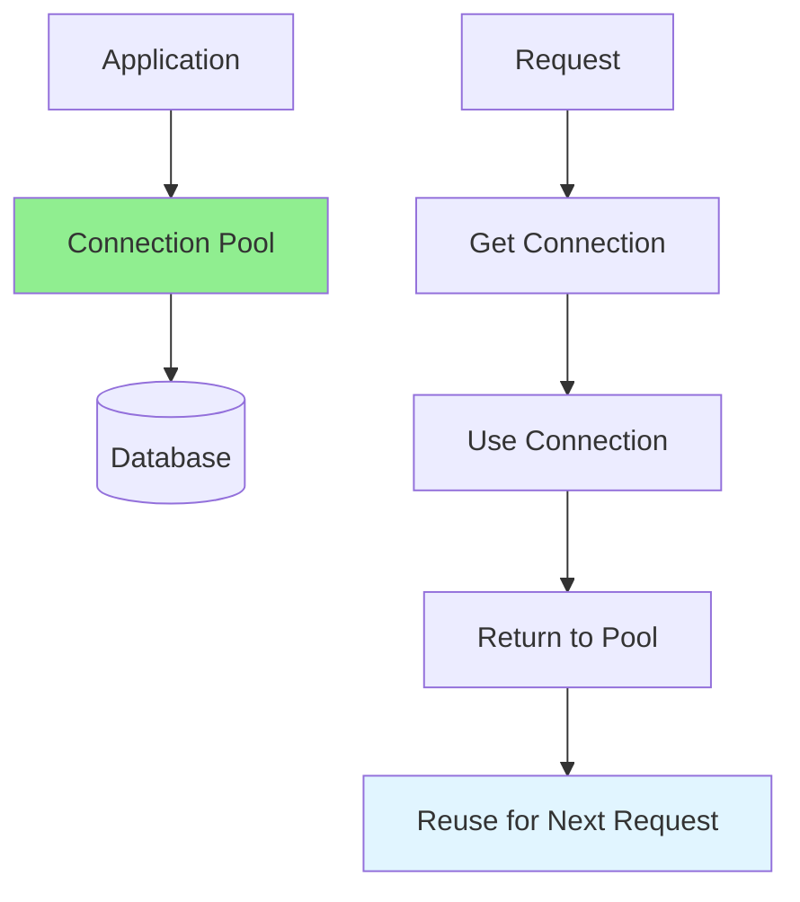
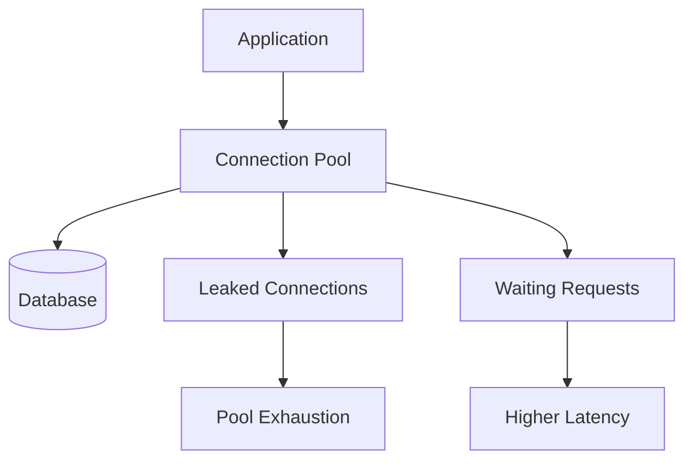

# 06.11 Database Connection Pooling / Connection Pooling Database

## Table of Contents / Mục lục
1. [Introduction / Giới thiệu](#introduction--giới-thiệu)
2. [Connection Pooling / Connection Pooling](#connection-pooling--connection-pooling)
3. [Configuration / Cấu hình](#configuration--cấu-hình)
4. [Failure Patterns / Mẫu lỗi thường gặp](#failure-patterns--mẫu-lỗi-thường-gặp)
5. [Monitoring / Giám sát](#monitoring--giám-sát)
6. [Best Practices / Thực hành tốt nhất](#best-practices--thực-hành-tốt-nhất)
7. [Summary / Tóm tắt](#summary--tóm-tắt)

---

## Introduction / Giới thiệu

### Overview / Tổng quan

**English**: Connection pooling reuses database connections for better performance. Learn to configure and optimize connection pools.

**Vietnamese**: Connection pooling tái sử dụng kết nối database để có hiệu suất tốt hơn. Học cách cấu hình và tối ưu connection pool.

### Connection Pooling / Connection Pooling



---

## Connection Pooling / Connection Pooling

### Example 1: Prisma Connection Pooling / Ví dụ 1: Connection Pooling Prisma

```typescript
// Prisma connection pool configuration / Cấu hình connection pool Prisma
const prisma = new PrismaClient({
  datasources: {
    db: {
      url: process.env.DATABASE_URL
    }
  },
  // Connection pool settings / Cài đặt connection pool
  // Prisma manages pool automatically / Prisma quản lý pool tự động
});

// Connection pool is managed by Prisma / Connection pool được quản lý bởi Prisma
// Default settings work for most cases / Cài đặt mặc định phù hợp cho hầu hết trường hợp
```

### Example 2: Direct Connection Pooling / Ví dụ 2: Connection Pooling trực tiếp

```typescript
// Using pg (PostgreSQL) with connection pooling / Sử dụng pg với connection pooling
import { Pool } from 'pg';

const pool = new Pool({
  host: process.env.DB_HOST,
  port: parseInt(process.env.DB_PORT || '5432'),
  database: process.env.DB_NAME,
  user: process.env.DB_USER,
  password: process.env.DB_PASSWORD,
  max: 20,              // Maximum pool size / Kích thước pool tối đa
  min: 5,               // Minimum pool size / Kích thước pool tối thiểu
  idleTimeoutMillis: 30000,  // Close idle connections / Đóng kết nối không hoạt động
  connectionTimeoutMillis: 2000  // Connection timeout / Timeout kết nối
});

// Use pool / Sử dụng pool
async function queryDatabase() {
  const client = await pool.connect();
  try {
    const result = await client.query('SELECT * FROM users');
    return result.rows;
  } finally {
    client.release();  // Return to pool / Trả về pool
  }
}
```

---

## Configuration / Cấu hình

### Example 3: Pool Configuration Guidelines / Ví dụ 3: Hướng dẫn cấu hình Pool

```typescript
// Connection pool configuration guidelines / Hướng dẫn cấu hình connection pool

// Calculate pool size / Tính kích thước pool
// Formula: connections = ((core_count * 2) + effective_spindle_count)
// For most apps: 10-20 connections is sufficient
// Cho hầu hết ứng dụng: 10-20 kết nối là đủ

const poolConfig = {
  max: 20,                    // Max connections / Kết nối tối đa
  min: 5,                     // Min connections / Kết nối tối thiểu
  idleTimeoutMillis: 30000,   // Idle timeout / Timeout không hoạt động
  connectionTimeoutMillis: 2000,  // Connection timeout / Timeout kết nối
  maxUses: 7500,              // Max uses per connection / Sử dụng tối đa mỗi kết nối
  allowExitOnIdle: false      // Keep pool alive / Giữ pool sống
};
```

### Pool Sizing Notes / Ghi chú chọn kích thước pool

- smaller pools are safer than overly large pools
- every app instance multiplies database connections
- web API, background workers, and cron jobs all consume connections
- database max connections must be considered globally, not per service

---

## Failure Patterns / Mẫu lỗi thường gặp

### Common Problems / Vấn đề thường gặp



### Example 4: Connection Leak Risk / Ví dụ 4: Rủi ro rò rỉ kết nối

```typescript
async function brokenQuery() {
  const client = await pool.connect();
  const result = await client.query('SELECT * FROM users');
  return result.rows;
  // Missing client.release() / Thiếu client.release()
}
```

### Example 5: Safe Pattern / Ví dụ 5: Mẫu an toàn

```typescript
async function safeQuery() {
  const client = await pool.connect();
  try {
    const result = await client.query('SELECT * FROM users');
    return result.rows;
  } finally {
    client.release();
  }
}
```

---

## Monitoring / Giám sát

### Example 6: Check Active Connections / Ví dụ 6: Kiểm tra kết nối active

```sql
SELECT
  count(*) AS total_connections,
  count(*) FILTER (WHERE state = 'active') AS active_connections,
  count(*) FILTER (WHERE state = 'idle') AS idle_connections
FROM pg_stat_activity
WHERE datname = current_database();
```

### What To Watch / Cần theo dõi gì

- requests waiting for a free connection
- average query duration rising under load
- pool exhaustion errors
- idle connections remaining too high
- too many total app instances relative to database limits

---

## Best Practices / Thực hành tốt nhất

1. **Set appropriate size** - Based on application load
2. **Monitor pool usage** - Track connection usage
3. **Handle errors** - Proper error handling
4. **Close connections** - Always release connections
5. **Test under load** - Verify pool handles load
6. **Think globally** - Count connections across all services
7. **Avoid leaks** - Release clients in `finally`
8. **Separate workloads** - Workers and APIs may need different sizing

---

## Summary / Tóm tắt

### Key Takeaways / Điểm chính

- **Connection pooling**: Reuses connections for efficiency
- **Pool size**: Configure based on load
- **Automatic**: Most ORMs manage pools automatically
- **Monitor**: Track pool usage and performance
- **Release**: Always return connections to pool
- **Leaks**: Small mistakes can exhaust the pool quickly
- **Sizing**: Connection limits must be planned across the whole system

### Next Steps / Bước tiếp theo

- [06.12 SQL vs NoSQL](./06.12_SQL_vs_NoSQL.md) - Next: SQL vs NoSQL

---

**Last Updated / Cập nhật lần cuối**: 2024

