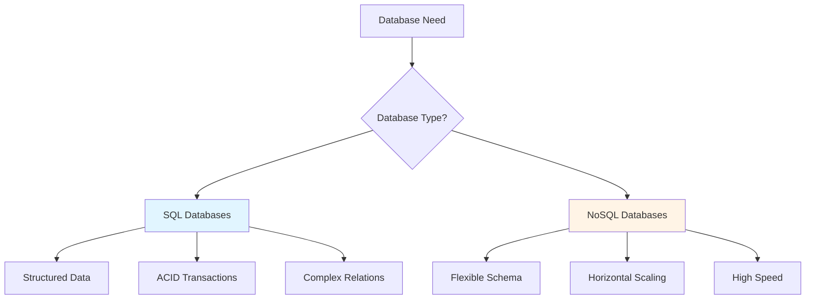

# 06.12 SQL vs NoSQL / SQL vs NoSQL - Khi nào dùng gì

## Table of Contents / Mục lục
1. [Introduction / Giới thiệu](#introduction--giới-thiệu)
2. [SQL Databases / Database SQL](#sql-databases--database-sql)
3. [NoSQL Databases / Database NoSQL](#nosql-databases--database-nosql)
4. [Comparison / So sánh](#comparison--so-sánh)
5. [When to Use What / Khi nào dùng gì](#when-to-use-what--khi-nào-dùng-gì)
6. [Best Practices / Thực hành tốt nhất](#best-practices--thực-hành-tốt-nhất)
7. [Summary / Tóm tắt](#summary--tóm-tắt)

---

## Introduction / Giới thiệu

### Overview / Tổng quan

**English**: SQL and NoSQL databases serve different purposes. Understanding their strengths helps choose the right database for your use case.

**Vietnamese**: Database SQL và NoSQL phục vụ mục đích khác nhau. Hiểu điểm mạnh của chúng giúp chọn đúng database cho use case.

### Database Type Comparison / So sánh loại database



---

## SQL Databases / Database SQL

### Example 1: SQL Database Examples / Ví dụ 1: Ví dụ database SQL

```sql
-- PostgreSQL example / Ví dụ PostgreSQL
CREATE TABLE users (
  id UUID PRIMARY KEY,
  email VARCHAR(255) UNIQUE NOT NULL,
  name VARCHAR(255) NOT NULL,
  created_at TIMESTAMP DEFAULT NOW()
);

-- Complex query with JOINs / Truy vấn phức tạp với JOIN
SELECT u.name, COUNT(o.id) as order_count, SUM(o.total) as total_spent
FROM users u
LEFT JOIN orders o ON u.id = o.user_id
GROUP BY u.id, u.name
HAVING COUNT(o.id) > 5;

-- ACID transaction / Transaction ACID
BEGIN;
  UPDATE accounts SET balance = balance - 100 WHERE id = 1;
  UPDATE accounts SET balance = balance + 100 WHERE id = 2;
COMMIT;
```

---

## NoSQL Databases / Database NoSQL

### Example 2: NoSQL Examples / Ví dụ 2: Ví dụ NoSQL

```typescript
// MongoDB (Document database) / MongoDB (Database tài liệu)
const user = {
  _id: ObjectId(),
  email: 'user@example.com',
  name: 'John Doe',
  orders: [
    { id: 1, total: 100 },
    { id: 2, total: 200 }
  ]
};

await db.collection('users').insertOne(user);

// Redis (Key-value) / Redis (Key-value)
await redis.set('user:123', JSON.stringify(user));
const user = await redis.get('user:123');

// Cassandra (Wide-column) / Cassandra (Wide-column)
// Optimized for write-heavy workloads / Tối ưu cho tải ghi nhiều
```

---

## Comparison / So sánh

### Example 3: Feature Comparison / Ví dụ 3: So sánh tính năng

```typescript
interface DatabaseComparison {
  feature: string;
  sql: string;
  nosql: string;
}

const comparison: DatabaseComparison[] = [
  {
    feature: 'Schema',
    sql: 'Fixed schema, structured',
    nosql: 'Flexible schema, dynamic'
  },
  {
    feature: 'Scalability',
    sql: 'Vertical scaling, complex horizontal',
    nosql: 'Horizontal scaling, easy'
  },
  {
    feature: 'Consistency',
    sql: 'Strong consistency (ACID)',
    nosql: 'Eventual consistency (BASE)'
  },
  {
    feature: 'Query Language',
    sql: 'SQL (standardized)',
    nosql: 'Various (MongoDB query, etc.)'
  },
  {
    feature: 'Relations',
    sql: 'Complex relations, JOINs',
    nosql: 'Simple relations, denormalized'
  }
];
```

---

## When to Use What / Khi nào dùng gì

### Example 4: Selection Guide / Ví dụ 4: Hướng dẫn chọn

```typescript
interface DatabaseSelection {
  useCase: string;
  recommended: 'SQL' | 'NoSQL' | 'Both';
  reason: string;
}

const selection: DatabaseSelection[] = [
  {
    useCase: 'E-commerce with complex relations',
    recommended: 'SQL',
    reason: 'Need ACID transactions, complex queries, relations'
  },
  {
    useCase: 'Real-time analytics, high write volume',
    recommended: 'NoSQL',
    reason: 'Horizontal scaling, high write throughput'
  },
  {
    useCase: 'Content management system',
    recommended: 'SQL',
    reason: 'Structured content, relations, consistency'
  },
  {
    useCase: 'Session storage, caching',
    recommended: 'NoSQL',
    reason: 'Simple key-value, fast access, TTL support'
  },
  {
    useCase: 'Social media feed',
    recommended: 'NoSQL',
    reason: 'High read/write, horizontal scaling'
  }
];
```

---

## Best Practices / Thực hành tốt nhất

1. **SQL for** - Structured data, complex queries, ACID
2. **NoSQL for** - Flexible schema, high scale, speed
3. **Consider both** - Polyglot persistence
4. **Understand trade-offs** - Consistency vs performance
5. **Choose based on needs** - Not trends

---

## Summary / Tóm tắt

### Key Takeaways / Điểm chính

- **SQL**: Structured, ACID, complex queries
- **NoSQL**: Flexible, scalable, high performance
- **Choose**: Based on use case requirements
- **Consider**: Both for different parts of system

### Next Steps / Bước tiếp theo

- [06.13 Database Migration](./06.13_Database_Migration_Version_Control.md) - Next: Migration

---

**Last Updated / Cập nhật lần cuối**: 2024

