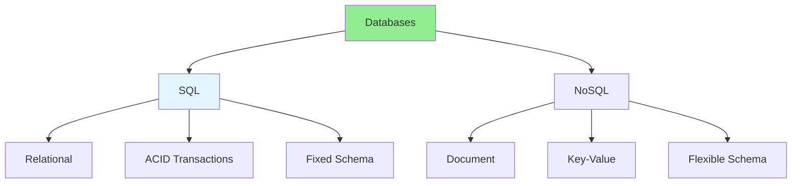

# 06.12 SQL vs NoSQL / SQL vs NoSQL

## Table of Contents / Mục lục
1. [Introduction / Giới thiệu](#introduction--giới-thiệu)
2. [SQL Databases / Database SQL](#sql-databases--database-sql)
3. [NoSQL Databases / Database NoSQL](#nosql-databases--database-nosql)
4. [Comparison / So sánh](#comparison--so-sánh)
5. [Best Practices / Thực hành tốt nhất](#best-practices--thực-hành-tốt-nhất)
6. [Summary / Tóm tắt](#summary--tóm-tắt)

---

## Introduction / Giới thiệu

### Overview / Tổng quan

**English**: SQL and NoSQL databases serve different use cases. Learn when to use SQL vs NoSQL based on your application requirements.

**Vietnamese**: Database SQL và NoSQL phục vụ các trường hợp sử dụng khác nhau. Học khi nào sử dụng SQL vs NoSQL dựa trên yêu cầu ứng dụng.

### SQL vs NoSQL / SQL vs NoSQL



---

## SQL Databases / Database SQL

### Example 1: SQL Database / Ví dụ 1: Database SQL

```sql
-- SQL Database (PostgreSQL) / Database SQL (PostgreSQL)
-- Structured, relational data / Dữ liệu có cấu trúc, quan hệ

CREATE TABLE users (
  id UUID PRIMARY KEY,
  email VARCHAR(255) UNIQUE NOT NULL,
  name VARCHAR(100) NOT NULL,
  created_at TIMESTAMP DEFAULT NOW()
);

CREATE TABLE orders (
  id UUID PRIMARY KEY,
  user_id UUID REFERENCES users(id),
  total DECIMAL(10,2) NOT NULL,
  created_at TIMESTAMP DEFAULT NOW()
);

-- Complex queries with JOINs / Truy vấn phức tạp với JOINs
SELECT u.name, SUM(o.total) as total_spent
FROM users u
LEFT JOIN orders o ON u.id = o.user_id
GROUP BY u.id, u.name;
```

---

## NoSQL Databases / Database NoSQL

### Example 2: NoSQL Database / Ví dụ 2: Database NoSQL

```typescript
// NoSQL Database (MongoDB) / Database NoSQL (MongoDB)
// Flexible, document-based / Linh hoạt, dựa trên document

// Document structure / Cấu trúc document
{
  _id: ObjectId("..."),
  email: "user@example.com",
  name: "John Doe",
  orders: [
    {
      orderId: "order-1",
      total: 100.50,
      items: [...]
    }
  ],
  createdAt: ISODate("2024-01-15")
}

// Query / Truy vấn
db.users.find({ email: "user@example.com" });
db.users.aggregate([
  { $match: { status: "active" } },
  { $group: { _id: "$category", total: { $sum: "$amount" } } }
]);
```

---

## Comparison / So sánh

### Example 3: When to Use Each / Ví dụ 3: Khi nào sử dụng mỗi loại

```markdown
# SQL vs NoSQL Comparison

## Use SQL when:
- Structured data with relationships
- Need ACID transactions
- Complex queries with JOINs
- Data integrity is critical
- Examples: E-commerce, banking, CRM

## Use NoSQL when:
- Unstructured or semi-structured data
- Need horizontal scaling
- Fast reads/writes
- Flexible schema
- Examples: Content management, IoT, real-time analytics

## Hybrid Approach
Many applications use both:
- SQL for transactional data
- NoSQL for analytics, caching, logs
```

---

## Best Practices / Thực hành tốt nhất

1. **Choose based on needs** - Match database to use case
2. **Consider scalability** - Plan for growth
3. **Data structure** - Structured vs unstructured
4. **Query patterns** - Complex queries vs simple lookups
5. **Hybrid** - Use both when appropriate

---

## Summary / Tóm tắt

### Key Takeaways / Điểm chính

- **SQL**: Relational, ACID, structured data
- **NoSQL**: Flexible, scalable, unstructured data
- **Choose**: Based on data structure and requirements
- **Hybrid**: Use both when needed
- **Trade-offs**: Each has strengths and weaknesses

### Next Steps / Bước tiếp theo

- [06.13 Database Migration](./06.13_Database_Migration_Version_Control.md) - Next: Migration

---

**Last Updated / Cập nhật lần cuối**: 2024

