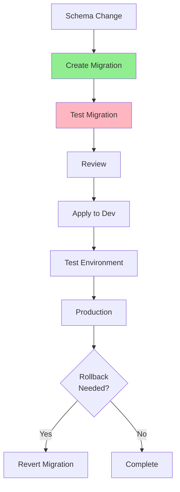

# 06.13 Database Migration and Version Control / Migration và Version Control

## Table of Contents / Mục lục
1. [Introduction / Giới thiệu](#introduction--giới-thiệu)
2. [Migration Concepts / Khái niệm Migration](#migration-concepts--khái-niệm-migration)
3. [Migration Tools / Công cụ Migration](#migration-tools--công-cụ-migration)
4. [Best Practices / Thực hành tốt nhất](#best-practices--thực-hành-tốt-nhất)
5. [Summary / Tóm tắt](#summary--tóm-tắt)

---

## Introduction / Giới thiệu

### Overview / Tổng quan

**English**: Database migrations version control schema changes, enabling safe, reversible database updates. Proper migration management is essential for team collaboration.

**Vietnamese**: Database migration kiểm soát phiên bản thay đổi schema, cho phép cập nhật database an toàn, có thể đảo ngược. Quản lý migration đúng cách rất quan trọng cho hợp tác nhóm.

### Migration Process / Quy trình Migration



---

## Migration Concepts / Khái niệm Migration

### Example 1: Migration Structure / Ví dụ 1: Cấu trúc Migration

```typescript
// Prisma migration / Migration Prisma
// Migration file: 20240115123456_add_user_table/migration.sql
CREATE TABLE "users" (
  "id" UUID NOT NULL,
  "email" VARCHAR(255) NOT NULL,
  "name" VARCHAR(255) NOT NULL,
  "created_at" TIMESTAMP NOT NULL DEFAULT CURRENT_TIMESTAMP,
  CONSTRAINT "users_pkey" PRIMARY KEY ("id")
);

CREATE UNIQUE INDEX "users_email_key" ON "users"("email");

// TypeORM migration / Migration TypeORM
export class AddUserTable1234567890 implements MigrationInterface {
  public async up(queryRunner: QueryRunner): Promise<void> {
    await queryRunner.createTable(
      new Table({
        name: 'users',
        columns: [
          {
            name: 'id',
            type: 'uuid',
            isPrimary: true
          },
          {
            name: 'email',
            type: 'varchar',
            length: '255',
            isUnique: true
          }
        ]
      })
    );
  }

  public async down(queryRunner: QueryRunner): Promise<void> {
    await queryRunner.dropTable('users');
  }
}
```

---

## Migration Tools / Công cụ Migration

### Example 2: Tool Comparison / Ví dụ 2: So sánh công cụ

```typescript
interface MigrationTool {
  name: string;
  language: string;
  features: string[];
}

const tools: MigrationTool[] = [
  {
    name: 'Prisma Migrate',
    language: 'TypeScript/JavaScript',
    features: [
      'Auto-generate migrations',
      'Type-safe',
      'Rollback support',
      'Migration history'
    ]
  },
  {
    name: 'TypeORM Migrations',
    language: 'TypeScript',
    features: [
      'Code-based migrations',
      'CLI support',
      'Multiple databases'
    ]
  },
  {
    name: 'Flyway',
    language: 'SQL/Java',
    features: [
      'SQL-based',
      'Version control',
      'Multiple databases'
    ]
  },
  {
    name: 'Alembic',
    language: 'Python',
    features: [
      'SQLAlchemy integration',
      'Auto-generate',
      'Python-based'
    ]
  }
];
```

---

## Best Practices / Thực hành tốt nhất

1. **Test migrations** - Always test before production
2. **Backup first** - Backup before migration
3. **Version control** - Track all migrations
4. **Rollback plan** - Have rollback strategy
5. **Document changes** - Record what changed and why

---

## Summary / Tóm tắt

### Key Takeaways / Điểm chính

- **Version control**: Track schema changes
- **Test**: Always test migrations
- **Backup**: Before applying
- **Rollback**: Have reversal strategy

### Next Steps / Bước tiếp theo

- [06.14 Backup and Recovery](./06.14_Database_Backup_Recovery.md) - Next: Backup

---

**Last Updated / Cập nhật lần cuối**: 2024

