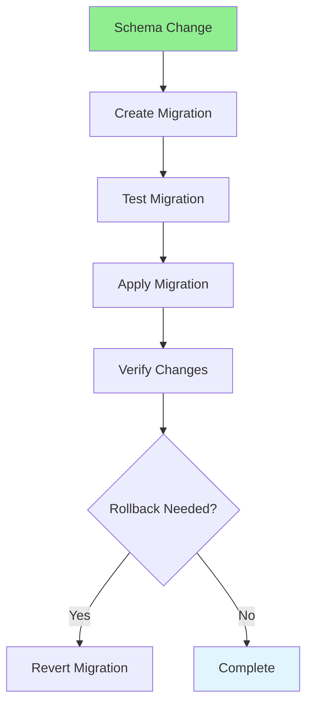

# 06.13 Database Migration: Version Control / Migration Database: Kiểm soát phiên bản

## Table of Contents / Mục lục
1. [Introduction / Giới thiệu](#introduction--giới-thiệu)
2. [Migration Process / Quy trình Migration](#migration-process--quy-trình-migration)
3. [Migration Tools / Công cụ Migration](#migration-tools--công-cụ-migration)
4. [Best Practices / Thực hành tốt nhất](#best-practices--thực-hành-tốt-nhất)
5. [Summary / Tóm tắt](#summary--tóm-tắt)

---

## Introduction / Giới thiệu

### Overview / Tổng quan

**English**: Database migrations version control schema changes. Learn to create, manage, and rollback database migrations safely.

**Vietnamese**: Migration database kiểm soát phiên bản thay đổi schema. Học cách tạo, quản lý và rollback migration database an toàn.

### Database Migration Process / Quy trình Migration Database



---

## Migration Process / Quy trình Migration

### Example 1: Prisma Migrations / Ví dụ 1: Migration Prisma

```typescript
// Prisma schema / Schema Prisma
// schema.prisma
model User {
  id        String   @id @default(uuid())
  email     String   @unique
  name      String?
  createdAt DateTime @default(now())
}

// Create migration / Tạo migration
// npx prisma migrate dev --name add_user_table

// Migration file / File migration
// migrations/20240115120000_add_user_table/migration.sql
CREATE TABLE "User" (
  "id" TEXT NOT NULL,
  "email" TEXT NOT NULL,
  "name" TEXT,
  "createdAt" TIMESTAMP(3) NOT NULL DEFAULT CURRENT_TIMESTAMP,
  CONSTRAINT "User_pkey" PRIMARY KEY ("id")
);

CREATE UNIQUE INDEX "User_email_key" ON "User"("email");

// Apply migration / Áp dụng migration
// npx prisma migrate deploy
```

### Example 2: Manual Migrations / Ví dụ 2: Migration thủ công

```sql
-- Migration: Add user table / Migration: Thêm bảng user
-- Version: 001
-- Created: 2024-01-15

-- Up migration / Migration lên
CREATE TABLE users (
  id UUID PRIMARY KEY DEFAULT gen_random_uuid(),
  email VARCHAR(255) UNIQUE NOT NULL,
  name VARCHAR(100),
  created_at TIMESTAMP DEFAULT CURRENT_TIMESTAMP
);

CREATE INDEX idx_users_email ON users(email);

-- Down migration / Migration xuống (rollback)
DROP INDEX IF EXISTS idx_users_email;
DROP TABLE IF EXISTS users;
```

---

## Migration Tools / Công cụ Migration

### Example 3: Migration Management / Ví dụ 3: Quản lý Migration

```typescript
// Migration tracking / Theo dõi migration
// Track applied migrations / Theo dõi migration đã áp dụng

CREATE TABLE schema_migrations (
  version VARCHAR(255) PRIMARY KEY,
  applied_at TIMESTAMP DEFAULT CURRENT_TIMESTAMP
);

// Check migration status / Kiểm tra trạng thái migration
SELECT version, applied_at 
FROM schema_migrations 
ORDER BY applied_at DESC;

// Apply migration / Áp dụng migration
BEGIN;
-- Migration SQL here
INSERT INTO schema_migrations (version) VALUES ('001');
COMMIT;
```

---

## Best Practices / Thực hành tốt nhất

1. **Version control** - Track all migrations in Git
2. **Test migrations** - Test on development first
3. **Backup before** - Backup database before migration
4. **Reversible** - Make migrations reversible
5. **Review** - Review migrations before applying

---

## Summary / Tóm tắt

### Key Takeaways / Điểm chính

- **Version control**: Track schema changes
- **Reversible**: Make migrations rollback-able
- **Test first**: Test on development
- **Backup**: Backup before migration
- **Tools**: Use migration tools (Prisma, TypeORM, etc.)

### Next Steps / Bước tiếp theo

- [06.14 Database Backup & Recovery](./06.14_Database_Backup_Recovery.md) - Next: Backup & Recovery

---

**Last Updated / Cập nhật lần cuối**: 2024

