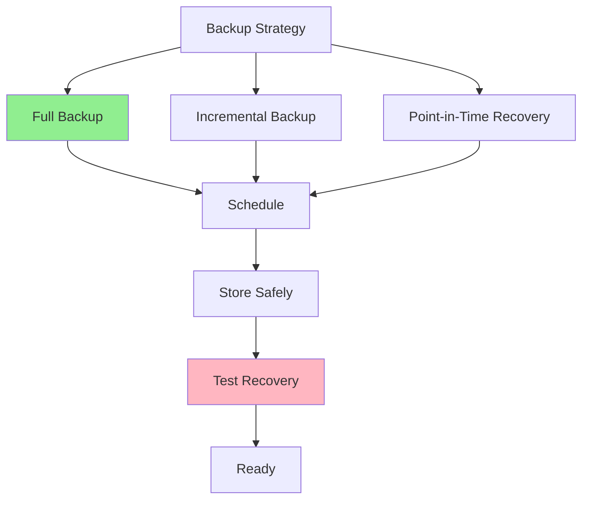

# 06.14 Database Backup and Recovery / Backup và Recovery

## Table of Contents / Mục lục
1. [Introduction / Giới thiệu](#introduction--giới-thiệu)
2. [Backup Strategies / Chiến lược backup](#backup-strategies--chiến-lược-backup)
3. [Recovery Procedures / Quy trình recovery](#recovery-procedures--quy-trình-recovery)
4. [Best Practices / Thực hành tốt nhất](#best-practices--thực-hành-tốt-nhất)
5. [Summary / Tóm tắt](#summary--tóm-tắt)

---

## Introduction / Giới thiệu

### Overview / Tổng quan

**English**: Regular backups and tested recovery procedures protect against data loss. Understanding backup strategies ensures business continuity.

**Vietnamese**: Backup thường xuyên và quy trình recovery đã kiểm thử bảo vệ khỏi mất dữ liệu. Hiểu chiến lược backup đảm bảo tính liên tục kinh doanh.

### Backup Strategy / Chiến lược backup



---

## Backup Strategies / Chiến lược backup

### Example 1: Backup Types / Ví dụ 1: Loại backup

```sql
-- Full backup / Backup đầy đủ
pg_dump -h localhost -U user -d mydb -F c -f backup.dump

-- Incremental backup / Backup tăng dần
-- Using WAL (Write-Ahead Logging) / Sử dụng WAL
-- Continuous archiving / Lưu trữ liên tục

-- Automated backup script / Script backup tự động
#!/bin/bash
# Daily backup / Backup hàng ngày
DATE=$(date +%Y%m%d)
pg_dump -h localhost -U user -d mydb -F c -f "backup_${DATE}.dump"

# Keep last 30 days / Giữ 30 ngày cuối
find /backups -name "backup_*.dump" -mtime +30 -delete
```

---

## Recovery Procedures / Quy trình recovery

### Example 2: Recovery Examples / Ví dụ 2: Ví dụ recovery

```sql
-- Restore from backup / Khôi phục từ backup
pg_restore -h localhost -U user -d mydb -c backup.dump

-- Point-in-time recovery / Khôi phục đến thời điểm cụ thể
-- Requires WAL archiving / Yêu cầu lưu trữ WAL
-- Restore to specific timestamp / Khôi phục đến timestamp cụ thể
```

---

## Best Practices / Thực hành tốt nhất

1. **Regular backups** - Daily or more frequent
2. **Test recovery** - Verify backups work
3. **Store safely** - Off-site, encrypted
4. **Document procedures** - Clear recovery steps
5. **Monitor backups** - Ensure they complete

---

## Summary / Tóm tắt

### Key Takeaways / Điểm chính

- **Backup**: Full, incremental, point-in-time
- **Test**: Regularly test recovery
- **Store**: Safely, off-site
- **Document**: Recovery procedures

### Next Steps / Bước tiếp theo

- [06.15 Performance Monitoring](./06.15_Database_Performance_Monitoring.md) - Next: Monitoring

---

**Last Updated / Cập nhật lần cuối**: 2024

