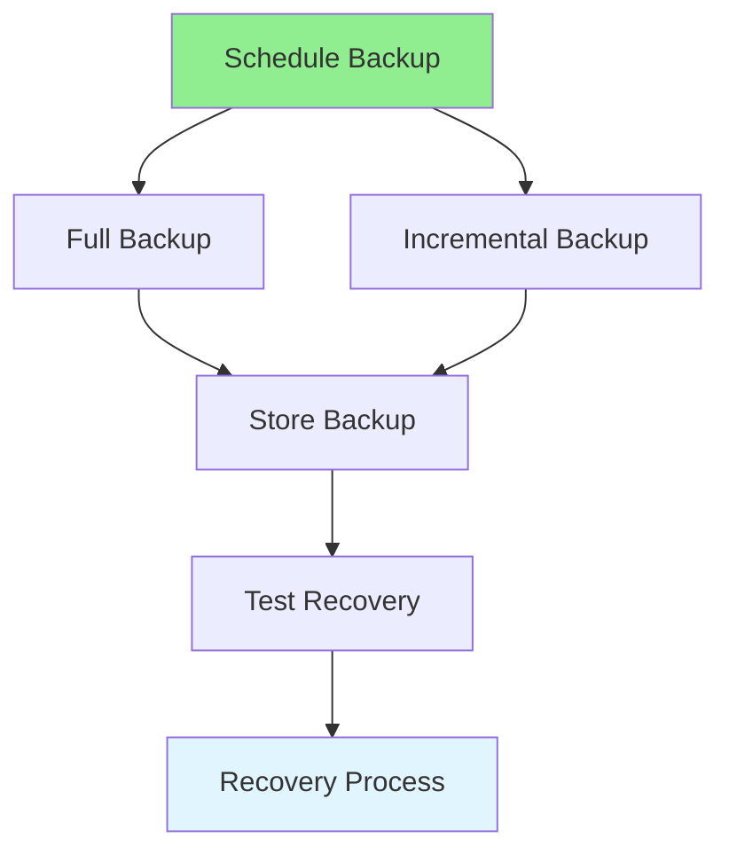

# 06.14 Database Backup & Recovery / Sao lưu & Khôi phục Database

## Table of Contents / Mục lục
1. [Introduction / Giới thiệu](#introduction--giới-thiệu)
2. [Backup Strategies / Chiến lược sao lưu](#backup-strategies--chiến-lược-sao-lưu)
3. [Recovery Process / Quy trình khôi phục](#recovery-process--quy-trình-khôi-phục)
4. [Best Practices / Thực hành tốt nhất](#best-practices--thực-hành-tốt-nhất)
5. [Summary / Tóm tắt](#summary--tóm-tắt)

---

## Introduction / Giới thiệu

### Overview / Tổng quan

**English**: Database backups protect against data loss. Learn backup strategies and recovery procedures for database protection.

**Vietnamese**: Sao lưu database bảo vệ khỏi mất dữ liệu. Học chiến lược sao lưu và quy trình khôi phục để bảo vệ database.

### Backup and Recovery Process / Quy trình sao lưu và khôi phục



---

## Backup Strategies / Chiến lược sao lưu

### Example 1: PostgreSQL Backup / Ví dụ 1: Sao lưu PostgreSQL

```bash
# Full backup / Sao lưu đầy đủ
pg_dump -h localhost -U postgres -d mydb -F c -f backup.dump

# Custom format (compressed) / Định dạng tùy chỉnh (nén)
pg_dump -h localhost -U postgres -d mydb -F c -f backup.dump

# Plain SQL format / Định dạng SQL thuần
pg_dump -h localhost -U postgres -d mydb -f backup.sql

# Backup specific tables / Sao lưu bảng cụ thể
pg_dump -h localhost -U postgres -d mydb -t users -t orders -f backup.sql

# Automated backup script / Script sao lưu tự động
#!/bin/bash
BACKUP_DIR="/backups"
DATE=$(date +%Y%m%d_%H%M%S)
pg_dump -h localhost -U postgres -d mydb -F c -f "$BACKUP_DIR/backup_$DATE.dump"
# Keep only last 7 days / Chỉ giữ 7 ngày gần nhất
find $BACKUP_DIR -name "backup_*.dump" -mtime +7 -delete
```

### Example 2: Automated Backups / Ví dụ 2: Sao lưu tự động

```typescript
// Automated backup service / Dịch vụ sao lưu tự động
import { exec } from 'child_process';
import { promisify } from 'util';

const execAsync = promisify(exec);

async function backupDatabase() {
  const date = new Date().toISOString().split('T')[0];
  const backupFile = `backup_${date}.dump`;
  
  try {
    await execAsync(
      `pg_dump -h ${process.env.DB_HOST} -U ${process.env.DB_USER} -d ${process.env.DB_NAME} -F c -f ${backupFile}`
    );
    
    // Upload to cloud storage / Tải lên cloud storage
    await uploadToS3(backupFile);
    
    console.log(`Backup completed: ${backupFile}`);
  } catch (error) {
    console.error('Backup failed:', error);
    throw error;
  }
}

// Schedule daily backup / Lên lịch sao lưu hàng ngày
// Using node-cron
import cron from 'node-cron';

cron.schedule('0 2 * * *', () => {
  backupDatabase();
}); // Daily at 2 AM / Hàng ngày lúc 2 giờ sáng
```

---

## Recovery Process / Quy trình khôi phục

### Example 3: Database Recovery / Ví dụ 3: Khôi phục Database

```bash
# Restore from backup / Khôi phục từ backup
pg_restore -h localhost -U postgres -d mydb -c backup.dump

# Restore from SQL file / Khôi phục từ file SQL
psql -h localhost -U postgres -d mydb -f backup.sql

# Restore specific tables / Khôi phục bảng cụ thể
pg_restore -h localhost -U postgres -d mydb -t users backup.dump

# Point-in-time recovery / Khôi phục theo thời điểm
# Requires WAL archiving / Yêu cầu lưu trữ WAL
pg_basebackup -h localhost -U postgres -D /backup/base
```

---

## Best Practices / Thực hành tốt nhất

1. **Regular backups** - Schedule automated backups
2. **Test recovery** - Regularly test restore procedures
3. **Multiple locations** - Store backups in multiple places
4. **Retention policy** - Define backup retention
5. **Monitor** - Monitor backup success/failure

---

## Summary / Tóm tắt

### Key Takeaways / Điểm chính

- **Regular backups**: Schedule automated backups
- **Multiple types**: Full, incremental, differential
- **Test recovery**: Verify backups work
- **Store safely**: Multiple locations
- **Monitor**: Track backup status

### Next Steps / Bước tiếp theo

- [06.15 Database Performance Monitoring](./06.15_Database_Performance_Monitoring.md) - Next: Performance Monitoring

---

**Last Updated / Cập nhật lần cuối**: 2024


