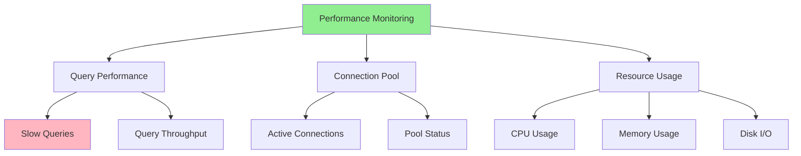

# 06.15 Database Performance Monitoring / Giám sát hiệu năng Database

## Table of Contents / Mục lục
1. [Introduction / Giới thiệu](#introduction--giới-thiệu)
2. [Monitoring Metrics / Chỉ số giám sát](#monitoring-metrics--chỉ-số-giám-sát)
3. [Monitoring Tools / Công cụ giám sát](#monitoring-tools--công-cụ-giám-sát)
4. [Identifying Issues / Xác định vấn đề](#identifying-issues--xác-định-vấn-đề)
5. [Best Practices / Thực hành tốt nhất](#best-practices--thực-hành-tốt-nhất)
6. [Summary / Tóm tắt](#summary--tóm-tắt)

---

## Introduction / Giới thiệu

### Overview / Tổng quan

**English**: Monitoring database performance helps identify bottlenecks and optimize proactively. Understanding key metrics enables data-driven optimization.

**Vietnamese**: Giám sát hiệu năng database giúp xác định nút thắt và tối ưu hóa chủ động. Hiểu các chỉ số chính cho phép tối ưu hóa dựa trên dữ liệu.

### Monitoring Dashboard / Bảng điều khiển giám sát



---

## Monitoring Metrics / Chỉ số giám sát

### Example 1: Key Metrics / Ví dụ 1: Chỉ số chính

```typescript
interface DatabaseMetrics {
  queryPerformance: {
    slowQueries: number;
    averageQueryTime: number;
    queryThroughput: number;
  };
  connections: {
    active: number;
    idle: number;
    max: number;
    poolUtilization: number;
  };
  resources: {
    cpuUsage: number;
    memoryUsage: number;
    diskIO: number;
  };
}

// Example metrics / Ví dụ chỉ số
const metrics: DatabaseMetrics = {
  queryPerformance: {
    slowQueries: 15, // Queries > 1 second / Truy vấn > 1 giây
    averageQueryTime: 250, // milliseconds / mili giây
    queryThroughput: 1000 // queries per second / truy vấn mỗi giây
  },
  connections: {
    active: 8,
    idle: 2,
    max: 10,
    poolUtilization: 80 // percentage / phần trăm
  },
  resources: {
    cpuUsage: 65, // percentage / phần trăm
    memoryUsage: 70,
    diskIO: 45
  }
};
```

---

## Monitoring Tools / Công cụ giám sát

### Example 2: Monitoring Setup / Ví dụ 2: Thiết lập giám sát

```sql
-- PostgreSQL: Enable slow query log / PostgreSQL: Bật log truy vấn chậm
-- In postgresql.conf / Trong postgresql.conf
log_min_duration_statement = 1000; -- Log queries > 1 second / Log truy vấn > 1 giây

-- View slow queries / Xem truy vấn chậm
SELECT query, duration, timestamp
FROM pg_stat_statements
WHERE duration > 1000
ORDER BY duration DESC;

-- Connection monitoring / Giám sát kết nối
SELECT count(*) as active_connections
FROM pg_stat_activity
WHERE state = 'active';
```

---

## Best Practices / Thực hành tốt nhất

1. **Monitor continuously** - Real-time monitoring
2. **Set alerts** - For critical metrics
3. **Track trends** - Historical data
4. **Identify bottlenecks** - Slow queries, resource limits
5. **Optimize proactively** - Before issues occur

---

## Summary / Tóm tắt

### Key Takeaways / Điểm chính

- **Metrics**: Query performance, connections, resources
- **Tools**: Database monitoring, APM tools
- **Identify**: Bottlenecks and issues
- **Optimize**: Based on data

### Next Steps / Bước tiếp theo

- [06.16 Database Security](./06.16_Database_Security.md) - Next: Security

---

**Last Updated / Cập nhật lần cuối**: 2024

