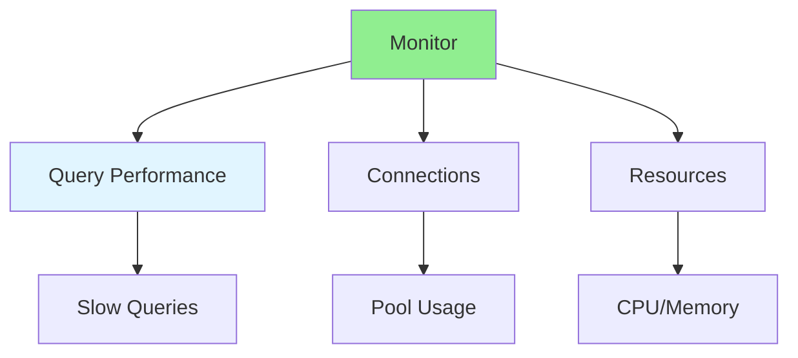
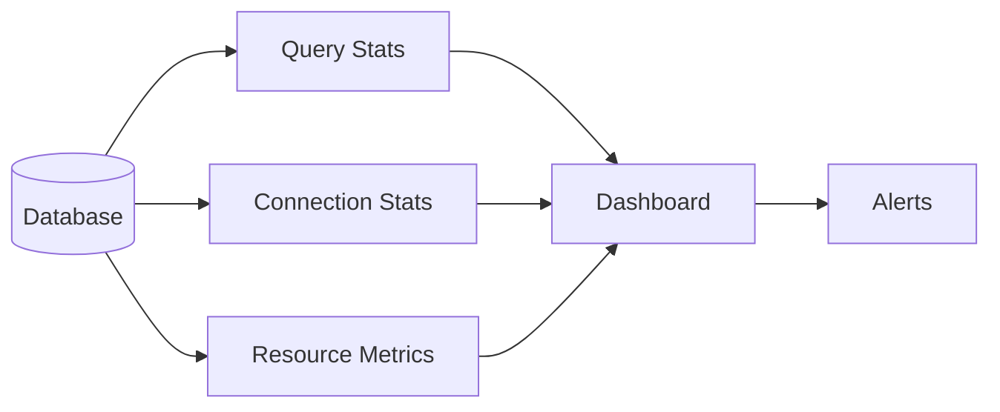

# 06.15 Database Performance Monitoring / Giám sát hiệu suất Database

## Table of Contents / Mục lục
1. [Introduction / Giới thiệu](#introduction--giới-thiệu)
2. [Performance Monitoring / Giám sát hiệu suất](#performance-monitoring--giám-sát-hiệu-suất)
3. [Key Metrics / Chỉ số chính](#key-metrics--chỉ-số-chính)
4. [Alerting and Investigation / Cảnh báo và điều tra](#alerting-and-investigation--cảnh-báo-và-điều-tra)
5. [Best Practices / Thực hành tốt nhất](#best-practices--thực-hành-tốt-nhất)
6. [Summary / Tóm tắt](#summary--tóm-tắt)

---

## Introduction / Giới thiệu

### Overview / Tổng quan

**English**: Performance monitoring identifies database bottlenecks. Learn to monitor query performance, connection usage, and resource utilization.

**Vietnamese**: Giám sát hiệu suất xác định điểm nghẽn database. Học cách giám sát hiệu suất truy vấn, sử dụng kết nối và sử dụng tài nguyên.

### Performance Monitoring / Giám sát hiệu suất



---

## Performance Monitoring / Giám sát hiệu suất

### Example 1: Query Performance Monitoring / Ví dụ 1: Giám sát hiệu suất truy vấn

```sql
-- Enable query logging / Bật ghi log truy vấn
-- PostgreSQL
ALTER SYSTEM SET log_min_duration_statement = 1000;  -- Log queries > 1s
ALTER SYSTEM SET log_statement = 'all';

-- Find slow queries / Tìm truy vấn chậm
SELECT 
  query,
  calls,
  total_time,
  mean_time,
  max_time,
  min_time
FROM pg_stat_statements
ORDER BY mean_time DESC
LIMIT 10;

-- Analyze query plan / Phân tích kế hoạch truy vấn
EXPLAIN ANALYZE
SELECT u.*, o.total_amount
FROM users u
JOIN orders o ON u.id = o.user_id
WHERE u.email = 'user@example.com';
```

### Example 2: Connection Monitoring / Ví dụ 2: Giám sát kết nối

```sql
-- Monitor connections / Giám sát kết nối
SELECT 
  count(*) as total_connections,
  count(*) FILTER (WHERE state = 'active') as active,
  count(*) FILTER (WHERE state = 'idle') as idle
FROM pg_stat_activity
WHERE datname = 'mydb';

-- Connection details / Chi tiết kết nối
SELECT 
  pid,
  usename,
  application_name,
  state,
  query_start,
  state_change,
  query
FROM pg_stat_activity
WHERE datname = 'mydb'
ORDER BY query_start;
```

### Monitoring Flow / Luồng giám sát



---

## Key Metrics / Chỉ số chính

### Example 3: Performance Metrics / Ví dụ 3: Chỉ số hiệu suất

```typescript
// Performance metrics to monitor / Chỉ số hiệu suất cần giám sát
interface DatabaseMetrics {
  queryPerformance: {
    slowQueries: number;
    averageQueryTime: number;
    totalQueries: number;
  };
  connections: {
    total: number;
    active: number;
    idle: number;
    maxConnections: number;
  };
  resources: {
    cpuUsage: number;
    memoryUsage: number;
    diskIO: number;
  };
  cache: {
    hitRate: number;
    missRate: number;
  };
}

// Monitor function / Hàm giám sát
async function monitorDatabase(): Promise<DatabaseMetrics> {
  // Query performance metrics
  const queryStats = await prisma.$queryRaw`
    SELECT 
      COUNT(*) as total_queries,
      AVG(mean_time) as avg_time
    FROM pg_stat_statements
  `;
  
  // Connection metrics
  const connectionStats = await prisma.$queryRaw`
    SELECT 
      COUNT(*) as total,
      COUNT(*) FILTER (WHERE state = 'active') as active
    FROM pg_stat_activity
    WHERE datname = current_database()
  `;
  
  return {
    queryPerformance: {
      slowQueries: 0, // Calculate from query logs
      averageQueryTime: queryStats[0].avg_time,
      totalQueries: queryStats[0].total_queries
    },
    connections: {
      total: connectionStats[0].total,
      active: connectionStats[0].active,
      idle: connectionStats[0].total - connectionStats[0].active,
      maxConnections: 100 // From config
    },
    resources: {
      cpuUsage: 0, // From system monitoring
      memoryUsage: 0,
      diskIO: 0
    },
    cache: {
      hitRate: 0, // Calculate from cache stats
      missRate: 0
    }
  };
}
```

### Metrics That Matter Most / Chỉ số quan trọng nhất

- slow query count
- average and percentile query time
- active connection count
- lock wait time
- cache hit ratio
- CPU saturation
- disk read and write pressure

---

## Alerting and Investigation / Cảnh báo và điều tra

### Example 4: Lock Investigation / Ví dụ 4: Điều tra lock

```sql
SELECT
  pid,
  usename,
  wait_event_type,
  wait_event,
  state,
  query
FROM pg_stat_activity
WHERE wait_event IS NOT NULL;
```

### Example 5: Long Running Queries / Ví dụ 5: Truy vấn chạy lâu

```sql
SELECT
  pid,
  now() - query_start AS duration,
  state,
  query
FROM pg_stat_activity
WHERE state <> 'idle'
ORDER BY query_start ASC;
```

### Investigation Checklist / Danh sách điều tra

- identify whether slowdown is query, lock, connection, CPU, or disk related
- compare current metrics with baseline
- review deploys and migration timing
- inspect the worst queries first
- confirm whether the problem is isolated or systemic

---

## Best Practices / Thực hành tốt nhất

1. **Monitor continuously** - Set up continuous monitoring
2. **Set alerts** - Alert on performance degradation
3. **Track trends** - Monitor trends over time
4. **Review regularly** - Regular performance reviews
5. **Optimize proactively** - Fix issues before they become problems
6. **Keep baselines** - Compare incidents against normal behavior
7. **Instrument locks and waits** - Raw CPU alone is not enough
8. **Correlate with deploys** - Many regressions come from app changes

---

## Summary / Tóm tắt

### Key Takeaways / Điểm chính

- **Query performance**: Monitor slow queries
- **Connections**: Track connection usage
- **Resources**: Monitor CPU, memory, disk
- **Cache**: Track cache hit rates
- **Alerts**: Set up performance alerts
- **Locks**: Blocking and waits can dominate real incidents
- **Baselines**: Monitoring is more useful when you know normal values

### Next Steps / Bước tiếp theo

- [06.16 Database Security](./06.16_Database_Security.md) - Next: Security

---

**Last Updated / Cập nhật lần cuối**: 2024

