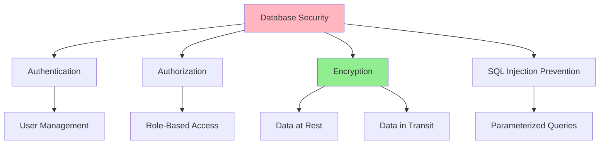

# 06.16 Database Security / Bảo mật Database

## Table of Contents / Mục lục
1. [Introduction / Giới thiệu](#introduction--giới-thiệu)
2. [Authentication and Authorization / Xác thực và ủy quyền](#authentication-and-authorization--xác-thực-và-ủy-quyền)
3. [SQL Injection Prevention / Phòng chống SQL Injection](#sql-injection-prevention--phòng-chống-sql-injection)
4. [Data Encryption / Mã hóa dữ liệu](#data-encryption--mã-hóa-dữ-liệu)
5. [Best Practices / Thực hành tốt nhất](#best-practices--thực-hành-tốt-nhất)
6. [Summary / Tóm tắt](#summary--tóm-tắt)

---

## Introduction / Giới thiệu

### Overview / Tổng quan

**English**: Database security protects sensitive data from unauthorized access and attacks. Implementing security best practices is essential for data protection.

**Vietnamese**: Bảo mật database bảo vệ dữ liệu nhạy cảm khỏi truy cập trái phép và tấn công. Triển khai thực hành bảo mật tốt nhất rất quan trọng cho bảo vệ dữ liệu.

### Security Layers / Lớp bảo mật



---

## Authentication and Authorization / Xác thực và ủy quyền

### Example 1: User Management / Ví dụ 1: Quản lý người dùng

```sql
-- Create user with limited privileges / Tạo user với quyền hạn chế
CREATE USER app_user WITH PASSWORD 'secure_password';

-- Grant only necessary permissions / Cấp chỉ quyền cần thiết
GRANT SELECT, INSERT, UPDATE ON users TO app_user;
GRANT SELECT ON products TO app_user;

-- Revoke unnecessary permissions / Thu hồi quyền không cần thiết
REVOKE DELETE ON users FROM app_user;

-- Role-based access / Truy cập dựa trên vai trò
CREATE ROLE read_only;
GRANT SELECT ON ALL TABLES IN SCHEMA public TO read_only;

CREATE ROLE app_readwrite;
GRANT SELECT, INSERT, UPDATE ON ALL TABLES TO app_readwrite;
```

---

## SQL Injection Prevention / Phòng chống SQL Injection

### Example 2: Secure Queries / Ví dụ 2: Truy vấn an toàn

```typescript
// ❌ Bad: SQL Injection vulnerable / Xấu: Dễ bị SQL Injection
const badQuery = `SELECT * FROM users WHERE email = '${userInput}'`;
// If userInput = "'; DROP TABLE users; --" / Nếu userInput = "'; DROP TABLE users; --"

// ✅ Good: Parameterized query / Tốt: Truy vấn tham số hóa
// Prisma (automatic) / Prisma (tự động)
const user = await prisma.user.findUnique({
  where: { email: userInput } // Parameterized / Tham số hóa
});

// Raw SQL with parameters / SQL thô với tham số
const user = await prisma.$queryRaw`
  SELECT * FROM users WHERE email = ${userInput}
`;

// TypeORM parameterized / TypeORM tham số hóa
const user = await userRepository.findOne({
  where: { email: userInput } // Parameterized / Tham số hóa
});
```

---

## Data Encryption / Mã hóa dữ liệu

### Example 3: Encryption Examples / Ví dụ 3: Ví dụ mã hóa

```typescript
// Encrypt sensitive data / Mã hóa dữ liệu nhạy cảm
import * as crypto from 'crypto';

function encryptSensitiveData(data: string, key: string): string {
  const cipher = crypto.createCipher('aes-256-cbc', key);
  let encrypted = cipher.update(data, 'utf8', 'hex');
  encrypted += cipher.final('hex');
  return encrypted;
}

function decryptSensitiveData(encrypted: string, key: string): string {
  const decipher = crypto.createDecipher('aes-256-cbc', key);
  let decrypted = decipher.update(encrypted, 'hex', 'utf8');
  decrypted += decipher.final('utf8');
  return decrypted;
}

// Store encrypted / Lưu trữ đã mã hóa
const encryptedEmail = encryptSensitiveData(userEmail, process.env.ENCRYPTION_KEY);
await prisma.user.create({
  data: {
    email_encrypted: encryptedEmail
  }
});
```

---

## Best Practices / Thực hành tốt nhất

1. **Least privilege** - Minimum necessary permissions
2. **Encrypt sensitive data** - At rest and in transit
3. **Parameterized queries** - Prevent SQL injection
4. **Regular audits** - Security reviews
5. **Strong passwords** - Enforce password policies

---

## Summary / Tóm tắt

### Key Takeaways / Điểm chính

- **Authentication**: Verify user identity
- **Authorization**: Control access
- **Encryption**: Protect sensitive data
- **SQL Injection**: Use parameterized queries
- **Audit**: Regular security reviews

### Next Steps / Bước tiếp theo

- Complete Group 06: Database Analysis ✅
- Move to [Group 07: Unit Test, Debug](../Group-07-Unit-Test-Debug/) - Coming soon

---

**Last Updated / Cập nhật lần cuối**: 2024

